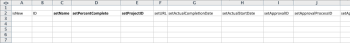

# Caso Kick-Starts : preparación sencilla de importación de proyectos y tareas

Describe en detalle la configuración y los controles disponibles para un proyecto básico y para una importación de tareas mediante el método Inicio rápido.

## Escenario

El equipo de implementación prefiere importar información de proyectos y tareas para proyectos activos en lugar de introducir manualmente estos datos en el sistema.

* [Proyectos](#projects)
* [Lista de tareas](#task-list)

### Proyectos {#projects}

La tabla siguiente muestra cuatro Proyectos y sus detalles básicos que deben asignarse a los formatos de archivo Inicio rápido .

En esta situación se supone que los usuarios ya se han importado en Adobe Workfront. Si los usuarios no están todavía en Workfront, sustituya nombres diferentes o complete el Escenario de inicio rápido con los usuarios antes de este escenario.

1. Implementar Workfront.

   | Fecha planificada de inicio | Hoy |
   |---|---|
   | Gerente del proyecto | Jennifer Campbell |
   | Patrocinador de proyecto | Marc Lewis |
   | Grupo | Marketing |
   | Compañía | *YourCompany* |

   {style=&quot;table-layout:auto&quot;}

1. Implementar el sistema HR.

   | Fecha planificada de inicio | 14 de julio de 2020XX |
   |---|---|
   | Gerente del proyecto | Reynolds de Pam |
   | Patrocinador de proyecto | Marc Lewis |
   | Grupo | Marketing |
   | Compañía | *YourCompany* |

   {style=&quot;table-layout:auto&quot;}

1. Implementar el sistema de gestión de documentos.

   | Fecha planificada de inicio | 22 de agosto de 2020XX |
   |---|---|
   | Gerente del proyecto | Jennifer Campbell |
   | Patrocinador de proyecto | Ray Andrews |
   | Grupo | IT |
   | Compañía | *YourCompany* |

   {style=&quot;table-layout:auto&quot;}

1. Implementar el nuevo sistema de calendario.

   | Fecha planificada de inicio | 6 de septiembre de 2020XX |
   |---|---|
   | Gerente del proyecto | Reynolds de Pam |
   | Patrocinador de proyecto | Ray Andrews |
   | Grupo | IT |
   | Compañía | *YourCompany* |

   {style=&quot;table-layout:auto&quot;}

### Lista de tareas {#task-list}

La siguiente lista de tareas muestra listas de tareas demasiado simplificadas para los proyectos. La única diferencia entre los proyectos es la fecha de inicio y el progreso realizado en cada proyecto.

Las tareas principales heredan las tareas secundarias Duración, Trabajo y Porcentaje completado. No es necesario establecer esos valores para que se conviertan en tareas de resumen.

>[!NOTE]
>
>Las instrucciones proporcionadas en esta situación no son tan explícitas como las instrucciones paso a paso que se proporcionan en [Escenario de inicio rápido: Empresa, grupo, función y preparación del inicio de sesión del usuario](../../../administration-and-setup/manage-workfront/using-kick-starts/kick-starts-scenario-company-group-role-user-prep.md). Se supone que ya ha aprendido a buscar y copiar valores de las hojas Empresa y Grupo, por lo que estos pasos se mencionarán, pero no se describirán específicamente.

1. Configurar.
1. Importar usuarios.

   <table style="table-layout:auto"> 
    <col width="50%"> 
    <col width="50%"> 
    <tbody> 
     <tr> 
      <td role="rowheader">Se ha asignado a</td> 
      <td>Ray Andrews</td> 
     </tr> 
     <tr> 
      <td role="rowheader">Tarea principal</td> 
      <td>1</td> 
     </tr> 
     <tr> 
      <td role="rowheader">Duración</td> 
      <td>1 hora</td> 
     </tr> 
     <tr> 
      <td role="rowheader">Trabajo</td> 
      <td>1 hora</td> 
     </tr> 
     <tr> 
      <td role="rowheader">Porcentaje completado</td> 
      <td> 
Workfront: 0%
 
HR: 100 %
 
Documentos: 100 %
 
Calendario: 100 %
 </td> 
     </tr> 
    </tbody> 
   </table>

1. Establezca permisos.

   <table style="table-layout:auto"> 
    <col width="50%"> 
    <col width="50%"> 
    <tbody> 
     <tr> 
      <td role="rowheader">Se ha asignado a</td> 
      <td>Ray Andrews</td> 
     </tr> 
     <tr> 
      <td role="rowheader">Tarea principal</td> 
      <td>1</td> 
     </tr> 
     <tr> 
      <td role="rowheader">Ant</td> 
      <td>2</td> 
     </tr> 
     <tr> 
      <td role="rowheader">Duración</td> 
      <td>1 hora</td> 
     </tr> 
     <tr> 
      <td role="rowheader">Trabajo</td> 
      <td>1 hora</td> 
     </tr> 
     <tr> 
      <td role="rowheader">Porcentaje completado</td> 
      <td> 
Workfront: 0%
 
HR: 100 %
 
Documentos: 100 %
 
Calendario: 100 %
 </td> 
     </tr> 
    </tbody> 
   </table>

1. Crear grupos.

   <table style="table-layout:auto"> 
    <col width="50%"> 
    <col width="50%"> 
    <tbody> 
     <tr> 
      <td role="rowheader">Se ha asignado a</td> 
      <td>Ray Andrews</td> 
     </tr> 
     <tr> 
      <td role="rowheader">Tarea principal</td> 
      <td>1</td> 
     </tr> 
     <tr> 
      <td role="rowheader">Ant</td> 
      <td>4</td> 
     </tr> 
     <tr> 
      <td role="rowheader">Duración</td> 
      <td>2 días</td> 
     </tr> 
     <tr> 
      <td role="rowheader">Trabajo</td> 
      <td>4 horas</td> 
     </tr> 
     <tr> 
      <td role="rowheader">Porcentaje completado</td> 
      <td> 
Workfront: 0%
 
HR: 100 %
 
Documentos: 100 %
 
Calendario: 25 %
 </td> 
     </tr> 
    </tbody> 
   </table>

1. Preparar la formación.

   <table style="table-layout:auto"> 
    <col width="50%"> 
    <col width="50%"> 
    <tbody> 
     <tr> 
      <td role="rowheader">Se ha asignado a</td> 
      <td>Chris Manning</td> 
     </tr> 
     <tr> 
      <td role="rowheader">Duración</td> 
      <td>2 días</td> 
     </tr> 
     <tr> 
      <td role="rowheader">Trabajo</td> 
      <td>4 horas</td> 
     </tr> 
     <tr> 
      <td role="rowheader">Porcentaje completado</td> 
      <td> 
Workfront: 0%
 
HR: 100 %
 
Documentos: 50 %
 
Calendario: 100 %
 </td> 
     </tr> 
    </tbody> 
   </table>

1. Crear políticas de soporte continuas.

   <table style="table-layout:auto"> 
    <col width="50%"> 
    <col width="50%"> 
    <tbody> 
     <tr> 
      <td role="rowheader">Se ha asignado a</td> 
      <td>Chris Manning</td> 
     </tr> 
     <tr> 
      <td role="rowheader">Duración</td> 
      <td>2 días</td> 
     </tr> 
     <tr> 
      <td role="rowheader">Trabajo</td> 
      <td>4 horas</td> 
     </tr> 
     <tr> 
      <td role="rowheader">Porcentaje completado</td> 
      <td> 
Workfront: 0%
 
HR: 100 %
 
Documentos: 50 %
 
Calendario: 0%
 </td> 
     </tr> 
    </tbody> 
   </table>

1. Despliegue.

   | Ant | 1, 6, 7 |
   |---|---|

   {style=&quot;table-layout:auto&quot;}

1. Capacite a los usuarios.

   <table style="table-layout:auto"> 
    <col width="50%"> 
    <col width="50%"> 
    <tbody> 
     <tr> 
      <td role="rowheader">Se ha asignado a</td> 
      <td>Chris Manning</td> 
     </tr> 
     <tr> 
      <td role="rowheader">Tarea principal</td> 
      <td>8</td> 
     </tr> 
     <tr> 
      <td role="rowheader">Duración</td> 
      <td>1 día</td> 
     </tr> 
     <tr> 
      <td role="rowheader">Trabajo</td> 
      <td>2 horas</td> 
     </tr> 
     <tr> 
      <td role="rowheader">Porcentaje completado</td> 
      <td> 
Workfront: 0%
 
HR: 0%
 
Documentos: 0%
 
Calendario: 0%
 </td> 
     </tr> 
    </tbody> 
   </table>

## Descargar plantilla

Vaya a la página Inicio rápido . Seleccione los objetos Empresa, Grupo, Proyecto, Tarea y Usuario. Active la casilla Incluir datos existentes (haga esto para hacer referencia rápidamente a los ID de empresa, grupo y usuario). Haga clic en el botón Descargar.

## Detalles del proyecto de entrada

Abra el archivo Workfront.xlsx que acaba de descargar. Vaya a la hoja PROJ Project .

\
A menos que ya haya creado proyectos en Workfront, debería estar vacío.\

>[!NOTE]
>
>Considere utilizar la herramienta Congelar paneles de la hoja de cálculo y/o ocultar o eliminar columnas innecesarias para facilitar el uso de la hoja. Sin embargo, tenga cuidado de no eliminar las columnas o columnas requeridas para usarlas más adelante.

Defina los valores de los siguientes campos de proyecto:

* **Establecer la columna isNew**
Introduzca TRUE en las filas 3 a 6 para la columna isNew .
* **Establecimiento de ID únicos**
Introduzca un ID único en cada fila para la columna de ID. Normalmente, los enteros que comienzan en 1 funcionan bien al crear nuevos registros.
* **Definir nombres de proyecto**
Introduzca los nombres de cada proyecto en la columna setName.
* **Establecer programación del proyecto**

   Introduzca el ID de la programación que desea que utilice el proyecto en el campo setScheduleID .

* **Establecer la fecha de inicio prevista del proyecto**

   Introduzca la fecha y la hora en la columna setPlannedStartDate con la hora y la fecha en que desea que se inicie el proyecto. Si se deja vacío, Workfront importa el proyecto con la fecha del día actual y una marca de hora de la medianoche de ese día según la zona horaria del explorador.

* **Definir números de tarea**
Introduzca valores en la columna setTaskNumber para controlar el orden en que aparecerán las tareas en el plan del proyecto.
* **Proporcione fechas de proyecto.**
Introduzca la Fecha de inicio planeada para cada proyecto en la columna setPlannedStartDate .
* **Configure otros detalles necesarios.**
Rellene otros detalles, como una descripción o el estado actual, según sea necesario. Busque los ID de grupo de cada proyecto en la hoja Grupo de GRUPOS y introdúzcalos en la columna setGroupID para los proyectos respectivos. Busque el ID de empresa para los proyectos en la hoja de la empresa CMPY y introdúzcalo en la columna setCompanyID . Busque el ID de usuario de cada propietario del proyecto en la hoja de usuario USER e introdúzcalo en la columna setOwnerID . Busque el ID de usuario de cada patrocinador de proyecto en la hoja de usuario USER y introdúzcalo en la columna setSponsorID .

>[!NOTE]
>
>Los valores aceptables para los campos Estado y Prioridad se pueden encontrar revisando el estado y las preferencias de prioridad para cada objeto en el área Configuración de flujo de trabajo de Workfront.

## Detalles de la tarea de entrada

Puede agregar información sobre las tareas del proyecto, a medida que lo importe mediante la introducción.

Abra el archivo Workfront.xlsx que acaba de descargar. **Vaya a la hoja Tarea TAREA.**

A menos que ya haya creado tareas en Workfront, esta hoja debe estar vacía.

La forma más sencilla de asignar tareas es un proyecto a la vez (especialmente cuando las tareas son las mismas en cada proyecto). A continuación, puede copiar el plan de tareas del primer proyecto y realizar pequeños ajustes en el plan de tareas para los proyectos siguientes. Los pasos restantes asumirán que está creando tareas solo para el proyecto Implementar Workfront . Según el escenario, se importarán 9 tareas por proyecto, por lo que escriba TRUE en las filas 3 a 11 para la columna isNew .

Defina los valores de los siguientes campos de tareas:

* **Establecimiento de ID**
Introduzca un ID único en cada fila para la columna ID.
* **Definir nombres**
Introduzca los nombres de las tareas en la columna setName.
* **Confirmar ID del proyecto**
Introduzca el ID definido para el proyecto Implementar Workfront; revise la hoja PROJ Project para asegurarse de que es el ID correcto.
* **Configurar usuarios**
Vaya a la hoja USER User para buscar el ID del usuario asignado a cada tarea e introduzca estos valores en las celdas correspondientes de la columna setAssignedToID .
* **Identificar relaciones de tarea**
Para las tareas 2 a 5, introduzca un 1 en la columna setParentID . Para la tarea 9, introduzca un 8 en la columna setParentID . En la columna setPredecessorString , introduzca el número de tarea para cada tarea predecesora. En los casos en los que una tarea tiene varias predecesoras, como la tarea 8 en este escenario, deberá utilizar una coma para separar cada ID de tarea predecesora. Los predecesores se pueden definir con etiquetas en relaciones que no sean de Inicio de Finalización mediante el método abreviado descrito en el artículo Creación de Relaciones de Predecesor .
* **Configurar duración**
Establezca la duración de cada tarea introduciendo el número de horas, días, semanas o meses para la tarea en el campo setDuration . A continuación, introduzca la unidad de duración en el campo setDurationUnit .

   |  | Valor aceptable |
   |---|---|
   | minutos | L |
   | Horas | H |
   | Días | D |
   | Semanas | M |
   | Meses | M |

   Los minutos también pueden representarse como fracción de una hora (p. ej., minutos = 5 horas)

* Defina la cantidad de esfuerzo para cada tarea en el campo setWorkRequired . A continuación, introduzca la unidad de trabajo en el campo setWorkUnit . Si el valor Trabajo requerido es diferente de la duración, también deberá introducir una A en el campo setDurationType .

   | Tipo de duración | Valor aceptable |
   |---|---|
   | Asignación calculada | A |
   | Trabajo calculado | M |
   | Condicionada por el esfuerzo | D |
   | Sencilla | D |

* Introduzca la representación numérica completa del porcentaje completado en el campo setPercentComplete para cada tarea. Este valor no debe incluir el símbolo de porcentaje (%).
* Incluya una descripción y otros detalles para cada tarea que esté creando, según sea necesario.

   

* Las columnas setPlannedStartDate y setTaskConstraint no se utilizan para crear la cronología de este proyecto porque dependemos de las relaciones predecesoras. En su lugar, puede introducir una fecha para cada tarea. Si lo hace, asegúrese de proporcionar también una restricción de tarea válida en la columna setTaskConstraint . Revise la Contención de tareas y los artículos relacionados para obtener detalles sobre los valores válidos para este campo.

   En este caso, la forma más sencilla de crear las tareas para los otros proyectos que está importando es copiar las tareas que acaba de definir y pegarlas a continuación, a partir de la fila 12. Entonces:

   1. Vuelva a numerar los valores en la columna ID.
   1. Actualice la columna setProjectID al valor establecido para el siguiente proyecto.
   1. Actualice los valores setParentID y setPredecessorString para reflejar los nuevos ID asignados a las tareas de este proyecto.
   1. Actualizar asignaciones de tareas y porcentaje completado.
   1. Repita estos pasos para las tareas del siguiente proyecto.

* **Importar el archivo de Excel**

   Siga las instrucciones proporcionadas en [Importar datos en Adobe Workfront mediante una plantilla de inicio rápido](../../../administration-and-setup/manage-workfront/using-kick-starts/import-data-via-kickstarts.md).
