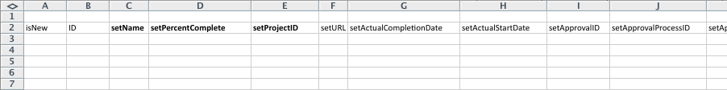

# Escenario de Kick-Starts: preparación sencilla de importación de proyectos y tareas

Describe en detalle la configuración y los controles disponibles para una importación básica de proyectos y tareas mediante el método Kick-Start.

## Escenario

El equipo de implementación prefiere importar la información de proyectos y tareas de los proyectos activos en lugar de introducir manualmente estos datos en el sistema.

* [Proyectos](#projects)
* [Lista de tareas](#task-list)

### Proyectos {#projects}

La siguiente tabla muestra cuatro proyectos y sus detalles básicos, que deben asignarse a los formatos de archivo de Kick Start.

En este escenario se supone que ya se han importado los usuarios a Adobe Workfront. Si los usuarios aún no están en Workfront, sustitúyalos por nombres diferentes o complete el escenario de Kick Start con los usuarios antes de este escenario.

1. Implemente Workfront.

   | Fecha planificada de inicio | Hoy |
   |---|---|
   | Gerente del proyecto | Jennifer Campbell |
   | Patrocinador de proyecto | Marc Lewis |
   | Grupo | Marketing |
   | Compañía | *YourCompany* |

   {style="table-layout:auto"}

1. Implemente el sistema de RR. HH.

   | Fecha planificada de inicio | 14 de julio de 20XX |
   |---|---|
   | Gerente del proyecto | Pam Reynolds |
   | Patrocinador de proyecto | Marc Lewis |
   | Grupo | Marketing |
   | Compañía | *YourCompany* |

   {style="table-layout:auto"}

1. Implemente el sistema de gestión de documentos.

   | Fecha planificada de inicio | 22 de agosto de 20XX |
   |---|---|
   | Gerente del proyecto | Jennifer Campbell |
   | Patrocinador de proyecto | Ray Andrews |
   | Grupo | IT |
   | Compañía | *YourCompany* |

   {style="table-layout:auto"}

1. Implementar el nuevo sistema de calendario.

   | Fecha planificada de inicio | 6 de septiembre de 20XX |
   |---|---|
   | Gerente del proyecto | Pam Reynolds |
   | Patrocinador de proyecto | Ray Andrews |
   | Grupo | IT |
   | Compañía | *YourCompany* |

   {style="table-layout:auto"}

### Lista de tareas {#task-list}

La siguiente lista de tareas muestra listas de tareas demasiado simplificadas para los proyectos. La única diferencia entre los proyectos son las fechas de inicio y el progreso realizado en cada proyecto.

Las tareas principales heredan la duración, el trabajo y el porcentaje completado de las tareas secundarias. No es necesario establecer esos valores para que se conviertan en tareas de resumen.

>[!NOTE]
>
>Las instrucciones proporcionadas en este escenario no son tan explícitas como las instrucciones paso a paso proporcionadas en [Escenario de Kick-Starts: preparación de Kick-Starts de la compañía, el grupo, la función y el usuario](../../../administration-and-setup/manage-workfront/using-kick-starts/kick-starts-scenario-company-group-role-user-prep.md). Se supone que ya ha aprendido a buscar y copiar valores de las hojas Compañía y Grupo, por lo que se mencionarán estos pasos, pero no se describirán específicamente.

1. Configure.
1. Importe usuarios.

   <table style="table-layout:auto"> 
    <col width="50%"> 
    <col width="50%"> 
    <tbody> 
     <tr> 
      <td role="rowheader">Asignado a</td> 
      <td>Ray Andrews</td> 
     </tr> 
     <tr> 
      <td role="rowheader">Tarea principal</td> 
      <td>1</td> 
     </tr> 
     <tr> 
      <td role="rowheader">Duración</td> 
      <td>1 hora</td> 
     </tr> 
     <tr> 
      <td role="rowheader">Trabajo</td> 
      <td>1 hora</td> 
     </tr> 
     <tr> 
      <td role="rowheader">Porcentaje completado</td> 
      <td> 
Workfront: 0 %
 
RR. HH.: 100 %
 
Documentos: 100 %
 
Calendario: 100 %
 </td> 
     </tr> 
    </tbody> 
   </table>

1. Permisos de URL

   <table style="table-layout:auto"> 
    <col width="50%"> 
    <col width="50%"> 
    <tbody> 
     <tr> 
      <td role="rowheader">Asignado a</td> 
      <td>Ray Andrews</td> 
     </tr> 
     <tr> 
      <td role="rowheader">Tarea principal</td> 
      <td>1</td> 
     </tr> 
     <tr> 
      <td role="rowheader">Ant</td> 
      <td>2</td> 
     </tr> 
     <tr> 
      <td role="rowheader">Duración</td> 
      <td>1 hora</td> 
     </tr> 
     <tr> 
      <td role="rowheader">Trabajo</td> 
      <td>1 hora</td> 
     </tr> 
     <tr> 
      <td role="rowheader">Porcentaje completado</td> 
      <td> 
Workfront: 0 %
 
RR. HH.: 100 %
 
Documentos: 100 %
 
Calendario: 100 %
 </td> 
     </tr> 
    </tbody> 
   </table>

1. Cree grupos.

   <table style="table-layout:auto"> 
    <col width="50%"> 
    <col width="50%"> 
    <tbody> 
     <tr> 
      <td role="rowheader">Asignado a</td> 
      <td>Ray Andrews</td> 
     </tr> 
     <tr> 
      <td role="rowheader">Tarea principal</td> 
      <td>1</td> 
     </tr> 
     <tr> 
      <td role="rowheader">Ant</td> 
      <td>4</td> 
     </tr> 
     <tr> 
      <td role="rowheader">Duración</td> 
      <td>2 días</td> 
     </tr> 
     <tr> 
      <td role="rowheader">Trabajo</td> 
      <td>4 horas</td> 
     </tr> 
     <tr> 
      <td role="rowheader">Porcentaje completado</td> 
      <td> 
Workfront: 0 %
 
RR. HH.: 100 %
 
Documentos: 100 %
 
Calendario: 25 %
 </td> 
     </tr> 
    </tbody> 
   </table>

1. Preparar la formación.

   <table style="table-layout:auto"> 
    <col width="50%"> 
    <col width="50%"> 
    <tbody> 
     <tr> 
      <td role="rowheader">Asignado a</td> 
      <td>Chris Manning</td> 
     </tr> 
     <tr> 
      <td role="rowheader">Duración</td> 
      <td>2 días</td> 
     </tr> 
     <tr> 
      <td role="rowheader">Trabajo</td> 
      <td>4 horas</td> 
     </tr> 
     <tr> 
      <td role="rowheader">Porcentaje completado</td> 
      <td> 
Workfront: 0 %
 
RR. HH.: 100 %
 
Documentos: 50 %
 
Calendario: 100 %
 </td> 
     </tr> 
    </tbody> 
   </table>

1. Generar políticas de apoyo continuas.

   <table style="table-layout:auto"> 
    <col width="50%"> 
    <col width="50%"> 
    <tbody> 
     <tr> 
      <td role="rowheader">Asignado a</td> 
      <td>Chris Manning</td> 
     </tr> 
     <tr> 
      <td role="rowheader">Duración</td> 
      <td>2 días</td> 
     </tr> 
     <tr> 
      <td role="rowheader">Trabajo</td> 
      <td>4 horas</td> 
     </tr> 
     <tr> 
      <td role="rowheader">Porcentaje completado</td> 
      <td> 
Workfront: 0 %
 
RR. HH.: 100 %
 
Documentos: 50 %
 
Calendario: 0 %
 </td> 
     </tr> 
    </tbody> 
   </table>

1. Despliegue hacia fuera.

   | Ant | 1, 6, 7 |
   |---|---|

   {style="table-layout:auto"}

1. Formar a los usuarios.

   <table style="table-layout:auto"> 
    <col width="50%"> 
    <col width="50%"> 
    <tbody> 
     <tr> 
      <td role="rowheader">Asignado a</td> 
      <td>Chris Manning</td> 
     </tr> 
     <tr> 
      <td role="rowheader">Tarea principal</td> 
      <td>8</td> 
     </tr> 
     <tr> 
      <td role="rowheader">Duración</td> 
      <td>1 día</td> 
     </tr> 
     <tr> 
      <td role="rowheader">Trabajo</td> 
      <td>2 horas</td> 
     </tr> 
     <tr> 
      <td role="rowheader">Porcentaje completado</td> 
      <td> 
Workfront: 0 %
 
RR. HH.: 0 %
 
Documentos: 0 %
 
Calendario: 0 %
 </td> 
     </tr> 
    </tbody> 
   </table>

## Descargar plantilla

Vaya a la página de Kick-Starts. Seleccione los objetos Compañía, Grupo, Proyecto, Tarea y Usuario. Seleccione la casilla de verificación Incluir datos existentes (haga esto para hacer referencia rápidamente a los ID de compañía, grupo y usuario). Haga clic en el botón Descargar.

## Detalles del proyecto de entrada

Abra el archivo Workfront.xlsx que acaba de descargar. Vaya a la hoja Proyecto PROJ.

A menos que ya haya creado proyectos en Workfront, debe estar vacío.

Establezca los valores de los siguientes campos de proyecto:

* **Establecer columna isNew**
Introduzca TRUE en las filas 3 a 6 de la columna isNew.
* **Establecer ID únicos**
Introduzca un ID único en cada fila para la columna de ID: normalmente, los números enteros que comienzan por 1 funcionan bien al crear nuevos registros.
* **Establecer nombres del proyecto**
Escriba los nombres de cada proyecto en la columna setName.
* **Establecer programación de proyecto**

  Introduzca el ID de la programación que desea que el proyecto utilice en el campo setScheduleID

* **Establecer la fecha de inicio planificada del proyecto**

  Introduzca la fecha y la hora en la columna setPlannedStartDate con la hora y la fecha en que desea que comience el proyecto. Si se deja vacío, Workfront importa el proyecto con la fecha del día actual y una marca de tiempo de la medianoche de ese día según la zona horaria del explorador.

* **Establecer números de tarea**
Introduzca valores en la columna setTaskNumber para controlar el orden en que aparecerán las tareas en el plan del proyecto.
* **Proporcione fechas del proyecto.**
Introduzca la fecha de inicio planificada de cada proyecto en la columna setPlannedStartDate.
* **Establecer otros detalles necesarios.**
Complete otros detalles, como una descripción o el estado actual, según sea necesario. Busque los ID de grupo de cada proyecto en la hoja Grupo GROUP y escríbalos en la columna setGroupID de los proyectos respectivos. Busque el ID de compañía de los proyectos en la hoja Compañía CMPY y escríbalo en la columna setCompanyID. Busque el ID de usuario de cada propietario de proyecto en la hoja usuario USER y escríbalo en la columna setOwnerID. Busque el ID de usuario para cada patrocinador del proyecto en la hoja de usuario USER y escríbalo en la columna setSponsorID.

>[!NOTE]
>
>Los valores aceptables para los campos Estado y Prioridad se pueden encontrar revisando las preferencias de estado y prioridad de cada objeto en el área Configuración del flujo de trabajo de Workfront.

## Detalles sobre la tarea de entrada

Puede añadir información sobre las tareas del proyecto a medida que lo importa mediante KickStart.

Abra el archivo Workfront.xlsx que acaba de descargar. **Ir a la hoja de tareas TASK.**

A menos que ya haya creado tareas en Workfront, esta hoja debe estar vacía.

La forma más sencilla de asignar tareas es un proyecto a la vez (especialmente cuando las tareas son las mismas en cada proyecto). A continuación, puede copiar el plan de tareas para el primer proyecto y realizar pequeños ajustes en el plan de tareas para los proyectos siguientes. En los pasos restantes se da por hecho que está creando tareas únicamente para el proyecto Implementar Workfront. Según el escenario, se importarán 9 tareas por proyecto, por lo que se debe introducir TRUE en las filas 3 a 11 para la columna isNew.

Establezca los valores de los siguientes campos de tarea:

* **Establecer ID**
Introduzca un ID único en cada fila para la columna de ID.
* **Establecer nombres**
Introduzca los nombres de las tareas en la columna setName.
* **Confirmar ID de proyecto**
Introduzca el ID que ha definido para el proyecto Implementar Workfront; revise la hoja del proyecto PROJ para asegurarse de que es el ID correcto.
* **Establecer usuarios**
Vaya a la hoja Usuario USER para buscar el ID del usuario asignado a cada tarea e introduzca estos valores en las celdas respectivas de la columna setAssignedToID.
* **Identificar relaciones de tareas**
Para las tareas 2 a 5, escriba un 1 en la columna setParentID. Para la tarea 9, escriba un 8 en la columna setParentID. En la columna setPredecessorString, escriba el número de tareas para cada tarea predecesora. En los casos en los que una tarea tiene varias predecesoras, como la tarea 8 en esta situación, deberá utilizar una coma para separar cada identificador de tarea predecesora. Las predecesoras se pueden definir con retardos en las relaciones que no son de tipo Iniciar-Finalizar mediante el método abreviado descrito en el artículo Crear relaciones de predecesoras.
* **Establecer duración**
Establezca la duración de cada tarea introduciendo el número de horas, días, semanas o meses para la tarea en el campo setDuration. A continuación, introduzca la unidad de duración en el campo setDurationUnit.

  |   | Valor aceptable |
  |---|---|
  | minutos | L |
  | Horas | H |
  | Días | D |
  | Semanas | S |
  | Meses | M |

  Los minutos también se pueden representar como una fracción de una hora (p. ej., minutos = 5 horas)

* Establezca la cantidad de esfuerzo para cada tarea en el campo setWorkRequired. A continuación, introduzca la unidad de trabajo en el campo setWorkUnit. Si el valor de trabajo requerido es diferente de la duración, también deberá escribir una A en el campo setDurationType.

  | Tipo de duración | Valor aceptable |
  |---|---|
  | Asignación calculada | A |
  | Trabajo calculado | S |
  | Condicionada por el esfuerzo | D |
  | Simple | D |

* Escriba la representación numérica completa del porcentaje completado en el campo setPercentComplete para cada tarea. Este valor no debe incluir el símbolo de porcentaje (%).
* Incluya una descripción y otros detalles para cada tarea que esté creando, según sea necesario.

  

* Las columnas setPlannedStartDate y setTaskConstraint no se utilizan para crear la línea de tiempo de este proyecto porque se basan en relaciones de predecesoras. En su lugar, puede introducir una fecha para cada tarea. En este caso, asegúrese de proporcionar también una restricción de tarea válida en la columna setTaskConstraint. Revise la restricción de tarea y los artículos relacionados para obtener información sobre los valores válidos para este campo.

  En este caso, la forma más sencilla de crear las tareas para los demás proyectos que está importando es copiar las tareas que acaba de definir y pegarlas a continuación, a partir de la fila 12. A continuación, hará lo siguiente:

   1. Vuelva a numerar los valores en la columna ID.
   1. Actualice la columna setProjectID al valor establecido para el proyecto siguiente.
   1. Actualice los valores setParentID y setPredecessorString para reflejar los nuevos identificadores asignados a las tareas de este proyecto.
   1. Actualice las asignaciones de tareas y el porcentaje completado.
   1. Repita estos pasos para las tareas del proyecto siguiente.

* **Importar el archivo de Excel**

  Siga las instrucciones proporcionadas en [Importar datos en Adobe Workfront a través de una plantilla de Kick-Start](../../../administration-and-setup/manage-workfront/using-kick-starts/import-data-via-kickstarts.md).
