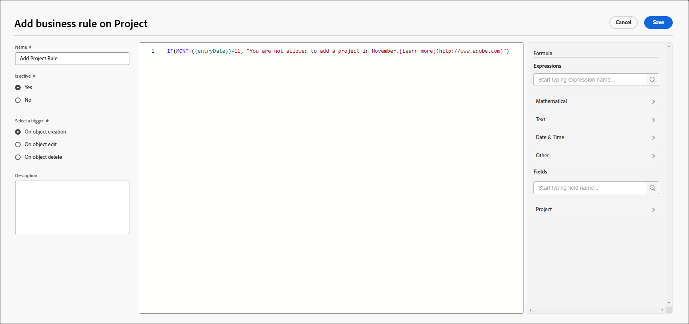

# Crear y editar reglas empresariales

<!--

<span class="preview">The highlighted information on this page refers to functionality not yet generally available. It is available only in the Preview environment for all customers. After the monthly releases to Production, the same features are also available in the Production environment for customers who enabled fast releases. </span>   

-->

Una regla empresarial permite aplicar la validación a objetos de Workfront e impedir que los usuarios creen, editen o eliminen un objeto cuando se cumplen determinadas condiciones. La validación de reglas empresariales ayuda a mejorar la calidad de los datos y la eficacia operativa mediante la prevención de acciones que podrían poner en peligro la integridad de los datos.

<!--

<div class="preview">

Organizations that have the Workflow Ultimate package can also configure business rules to automate actions for the created, edited, or modified object when certain conditions are met. Available actions include sharing the object, notifying a user, or attaching a custom form to the object.  

</div>

-->

Una sola regla empresarial solo se puede asignar a un objeto. Por ejemplo, si crea una regla empresarial para no editar proyectos en determinadas condiciones, no puede aplicar la misma regla a las tareas. Tendría que crear una regla empresarial independiente con las mismas condiciones para las tareas.

Los niveles de acceso y el uso compartido de objetos tienen una prioridad mayor que las reglas empresariales cuando un usuario interactúa con un objeto. Por ejemplo, si un usuario tiene un nivel de acceso o un permiso que no le permite editar un proyecto, dichos permisos tendrían prioridad sobre una regla empresarial que permita editar un proyecto en ciertas condiciones.

Cuando se aplica más de una regla empresarial a un objeto, se siguen todas las reglas pero no se aplican en un orden determinado. Por ejemplo, tiene dos reglas empresariales. Una restringe la creación de gastos en el mes de febrero. La segunda impide editar un proyecto cuando su estado es Completado. Si un usuario intenta añadir un gasto a un proyecto completado en junio, el gasto no se puede añadir porque ha activado la segunda regla.

Las reglas empresariales se aplican a la creación, edición y eliminación de objetos a través de la API y en la interfaz de Workfront.

>[!NOTE]
>
>Como las reglas empresariales bloquean determinadas acciones, siempre debe configurar primero las reglas empresariales en un entorno de zona protegida o de vista previa y probarlas a fondo antes de habilitarlas en producción.

## Requisitos de acceso

+++ Expanda para ver los requisitos de acceso para la funcionalidad en este artículo.

<table style="table-layout:auto"> 
 <col> 
 <col> 
 <tbody> 
  <tr>
   <td>Paquete de Adobe Workfront
   </td>
   <td> <p>Validación de regla de negocio:<ul><li><p>Ultimate</p></li><li>
    <p>Workflow Ultimate</p></li></ul></p><p>Automatización de reglas empresariales:<ul><li>
    <p>Workflow Ultimate</p></li><ul></p>
   </td>
  </tr> 
  <tr> 
   <td>Licencia de Adobe Workfront</td> 
   <td>Estándar</td> 
  </tr> 
  <tr> 
   <td>Configuraciones de nivel de acceso</td> 
   <td>Administrador del sistema</td> 
  </tr>  
 </tbody> 
</table>

Para obtener más información, consulte [Requisitos de acceso en la documentación de Workfront](/help/quicksilver/administration-and-setup/add-users/access-levels-and-object-permissions/access-level-requirements-in-documentation.md).

+++

## Escenarios para reglas empresariales

* [Escenarios para la validación de reglas de negocio](#scenarios-for-business-rule-validation)
* [Escenarios para la automatización de reglas de negocio](#scenarios-for-business-rule-automation)

### Escenarios para la validación de reglas de negocio

El formato de una validación de regla de negocio es &quot;SI se cumple la condición definida, se impide al usuario realizar la acción en el objeto y se muestra el mensaje&quot;.

La sintaxis de las propiedades y otras funciones de una regla empresarial es la misma que la sintaxis de un campo calculado en un formulario personalizado. Para obtener más información sobre la sintaxis, consulte [Añadir campos calculados con el diseñador de formularios](/help/quicksilver/administration-and-setup/customize-workfront/create-manage-custom-forms/form-designer/design-a-form/add-a-calculated-field.md).

Para obtener más información acerca de las instrucciones IF, consulte [Información general sobre las instrucciones &quot;IF&quot;](/help/quicksilver/reports-and-dashboards/reports/calc-cstm-data-reports/if-statements-overview.md) y [Operadores de condición en los campos personalizados calculados](/help/quicksilver/reports-and-dashboards/reports/calc-cstm-data-reports/condition-operators-calculated-custom-expressions.md).

Para obtener información acerca de los comodines basados en usuarios, consulte [Usar comodines basados en usuarios para generalizar informes](/help/quicksilver/reports-and-dashboards/reports/reporting-elements/use-user-based-wildcards-generalize-reports.md).

Para obtener información acerca de los comodines basados en fecha, consulte [Usar comodines basados en fecha para generalizar informes](/help/quicksilver/reports-and-dashboards/reports/reporting-elements/use-date-based-wildcards-generalize-reports.md).

También hay un comodín de API disponible en las reglas empresariales. Use `$$ISAPI` para almacenar en déclencheur la regla solamente en la API. Use `!$$ISAPI` para hacer cumplir la regla solamente en la interfaz de usuario y permitir que los usuarios omitan la regla a través de la API.

* Por ejemplo, esta regla prohíbe a los usuarios editar proyectos completados a través de la API. Si no se utilizara el comodín, la regla bloquearía la acción tanto en la interfaz de usuario como en la API.

  ```
  IF({status} = "CPL" && $$ISAPI, "You cannot edit completed projects through the API.")
  ```

Los caracteres comodín `$$BEFORE_STATE` y `$$AFTER_STATE` se utilizan en expresiones para acceder a los valores de campo del objeto antes y después de cualquier edición.

* Estos caracteres comodín están disponibles para el déclencheur de edición. El estado predeterminado para el déclencheur de edición (si no hay ningún estado incluido en la expresión) es `$$AFTER_STATE`.
* El déclencheur de creación de objetos solo permite `$$AFTER_STATE`, ya que el estado antes no existe.
* El déclencheur de eliminación de objetos solo permite `$$BEFORE_STATE`, ya que el estado después no existe.

Algunos escenarios sencillos de reglas empresariales son:

* Los usuarios no pueden añadir nuevos gastos durante la última semana de febrero. Esta fórmula puede expresarse de la siguiente manera:

  ```
  IF(MONTH($$TODAY) = 2 && DAYOFMONTH($$TODAY) >= 22, "You cannot add new expenses during the last week of February.")
  ```

* Los usuarios no pueden editar el nombre de proyecto de un proyecto en estado completo. Esta fórmula puede expresarse de la siguiente manera:

  ```
  IF({status} = "CPL" && {name} != $$BEFORE_STATE.{name}, "You cannot edit the project name.")
  ```

El sistema permite una regla de negocio por objeto y déclencheur. Por ejemplo, se permite una regla de déclencheur de edición para los problemas. Sin embargo, puede incluir varias reglas en una fórmula con instrucciones IF anidadas.

Un escenario con instrucciones IF anidadas es:

Los usuarios no pueden editar los proyectos completados y no pueden editar los proyectos con una fecha planificada de finalización en marzo. Esta fórmula puede expresarse de la siguiente manera:

```
IF(
    $$AFTER_STATE.{status}="CPL",
    "You cannot edit a completed project",
    IF(
        MONTH({plannedCompletionDate})=3,
        "You cannot edit a project with a planned completion date in March")
)
```


<!--

## Scenarios for business rule automation

>[!NOTE]
>
>Your organization must have a Workflow Ultimate package to use business rule automation.

The format of a business rule automation is "IF the defined condition is met, then the selected automation is triggered."

Business rule automation formulas do not require an error message

To ensure that an automation runs whenever the selected object and action occurs, such as when a project is created, use the following formula:

```
IF(true, true)
```

To share a project only if that's project has been approved, use a formula like the following:

```
IF({status} = "APR", true)
```

You can use wildcards in business rule actions, as described in the section [Scenarios for business rule validation](#scenarios-for-business-rule-validation).

-->

## Añadir una nueva regla empresarial

{{step-1-to-setup}}

1. Haga clic en **Reglas empresariales** en el panel de la izquierda.
1. Haga clic en **Nueva regla empresarial**.

1. Escriba **Name** para la regla de negocio en el cuadro de diálogo del generador de reglas.
1. En el campo **Está activa**, seleccione si la regla debe estar activa al guardarla.

   Si selecciona **No**, la regla se guardará como inactiva y podrá activarla más tarde.

1. (Opcional) Introduzca una **descripción** de la regla empresarial y lo que sucederá cuando se aplique.


1. Seleccione el tipo de objeto al que asignar la regla de negocio.

   

   Puede aplicar reglas de negocio a los siguientes objetos:

   * Proyecto
   * Tarea
   * Problema/Solicitud
   * Portafolio
   * Documento
   * Programa
   * Gasto
   * Compañía
   * Iteración
   * Registro de facturación
   * Grupo
   * Recurso no laboral
   * Riesgo
   * Tarjeta de tarifas
   * Asignación
   * Usuario
   * Función
   * Hora
   * Plantilla
   * Días libres
   * Conjunto de recursos
<!--
   * <span class="preview">Job role</span>
   * <span class="preview">Non-labor resource category</span>
   * <span class="preview">Resource Pool</span>
   * <span class="preview">Time Off</span>
   * <span class="preview">Hour</span>
   * <span class="preview">Staffing Plan</span>
   * <span class="preview">Template</span>
   * <span class="preview">Staffing Plan Resource</span>
   * <span class="preview">Team</span>
-->

1. Escriba **Name** para la regla de negocio en el cuadro de diálogo del generador de reglas.
1. En el campo **Está activa**, seleccione si la regla debe estar activa al guardarla.

   Si selecciona **No**, la regla se guardará como inactiva y podrá activarla más tarde.

1. Seleccione un **activador** para la regla empresarial. Las opciones son los siguientes:

   * **Creado**: la regla se aplica cuando un usuario intenta crear un objeto.
   * **Editado**: la regla se aplica cuando un usuario intenta editar un objeto.
   * **Eliminado**: la regla se aplica cuando un usuario intenta eliminar un objeto.

1. Genere la fórmula en el editor de fórmulas, en el centro del diálogo de la regla empresarial.

   El formato de una regla empresarial es: “SI se cumple la condición definida, se impide realizar la acción sobre el objeto y se muestra el mensaje”.

   En el área de fórmula, las partes de la regla empresarial que genere serán la condición y el mensaje que se mostrará en Workfront cuando se cumpla la condición.

   * El “objeto” es el tipo de objeto seleccionado al crear la regla empresarial. Se muestra en el encabezado del diálogo.
   * La “acción” es el activador seleccionado para la regla: crear, editar o eliminar el objeto.
   * Como el objeto y la acción ya están definidos, no se incluyen en la fórmula.
   * El mensaje de error personalizado <!--<span class="preview">is included only if the rule is for validation, and </span>--> se muestra al usuario cuando almacena en déclencheur la regla de negocio. Debe proporcionar instrucciones claras sobre qué ha fallado y cómo corregir el problema.

     Puede incluir una URL estática en el mensaje de error para vincular a la documentación u otras páginas útiles y guiar al usuario sobre cómo modificar su acción dentro de la restricción de la regla.

     En este ejemplo, &quot;Más información&quot; se vincula a la dirección URL. `"You are not allowed to add a new project in November.[Learn more](http://url)"`: la dirección URL debe estar entre paréntesis, pero no se requiere el texto entre corchetes para los vínculos. Puede mostrar la dirección URL completa, que será un vínculo en el que puede hacer clic.

    <!--UPDATE ME-->

   Este ejemplo es una regla de negocio para proyectos. Si el mes actual es noviembre, no se permite a los usuarios crear nuevos proyectos y en el mensaje se explica esto.

   Para obtener más ejemplos de reglas empresariales, consulte [Escenarios para reglas empresariales](#scenarios-for-business-rules) en este artículo.

1. (Opcional) Use la fórmula **Expresiones** y **Campos** en el panel derecho para ayudar a generar la regla.

   Busque una expresión o un campo para reducir la lista de elementos disponibles.

   La lista de campos disponibles se limita a los campos relacionados con el tipo de objeto de la regla empresarial.

1. (Condicional) Si está validando la acción, si su organización está en el paquete de Workfront Ultimate, en el área Entonces, seleccione **Validar el objeto**.

   Para otros paquetes, esta opción está preseleccionada.

<!--

1. (Conditional) To automate another action,, select the action. 

   For details on these actions, see the section [Business rule automation options](#business-rule-automation-options) in this article.

   >[!NOTE]
   >
   >Your organization must be on the Workflow Ultimate package to use actions besides validation. If you do not see these other options, your organization is not on the Workflow Ultimate package.

   -->

1. Haga clic en **Guardar** cuando termine de generar la regla empresarial.

>[!NOTE]
>
>Después de añadir una regla empresarial, debe probarla añadiendo, editando o eliminando el objeto asociado para asegurarse de que la regla se aplica correctamente.

<!--

<div class="preview">

### Business rule automation options

   >[!NOTE]
   >
   >Your organization must be on the Workflow Ultimate package to use actions besides validation. If you do not see these other options, your organization is not on the Workflow Ultimate package.

You can set these actions to automate when the business rule is triggered. Available actions depend on the selected object type.

|Automation|Further configuration|
|---|---|
|Attach a custom form|Select the custom form that you want to add|
|Share the object|Select the people, roles, groups, companies, or access levels that you want to share the object with.|

-->

## Activar una regla empresarial

Cuando una regla empresarial está inactiva, el campo Está activa en la lista de reglas empresariales muestra Falso. No se puede actualizar el estado de la regla en la vista de lista.

Para activar una regla empresarial:

1. Seleccione la regla empresarial en la lista de reglas y haga clic en el icono Editar.
1. Seleccione **Sí** en **Está activa**, en el diálogo de regla empresarial.
1. Haga clic en **Guardar**.
