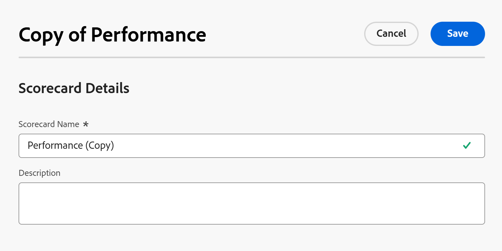

# Crear cuadro de resultados

<!--Audited: 11/2025-->

<!--DON'T DELETE, DRAFT OR HIDE THIS ARTICLE. IT IS LINKED TO THE PRODUCT, THROUGH THE CONTEXT SENSITIVE HELP LINKS.-->

<!--The highlighted information on this page refers to functionality not yet generally available. It is available only in the Preview environment for all customers. The same features will also be available in the Production environment for all customers after a week from the Preview release.    

For more information, see [Interface modernization](/help/quicksilver/product-announcements/product-releases/interface-modernization/interface-modernization.md). -->

Un cuadro de resultados mide en qué medida un proyecto se ajusta a los criterios previamente establecidos de un portafolio. Un cuadro de resultados suele reflejar la misión, los valores y las metas estratégicas de una organización.

Como administrador de portafolios, puede definir las preguntas y respuestas del cuadro de resultados para asegurarse de que sean significativas y valiosas durante la priorización y selección de proyectos.

Como administrador de [!DNL Adobe Workfront], puede crear cuadros de resultados basados en las recomendaciones de los administradores de portafolios.

Las preguntas y respuestas seleccionadas para un cuadro de resultados deben ser cuantificables a fin de proporcionar un valor de alineación para comparar distintos proyectos.

Puede crear un informe de valoración de la siguiente manera:

* Desde cero
* Al copiar una existente

## Requisitos de acceso

+++ Expanda para ver los requisitos de acceso para la funcionalidad en este artículo.

<table style="table-layout:auto"> 
 <col> 
 <col> 
 <tbody> 
  <tr> 
   <td role="rowheader">paquete de Workfront</td> 
   <td>
Workfront o Workflow Prime o superior
</td> 
  </tr> 
  <tr> 
   <td role="rowheader">Licencia de Adobe Workfront</td> 
   <td>
Estándar
 
Plan
</td> 
  </tr> 
  <tr> 
   <td role="rowheader">Configuraciones de nivel de acceso</td> 
   <td>Debe ser administrador de Workfront. </td> 
  </tr> 
 </tbody> 
</table>

Para obtener más información, consulte [Requisitos de acceso en la documentación de Workfront](/help/quicksilver/administration-and-setup/add-users/access-levels-and-object-permissions/access-level-requirements-in-documentation.md).

+++

## Crear un informe de valoración desde cero

{{step-1-to-setup}}

1. Haga clic en **[!UICONTROL Cuadros de resultados]** y luego haga clic en **[!UICONTROL Nuevo cuadro de resultados]**.

   Se abre el cuadro de diálogo **Nueva tarjeta de puntuación**.

   

1. Especifique un **[!UICONTROL Nombre de cuadro de resultados]** y una **[!UICONTROL Descripción]**.

   El nombre se muestra al asociar el cuadro de resultados con el proyecto. La descripción se muestra junto al nombre del cuadro de resultados en la lista del cuadro de resultados.

1. Haga clic en el menú desplegable **[!UICONTROL Añadir pregunta]** para abrir la sección [!UICONTROL pregunta del cuadro de resultados] y, a continuación, especifique la siguiente información para la pregunta:

   <table style="table-layout:auto"> 
    <col> 
    <col> 
    <tbody> 
     <tr> 
      <td role="rowheader">[!UICONTROL Question]</td> 
      <td>Escriba la pregunta que desee incluir en el cuadro de resultados.</td> 
     </tr> 
     <tr> 
      <td role="rowheader">[!UICONTROL Points]</td> 
      <td>Escriba el máximo de puntos posibles para esta pregunta.</td> 
     </tr> 
     <tr> 
      <td role="rowheader">[!UICONTROL Negative Points]</td> 
      <td>Seleccione esta opción para indicar que debe restarse [!DNL Workfront] del total de puntos posibles. Las puntuaciones negativas no se pueden añadir al máximo de puntos posibles de un cuadro de resultados.</td> 
     </tr> 
     <tr> 
      <td role="rowheader">[!UICONTROL Display Type]</td> 
      <td>Seleccione <strong>[!UICONTROL Value(0-100)]</strong> si desea mostrar un campo numérico en el cuadro de resultados donde los usuarios puedan especificar cualquier valor entre 0 y 100.
O bien, seleccione <strong>[!UICONTROL Drop Down]</strong> o <strong>[!UICONTROL Radio Buttons]</strong> para crear una respuesta que los usuarios puedan especificar mediante ese control. Haga clic en <strong>[!UICONTROL Add Answer]</strong> y, a continuación, escriba el <strong>[!UICONTROL Value]</strong> en puntos porcentuales para esta respuesta, en caso de que se complete. Si elige 100 %, el número de puntos asignados para esta pregunta se alcanza por completo. Si desea indicar que esta respuesta solo incluye una parte de la cantidad total de puntos asignados a esta pregunta, seleccione un valor porcentual inferior. Por ejemplo, si su pregunta tiene un valor de 10 puntos y desea que esta respuesta contenga 5 de esos puntos, elija 50 % para su valor.

      
Seleccione <strong>[!UICONTROL Default]</strong> si desea indicar que esta respuesta es la predeterminada.</strong>

     </tr> 
    </tbody> 
   </table>

1. Haga clic en **[!UICONTROL Añadir pregunta]** para añadir más preguntas y respuestas a su cuadro de resultados, siguiendo los mismos pasos.

   >[!NOTE]
   >
   >Puede reordenar las preguntas del cuadro de resultados arrastrando y soltando las preguntas en el orden correcto.

1. Haga clic en **[!UICONTROL Guardar]**.

   Esto crea el cuadro de resultados y los jefes de proyecto ahora pueden adjuntarlo a su caso comercial del proyecto.

## Copiar un informe de valoración existente

Puede crear un informe de valoración copiando y editando uno existente.

{{step-1-to-setup}}

1. Haga clic en **[!UICONTROL Cuadros de resultados]** en el panel izquierdo.
1. Seleccione un informe de valoración en la lista y, a continuación, haga clic en el icono **Copiar**  que se encuentra en la parte superior de la lista.

   Se abre la casilla **Copiar informe de valoración**.

   

1. Especifique la siguiente información:

   * **informe de valoración**: actualice el nombre del informe de valoración.  De forma predeterminada, el nombre se actualiza automáticamente según el siguiente formato:

     `Original scorecard name (Copy)`
   * **Descripción**: escriba información adicional sobre el cuadro de mandos.
1. Haga clic en **Guardar**.

   Esto crea un nuevo cuadro de resultados con la misma información que el original. Los jefes de proyecto ahora pueden adjuntarlo a su caso empresarial de proyecto.

## Aplicar un cuadro de resultados a un proyecto

Un usuario con permisos para [!UICONTROL administrar] en un proyecto puede aplicar un cuadro de resultados a un proyecto una vez que el administrador de [!DNL Workfront] haya creado el cuadro de resultados.

Se añade un cuadro de resultados a un proyecto como parte de la creación de un caso empresarial para el proyecto. Para obtener más información sobre cómo añadir un cuadro de resultados a un proyecto, consulte [Aplicar un cuadro de resultados a un proyecto y generar una puntuación de alineación](../../../manage-work/projects/define-a-business-case/apply-scorecard-to-project-to-generate-alignment-score.md).

Para obtener más información acerca de los permisos del proyecto, consulte [Compartir un proyecto en [!DNL Adobe Workfront]](../../../workfront-basics/grant-and-request-access-to-objects/share-a-project.md).

