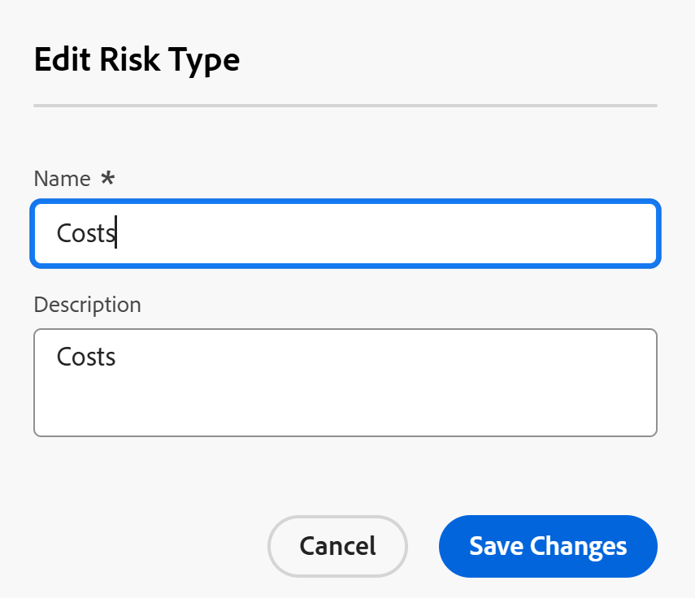

# Editar y crear tipos de riesgo

<!--Audited: 03/2025-->

<!--DON'T DELETE, DRAFT OR HIDE THIS ARTICLE. IT IS LINKED TO THE PRODUCT, THROUGH THE CONTEXT SENSITIVE HELP LINKS.-->

La información resaltada en esta página hace referencia a una funcionalidad que aún no está disponible de forma general. Solo está disponible en el entorno de vista previa para todos los clientes. Después de las versiones mensuales en Production, las mismas funciones también están disponibles en el entorno Production para los clientes que habilitaron versiones rápidas. 

Para obtener información sobre las versiones rápidas, consulte [Habilitar o deshabilitar las versiones rápidas para su organización](/help/quicksilver/administration-and-setup/set-up-workfront/configure-system-defaults/enable-fast-release-process.md). 

Adobe Workfront tiene una serie de tipos de riesgo predeterminados que puede asociar con proyectos en la fase de planificación para identificar posibles obstáculos antes de la aprobación de cualquier trabajo.

Los riesgos son posibles eventos que podrían impedir la finalización del proyecto a tiempo o dentro del presupuesto.

Además de los tipos de riesgo predeterminados, puede agregar nuevos tipos de riesgo para reflejar las necesidades de su organización.

Puede asociar tipos de riesgos con riesgos de proyecto para identificar el tipo de riesgo que podría presentar un proyecto.

## Requisitos de acceso

+++ Expanda para ver los requisitos de acceso para la funcionalidad en este artículo.

Debe tener el siguiente acceso para realizar los pasos de este artículo:

<table style="table-layout:auto"> 
 <col> 
 <col> 
 <tbody> 
  <tr> 
   <td role="rowheader">[!DNL Adobe Workfront] plan</td> 
   <td>Cualquiera</td> 
  </tr> 
  <tr> 
   <td role="rowheader">[!DNL Adobe Workfront] licencia*</td> 
   <td>
Nuevo: [!UICONTROL Standard]

   O
   
Actual: [!UICONTROL Plan]

   </td> 
  </tr> 
  <tr> 
   <td role="rowheader">Configuraciones de nivel de acceso</td> 
   <td>[!UICONTROL System Administrator]</td>
  </tr> 
 </tbody> 
</table>

*Para obtener más información sobre esta tabla, consulte [Requisitos de acceso en la documentación de Workfront](/help/quicksilver/administration-and-setup/add-users/access-levels-and-object-permissions/access-level-requirements-in-documentation.md).

+++

## Tipos de riesgos

Los tipos de riesgo son etiquetas que puede utilizar para clasificar los riesgos con fines de creación de informes.

Como administrador de [!DNL Workfront], puede crear [!UICONTROL tipos de riesgos] en el área de [!UICONTROL **Configuración**].

Después de configurar los tipos de riesgo, son universales para su sistema.

Todos los propietarios de proyecto pueden utilizar los mismos tipos de riesgo para sus proyectos.

## Editar y crear tipos de riesgo

Algunos tipos de riesgos ya están en [!DNL Workfront], de manera predeterminada.

Puede hacer lo siguiente para mejorar el número de tipos de riesgo en la instancia de Workfront:

* [Editar tipos de riesgo existentes](#edit-existing-risk-types)
* [Crear tipos de riesgos](#create-risk-types)

### Editar tipos de riesgo existentes {#edit-existing-risk-types}

{{step-1-to-setup}}

1. Haga clic en **[!UICONTROL Tipos de riesgo]**.
1. Seleccione el tipo de riesgo que desea editar.
1. Haga clic en el icono **[!UICONTROL Editar]** .

   Se abre el cuadro [!UICONTROL **Editar tipo de riesgo**].

   

   >[!TIP]
   >
   >   Puede editar la información de tipo de riesgo en línea, al hacer doble clic en el Nombre o la Descripción de un tipo de riesgo en una lista de tipos de riesgo.

1. (Opcional) Cambie el nombre y la descripción del tipo de riesgo.

   Hay un límite de 50 caracteres para los campos **[!UICONTROL Nombre]** y **[!UICONTROL Descripción]**.

1. Haga clic en **[!UICONTROL Guardar cambios].**

1. (Opcional) Para eliminar un tipo de riesgo, selecciónelo en la lista, haga clic en el icono [!UICONTROL **Eliminar**]  y, a continuación, en [!UICONTROL **Sí, eliminarlo**]. El tipo de riesgo se elimina y no se puede recuperar.

1. (Opcional) Para exportar una lista de tipos de riesgos, haga clic en el icono [!UICONTROL **Exportar**] . Puede exportar a los siguientes tipos de archivo:

   * PDF
   * Excel
   * Excel (xlsx)
   * Delimitado por tabulaciones

   >[!TIP]
   >
   >   Primero puede seleccionar un número limitado de tipos de riesgo y luego exportarlos para una lista más pequeña.

### Crear tipos de riesgos {#create-risk-types}

Puede crear tipos de riesgo, además de los predeterminados.

{{step-1-to-setup}}

1. Haga clic en **[!UICONTROL Tipos de riesgo]**.

1. Haga clic en **[!UICONTROL Nuevo tipo de riesgo]** para abrir el cuadro [!UICONTROL **Nuevo tipo de riesgo**]

   O

   Haga clic en [!UICONTROL **Agregar más tipos de riesgos**] en la esquina inferior izquierda de la lista de tipos de riesgos para agregar tipos de riesgos en línea.

   Se abre el cuadro **Nuevo tipo de riesgo**. 

   

1. Agregue un **[!UICONTROL Nombre]** (obligatorio) y una **[!UICONTROL Descripción]** (opcional) para el tipo de riesgo.

   Hay un límite de 50 caracteres para los campos **[!UICONTROL Nombre]** y **[!UICONTROL Descripción]**.

1. Haga clic en **[!UICONTROL Crear tipo de riesgo]**,

   O bien, si usó la edición en línea para agregar su tipo de riesgo, haga clic en **[!UICONTROL Introducir]** cuando haya terminado.

   >[!TIP]
   >
   >Para editar un tipo de riesgo personalizado, consulte la sección [[!UICONTROL Editar los tipos de riesgo existentes]](#edit-existing-risk-types) en este artículo.

## Adjuntar riesgos con tipos de riesgo en proyectos

Puede utilizar tipos de riesgos para etiquetar los riesgos agregados a sus proyectos.

Para obtener más información sobre cómo añadir riesgos a los proyectos, consulte [Crear y editar riesgos en proyectos](../../../manage-work/projects/define-a-business-case/create-edit-risks-on-projects.md).
