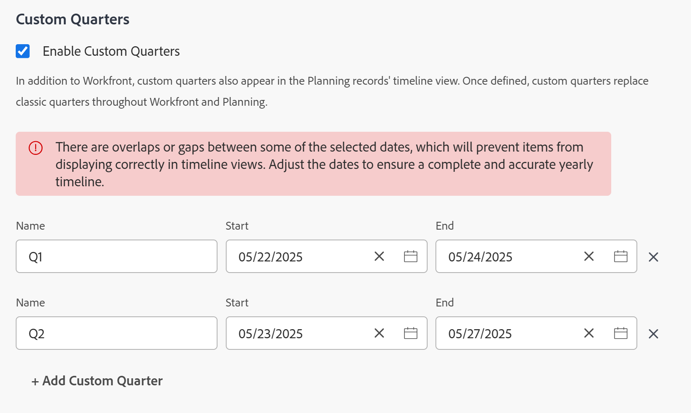

# Habilitar trimestres personalizados

<!--Audited: 03/2026-->

<!--
The highlighted information on this page refers to functionality not yet generally available. It is available only in the Preview environment for all customers. After the monthly releases to Production, the same features are also available in the Production environment for customers who enabled fast releases.    

For information about fast releases, see [Enable or disable fast releases for your organization](/help/quicksilver/administration-and-setup/set-up-workfront/configure-system-defaults/enable-fast-release-process.md). 
-->

Con fines de creación de informes, es posible que desee crear trimestres personalizados si los trimestres de su organización se basan en criterios específicos distintos de las fechas del calendario (como días laborables o días de compras).

Según los productos que haya adquirido su compañía, puede configurar el siguiente número de trimestres en el área Configuración de Workfront:

* Los clientes que solo compraron [!DNL Workfront], pueden configurar hasta ocho trimestres personalizados para su sistema [!DNL Adobe Workfront].
* Los clientes que compraron [!DNL Workfront] y [!DNL Workfront Planning], pueden configurar hasta 100 trimestres para su sistema [!DNL Workfront], que también están disponibles en [!DNL Planning].

## Requisitos de acceso

+++ Expanda para ver los requisitos de acceso para la funcionalidad en este artículo.

<table style="table-layout:auto"> 
 <col> 
 <col> 
 <tbody> 
  <tr> 
   <td>[!DNL Adobe Workfront] paquete</td> 
   <td>
Cualquiera
</td> 
  </tr> 
  <tr> 
   <td>[!DNL Adobe Workfront] licencia</td> 
   <td>
[!UICONTROL Standard]

       
[!UICONTROL Plan]
</td>
  </tr> 
  <tr> 
   <td>Configuraciones de nivel de acceso</td> 
   <td>[!UICONTROL System Administrator]</td> 
  </tr> 
 </tbody> 
</table>

Para obtener más información, consulte [Requisitos de acceso en la documentación de Workfront](/help/quicksilver/administration-and-setup/add-users/access-levels-and-object-permissions/access-level-requirements-in-documentation.md).

+++

## Configurar trimestres personalizados para su sistema [!DNL Workfront]

{{step-1-to-setup}}

1. Haga clic en **[!UICONTROL Trimestres personalizados]**.

1. Seleccione **[!UICONTROL Habilitar trimestres personalizados]**.

1. Escriba un nombre para el trimestre personalizado, como “Primer trimestre fiscal de 2021”.
1. Seleccione las fechas de inicio y finalización del trimestre personalizado.

   

1. (Opcional) Haga clic en **[!UICONTROL Add Custom Quarter]** para añadir trimestres personalizados adicionales al sistema.

   >[!IMPORTANT]
   >
   > Si su compañía compró [!DNL Workfront Planning], no puede guardar los trimestres personalizados si hay espacios o superposiciones entre los trimestres.
   >
   >Solo se permiten espacios y superposiciones entre los trimestres para [!DNL Workfront] clientes.

1. (Opcional y condicional) Si su empresa compró solo [!DNL Workfront], sin [!DNL Workfront Planning], cree un elemento de informe que haga referencia a los trimestres fiscales.

   **Ejemplo:** cree un filtro para una lista de [!UICONTROL project] e incluya la fecha planificada de finalización de un proyecto que haga referencia a los trimestres personalizados.

   

   Las referencias a “Este trimestre”, “Próximo trimestre” y “Último trimestre” se sustituyen por nuevas referencias a los trimestres personalizados.

   Para obtener información acerca de los elementos de informes, consulte [Elementos de creación de informes: filtros, vistas y agrupaciones](../../../reports-and-dashboards/reports/reporting-elements/reporting-elements-filters-views-groupings.md).

   Para obtener información acerca de cómo crear filtros, consulte [Crear o editar filtros en [!DNL Adobe Workfront]](../../../reports-and-dashboards/reports/reporting-elements/create-filters.md).
1. (Opcional y condicional) Si su empresa ha adquirido Workfront Planning y tiene acceso a [!DNL Workfront Planning], vaya a una página de tipo de registro y abra una vista de escala de tiempo. La vista muestra los nuevos trimestres personalizados.
Para obtener más información, consulte [Administrar la vista de cronología](/help/quicksilver/planning/views/manage-the-timeline-view.md).
