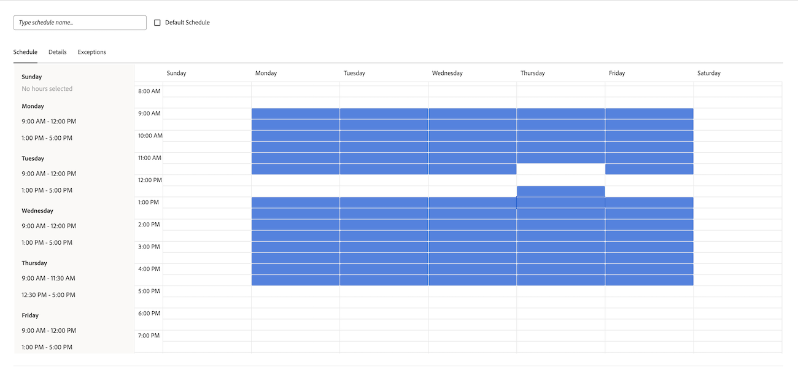

# Creación de una programación

<!--DON'T DELETE, DRAFT OR HIDE THIS ARTICLE. IT IS LINKED TO THE PRODUCT, THROUGH THE CONTEXT SENSITIVE HELP LINKS. 
Linked to Editing Users, Editing Projects, Creating and managing groups
-->

Como un [!DNL Adobe Workfront] administrador, puede definir la semana laboral utilizando los horarios. Puede asociar una programación a un usuario o proyecto. Esto permite [!DNL Workfront] para calcular las escalas de tiempo y la disponibilidad del usuario.

Cuando tiene usuarios que trabajan en zonas horarias diferentes, la creación de una programación en cada una de ellas y su asociación con esos usuarios garantizan que su trabajo se registre en [!DNL Workfront] en tiempo real y que su disponibilidad sea siempre precisa en función del momento en el que trabajen.

Para obtener información sobre cómo asociar programaciones con usuarios y proyectos, vea los siguientes artículos:

* [Edición del perfil de un usuario](../../../administration-and-setup/add-users/create-and-manage-users/edit-a-users-profile.md)
* [Editar proyectos](../../../manage-work/projects/manage-projects/edit-projects.md)

Los administradores de grupos también pueden crear programaciones asociadas a los grupos que administran. Para obtener más información, consulte [Crear y modificar las programaciones de un grupo](../../../administration-and-setup/manage-groups/work-with-group-objects/create-and-modify-a-groups-schedules.md).

Para obtener información sobre cómo usar las programaciones para ayudar a los usuarios a colaborar en [!DNL Workfront] para zonas horarias, consulte [Trabajo entre zonas horarias](../../../workfront-basics/tips-tricks-and-troubleshooting/working-across-timezones.md).

Para obtener información sobre cómo se utilizan las programaciones en la planificación de recursos, consulte [Información general sobre horarios](/help/quicksilver/administration-and-setup/set-up-workfront/configure-timesheets-schedules/schedules-overview.md) y [Resumen del Planificador de recursos](/help/quicksilver/resource-mgmt/resource-planning/get-started-resource-planner.md).

## Requisitos de acceso

Debe tener el siguiente acceso para realizar los pasos de este artículo:

<table style="table-layout:auto"> 
 <col> 
 <col> 
 <tbody> 
  <tr> 
   <td role="rowheader">plan de [!UICONTROL Adobe Workfront]</td> 
   <td>Cualquiera</td> 
  </tr> 
  <tr> 
   <td role="rowheader">[!DNL Adobe Workfront] licencia</td> 
   <td>[!UICONTROL Plan]</td> 
  </tr> 
  <tr> 
   <td role="rowheader">Configuraciones de nivel de acceso</td> 
   <td> 
Debe ser un [!DNL Workfront] administrador.
 
<b>NOTA</b>: Si todavía no tiene acceso, pregunte a su [!DNL Workfront] administrador si establece restricciones adicionales en su nivel de acceso. Para obtener información sobre cómo [!DNL Workfront] El administrador puede modificar su nivel de acceso. Consulte <a href="../../../administration-and-setup/add-users/configure-and-grant-access/create-modify-access-levels.md" class="MCXref xref">Crear o modificar niveles de acceso personalizados</a>.
 </td> 
  </tr> 
 </tbody> 
</table>

## Creación de una programación

1. Haga clic en **[!UICONTROL Menú principal]** icono  en la esquina superior derecha de [!DNL Adobe] Workfront y haga clic en **[!UICONTROL Configurar]** .
1. Clic **[!UICONTROL Horarios]**.
1. Clic **[!UICONTROL Nuevo horario]**.
1. Especifique un nombre para la programación.
1. (Opcional) Seleccione **[!UICONTROL Horario predeterminado]** para identificar esta programación como predeterminada.

   Puede haber más de una programación en [!DNL Workfront], pero solo puede tener un horario predeterminado.

   Debe haber al menos una programación en [!DNL Workfront]. Si solo tiene uno, se designa como el horario predeterminado.

   >[!NOTE]
   >
   >No puede designar una programación como predeterminada si es administrador de un grupo. Solo una [!DNL Workfront] Un administrador puede designar una programación como predeterminada para el sistema.

   

1. En el **[!UICONTROL Programación]** pestaña, seleccione una programación diaria arrastrando el contorno azul a través de bloques de horas para resaltarlos.

   Le recomendamos que seleccione 8 bloques de una hora durante un periodo de 9 horas. Este alojamiento sirve almuerzos y otras pausas.

   

1. En el **[!UICONTROL Detalles]** pestaña, especifique la siguiente información:

   <table style="table-layout:auto">
    <tr>
     <td>[!UICONTROL Grupo con acceso de administración]</td>
     <td>
Indique el grupo cuyos administradores tienen permiso para editar esta programación.

     
<b>IMPORTANTE</b>:

      <ul>
       <li>
       
Si es administrador de un grupo y crea una programación, este campo es obligatorio.

       
Como administrador de grupo, puede crear una programación sólo si está designada para un grupo o subgrupo para el que está designado como administrador.

       
Si administra un solo grupo, ese grupo se selecciona en este campo de forma predeterminada.

       
Si administra varios grupos, debe seleccionar un grupo en este campo antes de guardar la programación.
</li>
       <li>Si es un [!DNL Workfront] administrador crear una programación, este campo es opcional. Cuando crea una programación sin asociarla a un grupo, se guarda como una programación de nivel de sistema y no puede ser administrada por un administrador de grupo de ningún grupo.
       
Los programas asignados a cuentas o proyectos son visibles para todos los usuarios que pueden editar estos objetos. Esto es así tanto para las programaciones de nivel de sistema como para las de nivel de grupo.

       </li>
       
Especificar un grupo con acceso de administración para una programación no asigna la programación a los usuarios del grupo; sólo permite a los administradores del grupo editar, eliminar y copiar la programación.

       
Los administradores de grupo no pueden editar, eliminar ni copiar programaciones de nivel de sistema. Para obtener más información, consulte <a href="../../../administration-and-setup/manage-groups/group-roles/group-administrators.md" class="MCXref xref">Administradores de grupo</a>.
     </td>
    </tr>
    <tr>
     <td>[!UICONTROL Grupos con acceso de visualización]</td>
     <td>
Seleccione los grupos con acceso a [!UICONTROL View] para los que es visible esta programación.

     
Solo los usuarios de los grupos especificados aquí pueden encontrar la programación en el menú desplegable cuando la asignan a usuarios o proyectos.
</tr>
    <tr>
     <td>[!UICONTROL Zona horaria]</td>
     <td>
Seleccione el huso horario de la programación.

     
Si asocia la programación con un usuario, le recomendamos que la zona horaria de la programación coincida con la del usuario.Para obtener información sobre las zonas horarias del usuario, consulte <a href="../../../administration-and-setup/add-users/create-and-manage-users/edit-a-users-profile.md" class="MCXref xref">Editar el perfil de un usuario.
     </td>
    </tr>
   </table>

1. En el **[!UICONTROL Excepciones]** , especifique las excepciones a la programación.

   Las excepciones son días completos o medios que deben excluirse del horario, como festivos o eventos de la empresa.

   >[!NOTE]
   >
   >Si ya sabe cuáles son las excepciones de programación recurrentes, puede definir las excepciones de programación para muchos años en el futuro.

   Los días completos o parciales pueden excluirse del horario de trabajo. Haga clic en la fecha para seleccionarla como excepción y, a continuación, seleccione **[!UICONTROL Todo el día]** para indicar si la excepción es un día completo o no.

   

1. Especifique la hora de inicio y finalización para las excepciones de día parciales.

   

1. Clic **[!UICONTROL Guardar]**, luego haga clic en **[!UICONTROL Guardar] Cambios**.

1. (Opcional) Asocie la programación a un usuario.

   Para obtener más información, consulte [Edición del perfil de un usuario](../../../administration-and-setup/add-users/create-and-manage-users/edit-a-users-profile.md).

1. (Opcional) Asocie la programación a un proyecto.

   Para obtener más información, consulte [Editar proyectos](../../../manage-work/projects/manage-projects/edit-projects.md).
