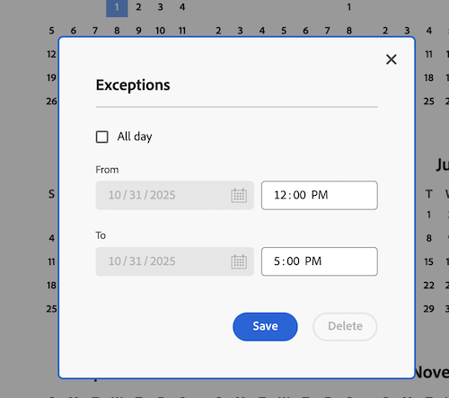

# Crear programación

<!--Audited: 01/2024-->

<!--DON'T DELETE, DRAFT OR HIDE THIS ARTICLE. IT IS LINKED TO THE PRODUCT, THROUGH THE CONTEXT SENSITIVE HELP LINKS. 
Linked to Editing Users, Editing Projects, Creating and managing groups
-->

Como administrador de [!DNL Adobe Workfront], puede definir la semana laboral con horarios. Puede asociar un horario a un usuario o proyecto. Esto permitirá que [!DNL Workfront] calcule las escalas de tiempo y la disponibilidad de los usuarios.

Al tener usuarios trabajando en zonas horarias diferentes, la creación de un horario en cada una de ellas y su asociación con esos usuarios garantiza que el trabajo se registre en [!DNL Workfront] en tiempo real y que su disponibilidad sea siempre precisa según el momento de trabajo.

Para obtener información acerca de cómo asociar horarios a usuarios y proyectos, consulte [Editar el perfil de un usuario](../../../administration-and-setup/add-users/create-and-manage-users/edit-a-users-profile.md) y [Editar proyectos](../../../manage-work/projects/manage-projects/edit-projects.md).

Los administradores de grupos también pueden crear horarios asociados a los grupos que administren. Para obtener más información, consulte [Creación y modificación de los horarios de un grupo](../../../administration-and-setup/manage-groups/work-with-group-objects/create-and-modify-a-groups-schedules.md).

Para obtener información acerca del uso de horarios para ayudar a los usuarios a colaborar en [!DNL Workfront] entre zonas horarias, consulte [Trabajar en diferentes zonas horarias](../../../workfront-basics/tips-tricks-and-troubleshooting/working-across-timezones.md).

Para obtener información acerca de cómo se usan los horarios en la planificación de recursos, consulte [Información general sobre los horarios](/help/quicksilver/administration-and-setup/set-up-workfront/configure-timesheets-schedules/schedules-overview.md) e [Información general sobre el Planificador de recursos](/help/quicksilver/resource-mgmt/resource-planning/get-started-resource-planner.md).

## Requisitos de acceso

+++ Expanda para ver los requisitos de acceso para la funcionalidad en este artículo.

<table style="table-layout:auto"> 
 <col> 
 <col> 
 <tbody> 
  <tr> 
   <td>[!DNL Adobe Workfront] paquete</td> 
   <td>
Cualquiera
</td> 
  </tr> 
  <tr> 
   <td>[!DNL Adobe Workfront] licencia</td> 
   <td>
[!UICONTROL Standard]

       
[!UICONTROL Plan]
</td>
  </tr> 
  <tr> 
   <td>Configuraciones de nivel de acceso</td> 
   <td>[!UICONTROL System Administrator]</td> 
  </tr> 
 </tbody> 
</table>

Para obtener más información, consulte [Requisitos de acceso en la documentación de Workfront](/help/quicksilver/administration-and-setup/add-users/access-levels-and-object-permissions/access-level-requirements-in-documentation.md).

+++

## Crear programación

{{step-1-to-setup}}

1. Haga clic en **[!UICONTROL Horarios]**.
1. Haga clic en **[!UICONTROL Nuevo horario]**.
1. Introduzca un nombre para el horario. 
1. (Opcional) Seleccione **[!UICONTROL Horario predeterminado]** para identificar este horario como el predeterminado.

   Es necesario tener al menos un horario en [!DNL Workfront].  Si solo tiene uno, se designará como el horario predeterminado.

   Es posible tener más de un horario, pero solo un horario predeterminado.

   >[!NOTE]
   >
   >El administrador de grupos no puede designar un horario como predeterminado. Solamente los administradores de [!DNL Workfront] pueden designar horarios como predeterminados del sistema.

   

1. En la pestaña **[!UICONTROL Horario]**, seleccione un horario diario arrastrando el contorno azul a través de bloques horarios para que se resalten.

   Se recomienda seleccionar 8 bloques de una hora para un periodo de 9 horas. Esto se adapta al almuerzo y otras pausas.

   

1. En la pestaña **[!UICONTROL Detalles]**, escriba la siguiente información:

   <table style="table-layout:auto">
    <tr>
     <td>[!UICONTROL Group with Administration Access]</td>
     <td>
Seleccione el grupo cuyos administradores tengan permisos para editar este horario.

     
<b>IMPORTANTE</b>:

      <ul>
       <li>
       
Si se trata de un administrador de grupos y crea una programación, este campo es obligatorio.

       
Como administrador de grupos, podrá crear una programación solo si estuviera designada para un grupo o subgrupo para el que esté designado como administrador.

       
En caso de administrar un solo grupo, ese grupo se selecciona en este campo de forma predeterminada.

       
En caso de administrar varios grupos, es necesario seleccionar un grupo en este campo antes de guardar la programación.
</li>
       <li>En caso de tratarse de un administrador de [!DNL Workfront] y encontrarse creando una programación, este campo es opcional. Cuando crea una programación sin asociarla a un grupo, se guarda como una programación a nivel del sistema y no puede ser administrada por un administrador de grupos de ningún grupo.
       
Los programas asignados a cuentas o proyectos son visibles para todos los usuarios que pueden editar estos objetos. Esto es así tanto para las programaciones a nivel del sistema como para las de nivel de grupo.

       </li>
       
Al especificar un grupo con acceso de administración para una programación, no se asigna la programación a los usuarios del grupo; solo permite a los administradores del grupo editar, eliminar y copiar la programación.

       
Los administradores de grupos no pueden editar, eliminar ni copiar programaciones a nivel del sistema. Para obtener más información, consulte <a href="../../../administration-and-setup/manage-groups/group-roles/group-administrators.md" class="MCXref xref">Administradores de grupos</a>.
     </td>
    </tr>
    <tr>
     <td>[!UICONTROL Groups with View Access]</td>
     <td>
Seleccione los grupos con acceso de [!UICONTROL Vista] que pueden ver esta programación.

     
Solo los usuarios de los grupos especificados aquí pueden encontrar la programación en el menú desplegable cuando la asignan a usuarios o proyectos.
</tr>
    <tr>
     <td>[!UICONTROL Time Zone]</td>
     <td>
Seleccione la zona horaria de la programación.

     
Si asocia la programación a un usuario, le recomendamos que la zona horaria de la programación coincida con la del usuario. Para obtener información sobre las zonas horarias del usuario, consulte <a href="../../../administration-and-setup/add-users/create-and-manage-users/edit-a-users-profile.md" class="MCXref xref">Editar el perfil de un usuario.
     </td>
    </tr>
   </table>

1. En la pestaña **[!UICONTROL Excepciones]**, especifique las excepciones a la programación.

   Las excepciones son días completos o medios días que deben excluirse de la programación, como los días festivos o los eventos de la compañía.

   >[!NOTE]
   >
   >Si ya sabe cuáles son las excepciones de la programación recurrentes, puede definir las excepciones de programación para muchos años en el futuro.

   Los días completos o parciales pueden excluirse del horario de trabajo. Haga clic en la fecha para seleccionarla como excepción y, a continuación, seleccione el campo **[!UICONTROL Todo el día]** para indicar si la excepción es un día completo o no.

   

1. Introduzca la hora de inicio y finalización para las excepciones de día parciales.

   

1. Haga clic en **[!UICONTROL Guardar]** y luego en **[!UICONTROL Guardar] cambios**.

1. (Opcional) Asocie la programación a un usuario.

   Para obtener más información, consulte [Editar el perfil de un usuario](../../../administration-and-setup/add-users/create-and-manage-users/edit-a-users-profile.md).

1. (Opcional) Asocie la programación a un proyecto.

   Para obtener más información, consulte [Editar proyectos](../../../manage-work/projects/manage-projects/edit-projects.md).
