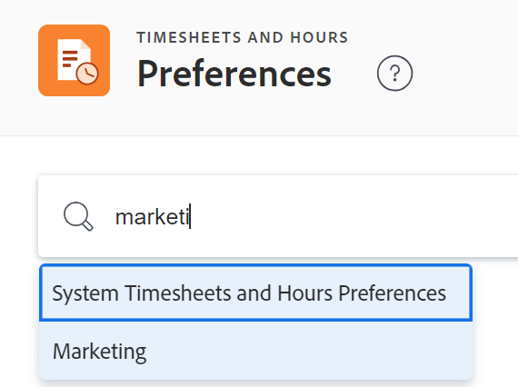

# Configurar preferencias de plantilla de horas y de horas

<!--Audited: 06/2025-->

<!--DON'T DELETE, DRAFT OR HIDE THIS ARTICLE. IT IS LINKED TO THE PRODUCT, THROUGH THE CONTEXT SENSITIVE HELP LINKS.-->

Como administrador de [!DNL Adobe Workfront], puede especificar las preferencias para plantilla de horas en [!DNL Workfront] para definir con qué elementos se pueden prepoblar las plantillas de horas y a qué elementos los usuarios pueden registrar tiempo.

>[!IMPORTANT]
>
>Además de los elementos que rellenan previamente una plantilla de horas según las condiciones descritas en este artículo, los siguientes elementos también se muestran en las plantillas de horas de forma predeterminada:
>
>* Elementos para los que ha registrado tiempo durante el lapso de tiempo de la plantilla de horas
>* Elementos anclados a la plantilla de horas
>* Elementos que busca y añade manualmente a la plantilla de horas. De forma predeterminada, los elementos añadidos manualmente están anclados.
>
>Para obtener más información, consulte [Registrar tiempo](../../../timesheets/create-and-manage-timesheets/log-time.md) y [Información general de plantillas de horas](/help/quicksilver/timesheets/timesheets/timesheets-overview.md).

Cualquier cambio que realice en las hojas de horas afectará a todas las que se creen en el futuro.

## Requisitos de acceso

+++ Expanda para ver los requisitos de acceso para la funcionalidad en este artículo.

<table style="table-layout:auto"> 
 <col> 
 <col> 
 <tbody> 
  <tr> 
   <td role="rowheader">[!DNL Adobe Workfront] plan</td> 
   <td>Cualquiera</td> 
  </tr> 
  <tr> 
   <td role="rowheader">[!DNL Adobe Workfront] licencia</td> 
   <td>
Current:[!UICONTROL Plan]

   O
   
Nuevo: estándar

   </td> 
  </tr> 
  <tr> 
   <td role="rowheader">Configuraciones de nivel de acceso</td> 
   <td>[!UICONTROL System Administrator]</td>
</tr> 
 </tbody> 
</table>

Para obtener más información, consulte [Requisitos de acceso en la documentación de Workfront](/help/quicksilver/administration-and-setup/add-users/access-levels-and-object-permissions/access-level-requirements-in-documentation.md).

+++

## Configurar plantilla de horas y preferencia de horas

{{step-1-to-setup}}

1. Haga clic en **[!UICONTROL plantilla de horas y horas]** > **[!UICONTROL Preferencias]**.

   Se muestra la página plantilla de horas y preferencia de horas.

1. (Opcional) En el cuadro de búsqueda **plantilla de horas y preferencia de horas del sistema**, empiece a escribir el nombre de un grupo y, a continuación, selecciónelo cuando se muestre en la lista.

   

   La página plantilla de horas y preferencia de horas se actualiza con las preferencias del grupo seleccionado. Las preferencias de nivel de sistema deben estar desbloqueadas para poder modificar las preferencias de nivel de grupo. Para obtener más información, consulte la sección [Desbloquear hoja de horas y preferencias de horas para grupos](#unlock-timesheet-and-hour-preferences-for-groups) en este artículo.

1. En la sección **[!UICONTROL Preferencias generales]**, configure cualquiera de las siguientes opciones:

   <table style="table-layout:auto"> 
    <col> 
    <col> 
    <tbody> 
     <tr> 
      <td role="rowheader">[!UICONTROL Log time for future dates]</td> 
      <td> 
Permite a los usuarios registrar tiempo para fechas futuras en todo el sistema en:
 
       <ul> 
        <li>Cualquier proyecto, tarea o problema en el que tenga acceso para registrar el tiempo</li> 
        <li>Sus plantillas de horas como hora general</li> 
       </ul> 
Esto resulta útil cuando los usuarios planean estar fuera de la oficina y desean registrar esas horas de antemano.
 
<b>NOTA</b>:
 
       
No puede evitar que los usuarios registren la hora en tareas o problemas que se hayan cerrado o cancelado. Solo puede evitar que los usuarios registren el tiempo en proyectos completos o inactivos. Le recomendamos que utilice filtros en listas de tareas y problemas para excluir de la visibilidad a los usuarios los que se hayan completado o cancelado.
 </td> 
     </tr>

   <tr> 
      <td role="rowheader">[!UICONTROL Assign Job Roles to hour entries manually]</td> 
      <td> 
Permite que los usuarios seleccionen manualmente cualquier rol asignado en su perfil de usuario o asignado al objeto.
 
<b>IMPORTANTE</b>:  
        <ul> 
         <li>Si deshabilita esta configuración después de asignar funciones laborales a las entradas de horas, los usuarios deben ajustar las horas registradas bajo varios roles en la pestaña [!UICONTROL Hours] del proyecto, tarea o problema.</li> 
         <li>Si el usuario no tiene una función laboral asignada en su perfil y hay una tarea asignada como [!UICONTROL Task Owner] en el cuadro de diálogo [!UICONTROL Advanced Assignments], esa función laboral aparecerá cuando el usuario registre tiempo en la tarea.</li> 
        </ul> 
 </td> 
     </tr> 
     <tr data-mc-conditions=""> 
      <td role="rowheader">[!UICONTROL Restrict timesheet editing to owners and administrators]</td> 
      <td> 
Restringir la edición a los propietarios de las plantillas de horas y a los [!DNL Workfront] administradores. Si se deshabilita esta opción, las plantillas de horas también se pueden editar:
 
       <ul> 
        <li> 
Usuarios con acceso administrativo a hojas de horas y horas en su nivel de acceso
 </li> 
        <li> 
Aprobadores de hojas de horas si “Puede editar horas” está habilitado en la hoja de horas
 </li> 
        <li> 
El administrador del responsable del parte de horas
 </li> 
       </ul> </td> 
     </tr> 
     <tr data-mc-conditions=""> 
      <td role="rowheader">[!UICONTROL Restrict hour editing to owners and administrators]</td> 
      <td>Restringir la edición al usuario que ingresó las horas y a los administradores de [!DNL Workfront]. Esta opción se aplica a la pestaña [!UICONTROL Hours] de un proyecto o de un informe de horas.</td> 
     </tr> 
    </tbody> 
   </table>

1. En la sección **[!UICONTROL Dónde pueden registrar el tiempo los usuarios]** configure cualquiera de las siguientes opciones:

   <table style="table-layout:auto">
    <tr>
        <td>[!UICONTROL Directly on projects]</td>
        <td>Permite a los usuarios registrar tiempo en el proyecto (tanto en la pestaña [!UICONTROL Updates] como en la plantilla de horas). Si los usuarios no registran el tiempo en el nivel de proyecto, estas opciones deben permanecer desmarcadas.</td>
    </tr>
    <tr>
        <td>[!UICONTROL On projects that are complete]</td>
        <td>Permite a los usuarios registrar el tiempo de un proyecto que se ha marcado como completado. Si esta opción está deshabilitada, los usuarios no podrán registrar el tiempo de trabajo que hayan completado en los proyectos en el estado [!UICONTROL Complete].</td>
    </tr>
    <tr>
        <td>[!UICONTROL On projects that are dead]</td>
        <td>Cuando esta opción está habilitada, los usuarios pueden registrar horas en los proyectos con un estado [!UICONTROL Dead].</td>
    </tr>
   </table>

1. En la sección **[!UICONTROL Rellenar previamente las hojas de tiempo]**, configure cualquiera de las siguientes opciones:

   <table style="table-layout:auto"> 
    <col> 
    <col> 
    <tbody> 
     <tr> 
      <td role="rowheader">[!UICONTROL Work that is within] &lt;number of weeks&gt; [!UICONTROL of the timesheet's work range]</td> 
      <td> 
Define el número de semanas antes y después del intervalo de fechas de la plantilla de horas que contiene las fechas de las tareas y problemas asignados al usuario.
 
      
La configuración predeterminada es 1 semana y puede ampliar este intervalo a 4 semanas.
 
      
Esto significa que la plantilla de horas se rellena previamente con tareas y problemas que tienen fechas entre cuatro semanas antes del rango de fechas de la plantilla de horas y hasta cuatro semanas después del rango de fechas de la hoja de tiempo, si selecciona 4 semanas para su rango. 
 </td> 
     </tr> 
     <tr> 
      <td role="rowheader">[!UICONTROL Tasks and issues that have been completed]</td> 
      <td>Si normalmente se asignan varios recursos a una sola tarea, recomendamos esta configuración. Esto significa que cuando un recurso registra tiempo en la tarea y la marca como completa, los otros recursos asignados a la tarea aún pueden encontrar la tarea o el problema en su hoja de tiempo para registrar sus horas.</td> 
     </tr> 
     <tr> 
      <td role="rowheader">[!UICONTROL Tasks and issues that have Planned Dates in timesheet's date range]</td> 
      <td> 
Cuando se selecciona, la plantilla de horas incluye tareas y problemas que tengan una Fecha de inicio y de finalización planificada que se encuentre dentro del intervalo de fechas de la plantilla de horas.
 </td> 
     </tr> 
     <tr> 
      <td role="rowheader"> [!UICONTROL Tasks that have Projected Dates in timesheet's date range]</td> 
      <td> 
Cuando se selecciona, la plantilla de horas incluye tareas que tengan una fecha de inicio o de finalización proyectada dentro del lapso de tiempo del proyecto, incluso si la fecha planificada del problema o tarea está fuera del rango de fechas de la plantilla de horas.
 </td> 
     </tr> 
    </tbody> 
   </table>

1. En la sección **[!UICONTROL Proyectos eliminados, tareas y problemas]**, especifique lo siguiente:

   <table style="table-layout:auto"> 
    <col> 
    <col> 
    <tbody> 
     <tr> 
      <td role="rowheader"> Al eliminar proyectos</td> 
      <td> 
       <ul> 
        <li><strong>[!UICONTROL Keep logged time already added to timesheets as general time]</strong>: Si este proyecto se restaura más tarde, las horas permanece en la plantilla de horas.</li> 
        <li><strong>[!UICONTROL Delete any logged time]</strong>: si este proyecto se restaura más tarde, el tiempo ya registrado se restaurará en el proyecto.</li> 
       </ul> </td> 
     </tr> 
     <tr> 
      <td role="rowheader">Al eliminar tareas o problemas</td> 
      <td> 
       <ul> 
        <li><strong>[!UICONTROL Move any logged time to the project]</strong> donde reside la tarea o el problema: si esta tarea o problema se restaura más tarde, el tiempo permanece en el proyecto. </li> 
        <li> 
<strong>[!UICONTROL Delete any logged time]</strong>: Si esta tarea o problema se restaura más tarde, el tiempo registrado se restaurará en la tarea o el problema.
 
Para obtener información más detallada sobre estas opciones, consulte <a href="../../../administration-and-setup/manage-workfront/manage-deleted-items/configure-how-hours-affected-when-obj-deleted-restored.md" class="MCXref xref">[!UICONTROL Configure affect] en las horas cuando se elimina y restaura un objeto</a>.
 </li> 
       </ul> </td> 
     </tr> 
    </tbody> 
   </table>

1. Haga clic en **[!UICONTROL Guardar]**.

## Desbloquear plantilla de horas y preferencias de horas para grupos

Es posible que los grupos de su organización necesiten plantillas de horas o preferencias de horas configuradas de forma diferente para sus flujos de trabajo únicos. Puede desbloquear las preferencias de todos los grupos de la organización para que puedan configurarlas ellos mismos.

Cuando una preferencia está desbloqueada y un administrador de grupo la modifica, afecta a los propietarios de las hojas de tiempo si el grupo es su grupo principal.

Para obtener información sobre cómo un administrador de grupo configura las preferencias de hojas de tiempo y horas para un grupo, consulte [Configurar la plantilla de horas y las preferencias de horas](../../../administration-and-setup/manage-groups/create-and-manage-groups/configure-timesheet-hour-preferences-group.md).

>[!NOTE]
>
>Después de que un administrador de [!DNL Workfront] desbloquee una preferencia a nivel del sistema, cualquier administrador de grupo puede configurarla y luego bloquearla para asegurarse de que todos en su grupo y los subgrupos inferiores utilicen la misma configuración. Esto es similar a la capacidad que tiene un administrador de [!DNL Workfront] para configurar y bloquear una preferencia para todos en el sistema. Para obtener más información, consulte [Bloquear o desbloquear una preferencia de hoja de tiempo y horas de un grupo](../../../administration-and-setup/manage-groups/create-and-manage-groups/lock-or-unlock-a-group-timesheet-hour-preference.md).

Para desbloquear una preferencia de proyecto de modo que los grupos puedan configurarla:

{{step-1-to-setup}}

1. El panel de navegación izquierdo, haga clic en **[!UICONTROL Plantillas de horas y horas]**, a continuación, haga clic en **[!UICONTROL Preferencias]**.

1. Realice una de las siguientes acciones:

   * Si desea que los administradores de grupo puedan configurar una preferencia para sus grupos, haga clic en la opción **desbloquear**  para desbloquearlo
   * Si desea que todos los grupos usen su configuración para una preferencia, asegúrese de que sea la opción bloqueada  (esta es la opción predeterminada).

     >[!IMPORTANT]
     >
     >Le recomendamos que se comunique con los administradores y usuarios de los grupos de todo el sistema para asegurarse de tener en cuenta todas las necesidades a la hora de configurar una preferencia bloqueada.
     >
     >Cuando la bloquea, su configuración se hereda por todos los grupos del sistema. Y si la preferencia ha estado desbloqueada durante algún tiempo, su configuración reemplaza aquellas que los administradores de grupo puedan haber realizado.

1. Haga clic en **[!UICONTROL Guardar]**.
