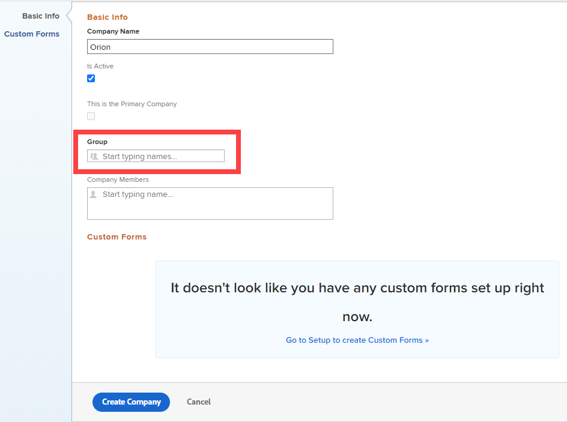

# Crear y editar compañías

<!--Audited: 01/2024-->

<!--DON'T DELETE, DRAFT OR HIDE THIS ARTICLE. IT IS LINKED TO THE PRODUCT, THROUGH THE CONTEXT SENSITIVE HELP LINKS.-->

Una compañía es una unidad organizativa de [!DNL Adobe Workfront] que puede representar a su organización, a un departamento dentro de la organización o a un cliente con el que trabaje. Puede agregar compañías a [!DNL Workfront] y utilizarlas para la planificación financiera, la generación de informes, la definición de permisos sobre objetos y la confidencialidad de la información.

## Requisitos de acceso

+++ Expanda para ver los requisitos de acceso para la funcionalidad en este artículo.

Debe tener lo siguiente para administrar compañías en [!DNL Workfront]:

<table style="table-layout:auto"> 
 <col data-mc-conditions=""> 
 <col data-mc-conditions=""> 
 <tbody> 
  <tr> 
   <td role="rowheader"> 
[!DNL Workfront] plan
 </td> 
   <td>Cualquiera</td> 
  </tr> 
  <tr> 
   <td role="rowheader"> 
[!DNL Adobe Workfront] licencia*
 </td> 
   <td>
Actual: [!UICONTROL plan]

   O
   
Nuevo: [!UICONTROL Standard]

   </td> 
  </tr> 
  <tr data-mc-conditions=""> 
   <td role="rowheader">Configuración del nivel de acceso</td> 
   <td> 
Uno de los siguientes:
 
    <ul> 
     <li> 
Nivel de acceso de [!UICONTROL System Administrator], que permite editar cualquier compañía del sistema. Para obtener más información, consulte <a href="../../../administration-and-setup/add-users/configure-and-grant-access/grant-a-user-full-administrative-access.md">Conceder acceso administrativo completo a un usuario</a>. 
 </li> 
     <li> 
Acceso administrativo para gestionar empresas, que permite editar cualquier empresa del sistema. Para obtener más información, consulte <a href="../../../administration-and-setup/add-users/configure-and-grant-access/grant-users-admin-access-certain-areas.md">Conceder a los usuarios acceso administrativo a ciertas áreas</a>.
 </li> 
    </ul> 
<b>NOTA</b>:  
     <ul> 
      <li> 
También puede administrar empresas asociadas a cualquier grupo al que esté asignado como administrador del grupo.
 </li> 
      <li> 
Para agregar y quitar usuarios del sistema [!DNL Workfront], debe tener uno de los siguientes elementos:
 
       <ul> 
        <li> 
Nivel de acceso de [!UICONTROL System Administrator]. Para obtener más información, consulte <a href="../../../administration-and-setup/add-users/configure-and-grant-access/grant-a-user-full-administrative-access.md" class="MCXref xref">Conceder acceso administrativo completo a un usuario</a>. 
 </li> 
        <li> 
En su nivel de acceso, [!UICONTROL Edit] debe estar seleccionado para la opción [!UICONTROL Users]. Además, para la configuración de [!UICONTROL Usuarios], en [!UICONTROL Ajustar la configuración] , la opción [!UICONTROL Crear] y al menos una de las dos opciones de [!UICONTROL Administración de usuarios] deben estar habilitadas. 
 
  
 
Si utiliza la opción [!UICONTROL User Admin (Usuarios del grupo)], debe ser administrador de un grupo del que sea miembro el usuario.
 </li> 
       </ul> 
Para obtener información sobre la configuración Usuarios en un nivel de acceso, consulte <a href="../../../administration-and-setup/add-users/configure-and-grant-access/grant-access-other-users.md" class="MCXref xref">Conceder acceso a usuarios</a>.
 </li> 
     </ul> 
 </td> 
  </tr> 
 </tbody> 
</table>

&#42;Para saber qué configuraciones de plan, tipo de licencia o nivel de acceso tiene, póngase en contacto con el administrador de [!DNL Workfront]. Para obtener más información, consulte [Requisitos de acceso en la documentación de Workfront](/help/quicksilver/administration-and-setup/add-users/access-levels-and-object-permissions/access-level-requirements-in-documentation.md).

+++

## Ventajas de agregar usuarios a una compañía {#benefits-of-adding-users-to-a-company}

* Puede crear el organigrama de una empresa asociando usuarios con informes directos. Solo los usuarios de la misma compañía pueden agregarse como informes directos de otro usuario de esa compañía.
* Como jefe de proyecto, puede identificar los recursos disponibles en la misma compañía.
* Puede mantener la información privada entre empresas eligiendo una o todas las opciones de configuración siguientes:

   * Los usuarios de la misma compañía pueden ver las solicitudes de los demás.

     Para obtener más información sobre cómo un administrador de [!DNL Workfront] puede conceder acceso similar a las solicitudes según la compañía de los usuarios, consulte la sección [Configurar las preferencias de tareas y problemas para todos en [!DNL Workfront]](../../../administration-and-setup/set-up-workfront/configure-system-defaults/set-task-issue-preferences.md#changing-task-and-issue-preferences) en el artículo [Configurar las preferencias de tareas y problemas en todo el sistema](../../../administration-and-setup/set-up-workfront/configure-system-defaults/set-task-issue-preferences.md).

     Para obtener más información sobre cómo un administrador de grupo puede conceder acceso similar a las solicitudes según la compañía de los usuarios, vea [Configurar las preferencias de tareas y problemas para un grupo](../../../administration-and-setup/manage-groups/create-and-manage-groups/configure-task-issue-preferences-group.md).

   * Los usuarios solo pueden ver las colas de solicitudes asociadas a sus empresas. Para obtener más información sobre cómo restringir la visibilidad de una cola de solicitudes, vea [Proporcionar acceso a las colas de solicitudes](../../../manage-work/requests/create-and-manage-request-queues/provide-access-to-request-queues.md).
   * Puede restringir el acceso de los usuarios únicamente a los usuarios de su empresa o compañía y de la compañía principal. Para obtener información acerca de la funcionalidad principal de la compañía con respecto a la privacidad del usuario, vea [Crear o modificar niveles de acceso personalizados](../../../administration-and-setup/add-users/configure-and-grant-access/create-modify-access-levels.md).
   * Los usuarios pueden restringir las actualizaciones que realizan en los elementos para que solo los usuarios de su compañía puedan verlos. Para obtener más información acerca de cómo hacer que una actualización sea privada para una compañía, vea [Trabajo de actualización](../../../workfront-basics/updating-work-items-and-viewing-updates/update-work.md).

## Crear o editar una compañía en [!DNL Workfront] {#create-or-edit-a-company-in-workfront}

No hay límite en el número de compañías que puede agregar. Sin embargo, recomendamos que limite el número de compañías que utiliza debido a problemas que pueden producirse con los permisos de objetos; una fragmentación excesiva podría interferir con la visibilidad de los usuarios de los elementos de trabajo.

De manera predeterminada, la compañía asociada con su instancia de [!DNL Workfront] ya se ha creado en su sistema de [!DNL Workfront] y es la compañía principal de su organización. Tiene el mismo nombre que el nombre del cliente. Para obtener más información acerca de la información de sus clientes en [!DNL Workfront], vea [Configurar información básica para su sistema](../../../administration-and-setup/get-started-wf-administration/configure-basic-info.md).

Para agregar o editar una compañía:

{#step-1-to-setup}

1. Haga clic en **[!UICONTROL Compañías]**.

   Se muestra una lista de empresas.
1. Si va a agregar una compañía, haga clic en **[!UICONTROL Nueva compañía]**.

   O

   Si estás editando una empresa existente, selecciónela y luego haz clic en **[!UICONTROL Editar]** en la parte superior de la lista de empresas.

1. Actualice la siguiente información:

   <table style="table-layout:auto"> 
    <col> 
    <col> 
    <tbody> 
     <tr> 
      <td role="rowheader">Sección [!UICONTROL Información básica]</td> 
      <td> 
       <ul> 
        <li> 
<b>[!UICONTROL Nombre de la compañía]</b>: escriba un nombre para la compañía.
 </li> 
        <li> 
<b>[!UICONTROL Está Activo]</b>: cuando esta opción está habilitada, los usuarios pueden encontrar la compañía y adjuntarla a los proyectos que creen y editen. No se puede adjuntar una empresa inactiva a los proyectos. Esta opción está habilitada de forma predeterminada.
 </li> 
        <li> 
<b>[!UICONTROL Esta es la compañía principal]</b>: asigna la compañía como compañía principal de su organización. La compañía principal suele representar su cuenta de [!DNL Workfront] donde trabajan la mayoría de los usuarios.
 
Puede tener una compañía o ninguna compañía designada como compañía primaria, pero no puede tener varias compañías designadas como compañías primarias. Para obtener más información, vea <a href="../../../administration-and-setup/add-users/configure-and-grant-access/create-modify-access-levels.md" class="MCXref xref">Crear o modificar niveles de acceso personalizados</a>.
 
<b>NOTA</b>: Al modificar sus niveles de acceso, puede restringir a los usuarios para que vean otros usuarios: solo en su compañía principal, o en su compañía asociada y en la compañía principal. Para obtener información acerca de cómo funciona la compañía principal con los niveles de acceso de los usuarios, vea <a href="../../../administration-and-setup/add-users/configure-and-grant-access/create-modify-access-levels.md" class="MCXref xref">Crear o modificar niveles de acceso personalizados</a>.
 </li> 
        <li> 
<b>[!UICONTROL Group]</b>: si hay un grupo que hace negocios con la compañía, puede agregar el nombre del grupo aquí. Esto resulta útil para los administradores de grupos que necesitan informar y administrar todas las compañías con las que hacen negocios sus grupos.
 
<b>IMPORTANTE</b>: Si no asocia el grupo que trabajará con esta compañía, los administradores del grupo no podrán tener acceso a la compañía a menos que tengan acceso administrativo a las compañías de su nivel de acceso. Para obtener información acerca de cómo se concede este acceso, vea <a href="../../../administration-and-setup/add-users/configure-and-grant-access/grant-users-admin-access-certain-areas.md" class="MCXref xref">Conceder a los usuarios acceso administrativo a ciertas áreas</a>.
 
Empiece a escribir el nombre del grupo y, a continuación, presione <strong>[!UICONTROL Entrar]</strong> cuando aparezca.
 
Cuando asigna un grupo a una compañía, los administradores del grupo obtienen acceso a [!UICONTROL Administrar]. Para obtener más información, consulte <a href="#group-administrators-and-companies" class="MCXref xref">Administradores de grupos y empresas</a> en este artículo.
 </li> 
        <li> 
<b>[!UICONTROL Miembros de la compañía]</b>: agregue usuarios existentes a la compañía. Al hacerlo, asocia estos usuarios con esta compañía.
 
No hay límite en cuanto a la cantidad de usuarios que asocia con una empresa, pero un usuario no puede asociarse con más de una empresa.
 </li> 
       </ul> </td> 
     </tr>
     <tr> 
      <td role="rowheader">Sección [!UICONTROL Custom Forms]</td> 
      <td> 
Si hay campos que desea agregar a su compañía que no están disponibles en [!DNL Workfront], puede crear un formulario personalizado y asociarlo a su compañía. 
 
Puede adjuntar este formulario a su empresa seleccionándolo en el menú desplegable. En el menú solo se muestran los formularios personalizados activos.
 
<strong>Nota:</strong> Las características de formulario personalizadas avanzadas, como los campos de búsqueda externa y los campos nativos de Workfront, solo están disponibles cuando abre el registro de compañía en la página de detalles, no en el cuadro de diálogo Editar compañía. (En la lista de empresas, haga clic en el nombre de la empresa para abrir los detalles).
 
 Para obtener información sobre cómo crear formularios personalizados, consulte <a href="../../../administration-and-setup/customize-workfront/create-manage-custom-forms/create-or-edit-a-custom-form.md" class="MCXref xref">Crear o editar un formulario personalizado</a>. 
 </td>
     </tr> 
    </tbody> 
   </table>

1. (Condicional) Si va a crear una compañía, haga clic en **[!UICONTROL Crear compañía]**.

   O

   Si está editando una compañía existente, haga clic en **[!UICONTROL Guardar cambios]**.

## Administrar suscripciones a compañías

Para obtener información acerca de cómo administrar suscripciones para una compañía existente, consulte [Administrar suscripciones a compañías](../../../administration-and-setup/set-up-workfront/organizational-setup/manage-company-memberships.md).

## Administrar tarifas de facturación

Para obtener información sobre cómo anular las tarifas de facturación en el nivel de compañía, consulte [Anular tarifas de facturación de rol en el nivel de compañía](/help/quicksilver/administration-and-setup/set-up-workfront/organizational-setup/override-job-role-billing-rates-company-level.md).

## Descripción general del uso compartido de objetos con empresas

Ciertos permisos están disponibles para los usuarios asociados con una compañía, como se explica en la sección [Ventajas de agregar usuarios a una compañía](#benefits-of-adding-users-to-a-company). Además de estos permisos, puede permitir a los usuarios permisos para ver, contribuir o editar objetos en [!DNL Workfront] compartiendo el objeto con su compañía.

En lugar de compartir un objeto con un usuario individual a la vez, puede compartirlo con toda su compañía. Cada usuario de la compañía tiene los mismos permisos en ese objeto.

Para obtener más información acerca de cómo compartir objetos, vea [Información general sobre los permisos de uso compartido en objetos](../../../workfront-basics/grant-and-request-access-to-objects/sharing-permissions-on-objects-overview.md).

## Administradores de grupo y empresas {#group-administrators-and-companies}

Cuando un administrador de [!DNL Workfront] asigna un grupo a una compañía, los administradores del grupo obtienen acceso de [!UICONTROL Administrar] a la compañía en [!UICONTROL Configuración]. Esto incluye acceso a la página [!UICONTROL Compañías] en [!UICONTROL Configuración], donde pueden ver y administrar la compañía asociada con su grupo.

Con este acceso a la página [!UICONTROL Compañías], un administrador de grupo puede asignar un grupo a una compañía, pero debe ser una compañía que el administrador de grupo haya creado. Si el nivel de acceso del administrador del grupo no está configurado con acceso administrativo a las empresas, el campo [!UICONTROL Grupo] es necesario cuando el administrador del grupo crea la empresa; su título en negrita indica lo siguiente:

Para obtener información sobre cómo los usuarios obtienen acceso administrativo a las compañías en su nivel de acceso, vea [Conceder acceso administrativo a los usuarios a ciertas áreas](../../../administration-and-setup/add-users/configure-and-grant-access/grant-users-admin-access-certain-areas.md).

Para obtener información sobre cómo administrar una compañía en el área [!UICONTROL Configuración], consulte [Crear o editar una compañía en [!DNL Workfront]](#create-or-edit-a-company-in-workfront) en este artículo.
