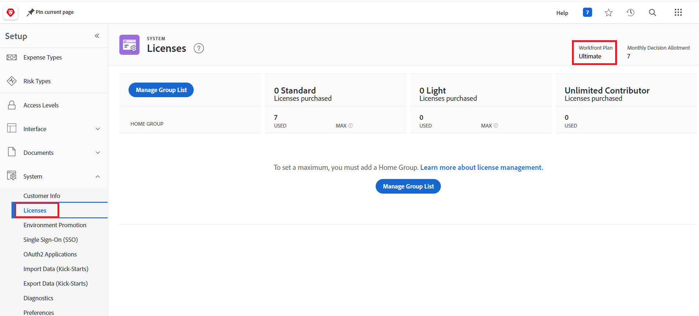

# Preguntas frecuentes sobre la promoción del entorno

Las siguientes preguntas frecuentes sobre la promoción del entorno son:

## ¿Se admite la promoción entre dominios?

### Respuesta

Actualmente no se admite la promoción de entornos entre dominios. Debe promocionar entre entornos del mismo dominio.

## ¿Cómo podemos averiguar si nuestra instancia de Workfront tiene una licencia Prime o Ultimate?

### Respuesta

* Un administrador de Workfront puede localizar la licencia de su organización.

  1. Haga clic en el icono **[!UICONTROL Menú principal]**  en la esquina superior derecha de Adobe Workfront o (si está disponible), haga clic en el icono **[!UICONTROL Menú principal]**  en la esquina superior izquierda y, a continuación, haga clic en **[!UICONTROL Configurar]** .
  1. Haga clic en **Sistema** en el panel izquierdo.
  1. Para ver su plan de Workfront, seleccione **Licencias**.
El plan se muestra cerca de la esquina superior derecha de la página.
     

  O
* Póngase en contacto con su representante de cuentas de Workfront.

## ¿La promoción del entorno es bidireccional?

### Respuesta

Sí. Por ejemplo, puede promocionar de Zona protegida a Producción o de Producción a Zona protegida.

## ¿Se admite el uso compartido?

### Respuesta

No, el uso compartido no es compatible actualmente.

## ¿Está disponible la reversión del paquete?

### Respuesta

La reversión del paquete está disponible para el paquete más reciente, en un plazo de 24 horas desde la instalación del paquete.

## ¿Habrá una opción para omitir la promoción de componentes individuales? Donde existen las opciones `Use Existing`, `Overwrite` y `Save with a new Name`&quot;, ¿se puede añadir `Skip` para que pueda omitir la promoción de parámetros individuales?

### Respuesta

* &quot;Usar existente&quot; es equivale a &quot;omitir&quot; o ignorar la implementación, porque se asigna al objeto existente en el entorno de destino y no realiza ningún cambio.
* Para omitir objetos, se recomienda eliminar cualquier objeto que no desee instalar del paquete de promoción o directamente del entorno de origen. Después de quitar los objetos, vuelva a montar el paquete.
