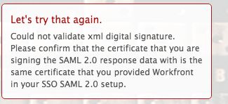

# Mensaje de error: No se pudo validar la firma digital XML

## Problema

No puede establecer correctamente una conexión con ADFS.

>[!NOTE]
>
>Si establece una conexión de prueba satisfactoria y sigue teniendo problemas, es posible que tenga asignaciones de atributos incorrectas o problemas con los identificadores de federación. Póngase en contacto con el Servicio de atención al cliente si tiene alguna pregunta.

## Requisitos de acceso

+++ Expanda para ver los requisitos de acceso para la funcionalidad en este artículo.

<table style="table-layout:auto"> 
 <col> 
 <col> 
 <tbody> 
  <tr> 
   <td>[!DNL Adobe Workfront] paquete</td> 
   <td>
Cualquiera
</td> 
  </tr> 
  <tr> 
   <td>[!DNL Adobe Workfront] licencia</td> 
   <td>
Estándar

       
Plan
</td>
  </tr> 
  <tr> 
   <td>Configuraciones de nivel de acceso</td> 
   <td>[!UICONTROL System Administrator]</td> 
  </tr> 
 </tbody> 
</table>

Para obtener más información, consulte [Requisitos de acceso en la documentación de Workfront](/help/quicksilver/administration-and-setup/add-users/access-levels-and-object-permissions/access-level-requirements-in-documentation.md).

+++

## Causa 1: el certificado es incorrecto

### Solución

Recupere manualmente el certificado de firma del servidor ADFS:

1. En [!DNL Windows], haga clic en **[!UICONTROL Inicio]** > **[!UICONTROL Administración]** > **[!UICONTROL Administración de ADFS 2.0]**.\
   Aparece el cuadro de diálogo Administración de ADFS 2.0.

1. Seleccione **[!UICONTROL Relación de confianza]** > **[!UICONTROL Confianzas de usuario de confianza]** en el panel izquierdo.

1. Haga clic con el botón derecho en **[!UICONTROL Confianza del usuario de confianza]** y seleccione **[!UICONTROL Propiedades]**.

1. Haga clic en la pestaña **[!UICONTROL Firma]**.
1. Haga clic en el nombre del certificado de firma y luego haga clic en **[!UICONTROL Ver]**.
1. Haga clic en Copiar a **[!UICONTROL archivo]**... y seleccione **[!UICONTROL Siguiente]**.

1. Seleccione **[!UICONTROL Base-64 codificado x.509 (CER)]**, y haga clic en **[!UICONTROL Siguiente]**.

1. Especifique el nombre de archivo y haga clic en **[!UICONTROL Siguiente]**.
1. Haga clic en **[!UICONTROL Finalizar]**.
1. En [!DNL Adobe Workfront], vaya a **[!UICONTROL Configuración]** > **[!UICONTROL Sistema]** > **[!UICONTROL Inicio de sesión único (SSO)]** y cargue manualmente el Certificado de firma.

## Causa 2: el certificado se firma mediante DSA cuando [!DNL Workfront] espera una firma RSA

### Solución

Vuelva a crear el certificado y utilice la firma RSA en lugar del DSA.

## Causa 3: los datos XML son incorrectos

### Solución

Volver a exportar y volver a importar los metadatos XML desde el sistema de administración de ADFS.

## Causa 4: no se pudo realizar la solicitud debido a un error del lado de SAML

### Solución

Póngase en contacto con su proveedor de SAML.
