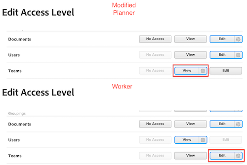

# Los administradores de grupo deben tener un acceso mayor que los que administran

Si un administrador de grupo tiene permisos en su nivel de acceso inferiores a los que administra, no podrá ver, modificar ni asignar niveles de acceso inferiores.

## Problema

Si a un administrador de grupos se le asignase un nivel de acceso de Planificador modificado con permisos de Visualización para Teams, pero a ciertos usuarios se les asignase un nivel de acceso de Trabajador con permisos de Edición para Teams, el administrador de grupos no podrá interactuar con el nivel de acceso de Trabajador modificado.

>[!NOTE]
>
>Esta lógica también se aplica al menú desplegable Ajustar la configuración. Ambos niveles de acceso podrán tener acceso de Edición, pero la configuración del menú desplegable Ajustar la configuración deberá ser superior para el administrador de grupos.
> 

## Solución

Los administradores de grupos deben tener permisos más altos en todas las áreas del nivel de acceso que los de aquellos que administran.
