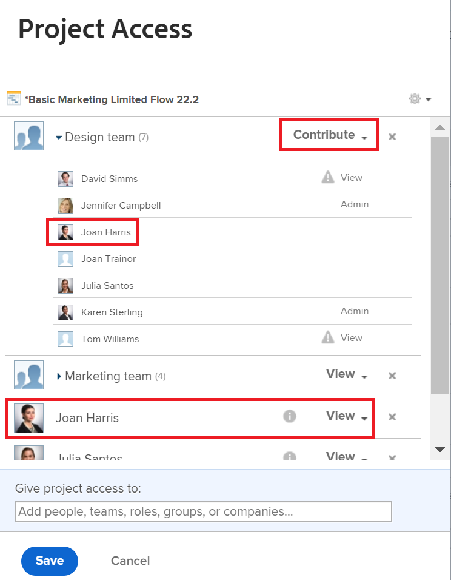

# Al compartir, se muestra más de un permiso

## Pregunta

La ventana Uso compartido muestra dos permisos diferentes para un usuario. ¿Cuál se está utilizando?

## Respuesta

Los usuarios tienen el permiso más alto mostrado en la pantalla para compartir. Para obtener más información acerca de los permisos, vea el artículo [Información general sobre los permisos de uso compartido en objetos](../../workfront-basics/grant-and-request-access-to-objects/sharing-permissions-on-objects-overview.md).

