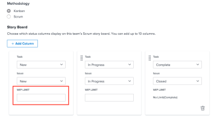

# Configurar [!UICONTROL Kanban]

<!--Audited: 12/2023-->

Puede crear un equipo ágil en [!DNL Adobe Workfront] tal como se describe en [Crear un equipo ágil](../../agile/get-started-with-agile-in-workfront/create-an-agile-team.md). Al crear un equipo ágil, puede elegir la metodología que utiliza el equipo para completar su trabajo. Puede elegir entre las siguientes opciones:

* Scrum
* Kanban

En este artículo se describe cómo configurar los ajustes de un equipo Kanban. Después de crear un equipo ágil y elegir la metodología Kanban, puede consultar este artículo para actualizar la siguiente configuración:

* Si las historias se estiman en puntos o en horas
* Las columnas de estado del tablero de historias de Agile
* Campos adicionales para mostrar en tarjetas de historia en el panel de historia ágil
* Límite de trabajo en curso (WIP)
* Cómo añadir automáticamente historias desde el registro de asuntos pendientes
* Cuánto tiempo permanecen las tarjetas en el tablero Kanban

Para obtener información sobre cómo configurar un equipo de Scrum, consulte [Configurar Scrum](../get-started-with-agile-in-workfront/configure-scrum.md).

## Requisitos de acceso

+++ Expanda para ver los requisitos de acceso para la funcionalidad en este artículo.

<table style="table-layout:auto"> 
 <col> 
 </col> 
 <col> 
 </col> 
 <tbody> 
  <tr> 
   <td role="rowheader">paquete de Adobe Workfront</td> 
   <td> 
Cualquiera
 </td> 
  </tr>

<tr> 
   <td role="rowheader">Licencia de Adobe Workfront</td> 
   <td> 
Estándar
 
   
Trabajo o superior
 </td> 
  </tr>

<tr> 
   <td role="rowheader">Configuraciones de nivel de acceso</td> 
   <td> 
Editar acceso a Equipos
  </td> 
  </tr>

</tbody> 
</table>

Para obtener más información sobre el contenido de esta tabla, consulte [Requisitos de acceso en la documentación de Workfront](/help/quicksilver/administration-and-setup/add-users/access-levels-and-object-permissions/access-level-requirements-in-documentation.md).

+++

## Configure si las historias se calculan en puntos o en horas

Puede configurar las historias para que se estimen mediante puntos o horas.

Para configurar cómo se calculan las historias para su equipo ágil:

{{step1-to-team}}

1. Haga clic en el icono **[!UICONTROL Cambiar de equipo]** y, a continuación, seleccione un nuevo equipo en el menú desplegable o busque un equipo en el cuadro de búsqueda.
1. Seleccione el equipo ágil que desea administrar.
1. Haga clic en el menú **[!UICONTROL Más]**  y luego seleccione **[!UICONTROL Editar]**.

   

1. En la sección **[!UICONTROL Agile]**, en el área **[!UICONTROL Estimar historias en]**, seleccione si desea usar puntos u horas para estimar el tamaño (carga de trabajo) de las historias. Si selecciona Puntos, especifique cuántas horas son iguales a 1 punto. (El valor predeterminado es 1 punto = 8 horas). Número de horas planificadas que se añaden a la historia.

   **Ejemplo:** si ha seleccionado calcular historias en puntos y 1 punto equivale a 8 horas, y una historia se estima en 3 puntos, se añaden 24 horas planificadas a la historia.

1. Haga clic en **[!UICONTROL Guardar cambios]**.

## Configurar columnas de estado en el panel de historias ágiles

Puede definir los estados que existen en el panel de historias para el equipo ágil. Estos son los únicos estados que se muestran en el panel de historias.

Para definir los estados disponibles para el tablero de historia asociado con el equipo Agile:

{{step1-to-team}}

1. Haga clic en el icono **[!UICONTROL Cambiar de equipo]**  y, a continuación, seleccione un nuevo equipo en el menú desplegable o busque un equipo en la barra de búsqueda.

1. Seleccione el equipo ágil que desea administrar.
1. Haga clic en el menú **[!UICONTROL Más]** y luego seleccione **[!UICONTROL Editar]**.

   

1. En la sección **[!UICONTROL Agile]**, busque el área **[!UICONTROL Tablero de historias]**.

1. (Opcional) Haga clic en **[!UICONTROL Añadir columna]** para añadir una columna de estado adicional al tablero de historia.
1. (Opcional) Arrastre cualquier columna de estado con el indicador de arrastrar y soltar para reordenar las columnas de estado en el tablero de historias. La primera columna no se puede mover y no se puede arrastrar otra columna delante de la primera.

   

1. Seleccione los estados de las tareas.

   >[!IMPORTANT]
   >
   >Solo se pueden seleccionar los estados bloqueados en todo el sistema. No se pueden seleccionar estados específicos de grupos. El estado de la primera columna siempre corresponde a **[!UICONTROL Nuevo]**.

   Puede añadir estados personalizados si el administrador de [!DNL Workfront] los ha configurado. Para obtener más información, consulte [Crear o editar un estado](../../administration-and-setup/customize-workfront/creating-custom-status-and-priority-labels/create-or-edit-a-status.md).

1. Haga clic en **[!UICONTROL Guardar cambios]**.

## Configurar campos adicionales para que se muestren en las tarjetas de historia en el tablero de historia de Agile

Cuando se añaden campos a las tarjetas de historia, los campos se muestran cuando se rellena el campo y son de solo lectura.

De forma predeterminada, los siguientes tipos de datos se muestran en la tarjeta de historia para tareas y problemas:

* Nombre de la historia con un vínculo directamente a la tarea o al problema
* El nombre del proyecto con un vínculo directamente al proyecto
* Este vínculo solo se muestra para artículos, no para subtareas
* La descripción de la tarea o el problema
* Compromiso actual
* Vea y edite el porcentaje completado ajustando el porcentaje completado en sí o ajustando el número de puntos u horas que se han completado
* Usuarios asignados

Se pueden mostrar datos adicionales (incluidos datos personalizados) en las tarjetas de historias. Es posible que desee mostrar campos adicionales en las tarjetas de historias por varios motivos. Por ejemplo, es posible que desee mostrar el ID de cliente si está trabajando en artículos para varios clientes dentro de la iteración o puede que desee mostrar la Fecha de inicio o de finalización del proyecto.

>[!NOTE]
>
>Si utiliza un campo personalizado en una tarjeta de historia, no puede contener un punto (o una coma) en el nombre.

Para configurar las tarjetas de historia asignadas al equipo Agile para que muestren campos adicionales:

{{step1-to-team}}

1. Haga clic en el icono **[!UICONTROL Cambiar de equipo]**  y, a continuación, seleccione un nuevo equipo en el menú desplegable o busque un equipo en la barra de búsqueda.

1. Seleccione el equipo ágil que desea administrar.
1. Haga clic en el menú **[!UICONTROL Más]** y luego seleccione **[!UICONTROL Editar]**.

   

1. En la sección **[!UICONTROL Agile]**, busque el nombre de un campo para localizarlo.

   

1. Seleccione el nombre del campo que desee añadir.
1. Escriba **[!UICONTROL Nombre para mostrar]** para que el campo se muestre en la historia o en la tarjeta del problema.
1. Haga clic en **[!UICONTROL Guardar cambios]**.

## Configurar el límite de trabajo en curso (WIP)

Al definir el límite de trabajo en curso de un equipo Kanban, puede controlar el número de elementos en los que trabaja el equipo actualmente, limitando el número de tareas que pueden aparecer en la columna [!UICONTROL Nuevo] o [!UICONTROL En curso] del tablero [!UICONTROL Kanban].

Después de configurar el límite de trabajo en curso para un equipo Kanban, puede ver el límite de trabajo en curso y actualizarlo desde el tablero de historias de Agile de [!UICONTROL Kanban], tal como se describe en [Administrar el límite de trabajo en curso (WIP) en el tablero [!UICONTROL Kanban]](../../agile/use-kanban-in-an-agile-team/work-in-progress-limit-on-the-kanban-board.md).

Para limitar el trabajo en curso para el equipo Kanban:

{{step1-to-team}}

1. Haga clic en el icono **[!UICONTROL Cambiar de equipo]**  y, a continuación, seleccione un nuevo equipo en el menú desplegable o busque un equipo en la barra de búsqueda.

1. Seleccione el equipo Kanban que desea gestionar.
1. Haga clic en el menú **[!UICONTROL Más]**  y luego seleccione **[!UICONTROL Editar]**.

   

1. En la sección **[!UICONTROL Agile]**, en el apartado **[!UICONTROL Metodología]**, compruebe que Kanban esté seleccionado.

1. En la sección **[!UICONTROL Tablero de historias]**, en el campo **[!UICONTROL Límite de trabajo en curso]**, especifique el número máximo de elementos permitidos en cada columna del tablero de historias de Agile de [!UICONTROL Kanban]. Puede establecer un límite diferente para cada columna. El límite máximo que puede establecer para cada columna es 100.
Cuando se establece, el límite de trabajo en curso muestra un mensaje de advertencia en el tablero de historias [!UICONTROL Kanban] de Agile cada vez que se supera el límite de cualquier columna del tablero de historias. Este mensaje de advertencia se muestra solo la primera vez que se supera el límite de trabajo en curso. Este mensaje de advertencia no se muestra en ninguna columna cuyo estado sea igual a [!UICONTROL Completado].
El límite de trabajo en curso es simplemente una advertencia visual y no limita a su equipo para tener más elementos en una sola columna que el límite establecido.

   

1. Haga clic en **Guardar cambios**.

## Configurar la adición automática de historias del registro de asuntos pendientes

<!-- this functionality needs to be verified-->

Puede configurar historias del registro de asuntos pendientes para que se añadan automáticamente a la primera columna del tablero [!UICONTROL Kanban] inmediatamente después de que se mueva un elemento de esa columna.

{{step1-to-team}}

1. Haga clic en el icono **[!UICONTROL Cambiar de equipo]**  y, a continuación, seleccione un nuevo equipo en el menú desplegable o busque un equipo en la barra de búsqueda.

1. Seleccione el equipo Kanban que desea gestionar.
1. Haga clic en el menú **[!UICONTROL Más]**  y luego seleccione **[!UICONTROL Editar]**.

   

1. Seleccione **[!UICONTROL Añadir automáticamente la historia siguiente del registro de asuntos pendientes]** para configurar que el siguiente elemento del registro de asuntos pendientes se añada automáticamente a la columna **[!UICONTROL Nuevo]** cuando se mueva un elemento fuera de la columna **[!UICONTROL En curso]**.

   Los usuarios deben habilitar la configuración **Mostrar registro de asuntos pendientes** en el tablero [!UICONTROL Kanban] para que esta funcionalidad sea efectiva. Cuando los usuarios habilitan la configuración [!UICONTROL Mostrar registro de asuntos pendientes] en el [!UICONTROL tablero Kanban], se lleva a cabo la siguiente funcionalidad:

   Cada vez que una historia se mueve de la columna [!UICONTROL En curso] a una columna del tablero de historias que representa un estado [!UICONTROL Completado] (o un estado que equivale a [!UICONTROL Completado]), una historia de la columna Registro de asuntos pendientes se mueve automáticamente a la columna [!UICONTROL Nuevo] del [!UICONTROL tablero Kanban].
Cuando se añade desde el registro de asuntos pendientes, la historia con la prioridad más alta se añade al tablero de historias.

1. Haga clic en **[!UICONTROL Guardar cambios]**.

## Configurar cuánto tiempo permanecen las tarjetas en el tablero [!UICONTROL Kanban]

Puede elegir cuánto tiempo permanecerán las tarjetas completadas en el tablero [!UICONTROL Kanban]. Se puede acceder a las tareas que no están en el tablero [!UICONTROL Kanban] en su proyecto original.

{{step1-to-team}}

1. (Opcional) Haga clic en el icono **[!UICONTROL Cambiar de equipo]**  y, a continuación, seleccione un nuevo equipo Kanban en el menú desplegable o busque un equipo en la barra de búsqueda.
1. Seleccione el equipo Kanban.
1. Haga clic en el menú **[!UICONTROL Más]**  y luego seleccione **[!UICONTROL Editar]**.

   

1. En el menú desplegable **[!UICONTROL Número de días que las tarjetas completadas permanecen en el tablero Kanban]**, seleccione un valor.

   Puede elegir un número de 1 a 30 días.
1. Haga clic en **[!UICONTROL Guardar cambios]**.
