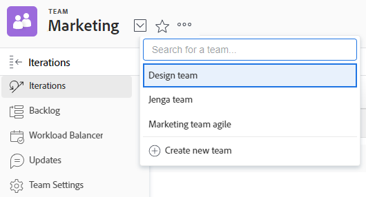

# Crear un equipo ágil

<!--Audited: 01/2024-->

[!DNL Adobe Workfront] permite que los equipos de Agile completen el trabajo de forma incremental y organizada.

Cualquier usuario de la organización puede ver el equipo Agile y todos los componentes Agile del equipo, incluidos el registro de pendientes, las iteraciones, el guion gráfico y las historias individuales. Sin embargo, solo los miembros del equipo con acceso de [!UICONTROL Editar] pueden realizar cambios en el trabajo asignado al equipo.

[!DNL Workfront] admite las siguientes metodologías Agile:

* **[!UICONTROL Scrum]**: los equipos tienen un trabajo pendiente que debe completarse. Cuando el equipo está listo para trabajar en una parte específica del trabajo, el trabajo se mueve del registro de pendientes a una iteración. Para obtener información más detallada sobre cómo administrar un equipo de Scrum, consulta [Scrum en un equipo Agile](../../agile/use-scrum-in-an-agile-team/scrum-in-an-agile-team.md).

* **[!UICONTROL Kanban]:** Los equipos mueven el trabajo en la vista Kanban a través de estados predeterminados. Los estados predeterminados son: registro de pendientes, en proceso y listo. Para obtener información más detallada sobre cómo administrar un equipo Kanban, consulte [Kanban en un equipo Agile](../../agile/use-kanban-in-an-agile-team/using-kanban-in-an-agile-team.md).

## Requisitos de acceso

+++ Expanda para ver los requisitos de acceso para la funcionalidad en este artículo.

<table style="table-layout:auto"> 
 <col> 
 </col> 
 <col> 
 </col> 
 <tbody> 
  <tr> 
   <td role="rowheader">paquete de Adobe Workfront</td> 
   <td> 
Cualquiera
 </td> 
  </tr> 
  <tr> 
   <td role="rowheader">Licencia de Adobe Workfront</td> 
   <td> 
Estándar

   
Plan para crear un nuevo equipo Agile

  
Trabaje o superior para convertir un equipo en un equipo ágil
 </td> 
  </tr> 
 </tbody> 
</table>

Para obtener más información sobre el contenido de esta tabla, consulte [Requisitos de acceso en la documentación de Workfront](/help/quicksilver/administration-and-setup/add-users/access-levels-and-object-permissions/access-level-requirements-in-documentation.md).

+++

## Decidir una metodología ágil

Puede utilizar una metodología Agile de Scrum o Kanban para su equipo Agile. Cada metodología ofrece varios beneficios. La forma en que trabaja su equipo Agile determina la metodología Agile que elija utilizar.

Tanto la metodología Agile de Scrum como la de Kanban en [!DNL Workfront] le permiten mover historias a través de un guion gráfico para indicar un cambio de estado y el progreso de la historia.

Las metodologías Scrum y Kanban Agile en [!DNL Workfront] difieren en los siguientes aspectos:

### Ventajas de usar Kanban en [!DNL Workfront]

La metodología Agile [!DNL Kanban] de [!DNL Workfront] le permite mover más fácilmente las historias a través de un panel de historias Agile al mismo tiempo que limita la cantidad de trabajo en curso. No hay fechas de inicio y finalización al usar la metodología Agile [!DNL Kanban].

La siguiente funcionalidad es compatible con esta metodología:

* Mostrar el registro de pendientes en el panel de historias Agile [!DNL Kanban].
Para obtener más información, consulte [Agregar el registro de pendientes al tablero [!UICONTROL Kanban]](../../agile/use-kanban-in-an-agile-team/view-the-backlog-on-the-kanban-board.md).

* Configure los elementos del registro de pendientes para que se agreguen automáticamente al panel de historias ágil [!UICONTROL Kanban] cuando otros elementos se muevan a un estado que sea igual a Completo.
Para obtener más información, consulte la sección [Configurar historias para que se agreguen automáticamente del registro de pendientes](../../agile/get-started-with-agile-in-workfront/configure-kanban.md#configur5) en el artículo [Configurar Kanban](../../agile/get-started-with-agile-in-workfront/configure-kanban.md).

* Configure un límite de trabajo en curso (WIP) para que se muestre en el [!UICONTROL Panel de historias Agile de Kanban].
Para obtener más información, consulte [Administrar el límite de trabajo en curso (WIP) en el Panel Kanban](../../agile/use-kanban-in-an-agile-team/work-in-progress-limit-on-the-kanban-board.md).

### Ventajas de usar Scrum en [!DNL Workfront]

La metodología Scrum agile de [!DNL Workfront] le permite agregar un conjunto de historias a una iteración Agile y crear un guion gráfico para esa iteración. La iteración se basa en las fechas de inicio y finalización definidas.

La siguiente funcionalidad es compatible con esta metodología:

* Incluir problemas en el guion gráfico de [!UICONTROL Scrum]
* Incluir problemas en el registro de pendientes de un equipo Agile
* Las subtareas se pueden mostrar en el guion gráfico de [!UICONTROL Scrum]
* Ver un gráfico de evolución para ver el progreso de las historias durante la iteración
Para obtener más información, consulte [Resumen del gráfico de evolución de Agile](../../agile/use-scrum-in-an-agile-team/burndown/burndown-chart-overview.md).

## Crear un equipo ágil

{{step1-to-team}}

1. Haga clic en el icono **[!UICONTROL Cambiar equipos]**  y, a continuación, haga clic en **[!UICONTROL Crear nuevo equipo]**.

   

   Aparece el cuadro Nuevo equipo.

1. Especifique la siguiente información:

   <table style="table-layout:auto"> 
    <col> 
    <col> 
    <tbody> 
     <tr> 
      <td role="rowheader"><strong>[!UICONTROL Nombre de equipo]</strong> </td> 
      <td>Escriba un nombre para el nuevo equipo Agile.</td> 
     </tr> 
     <tr> 
      <td role="rowheader"><strong>[!UICONTROL Este es un equipo Agile]</strong> </td> 
      <td>Seleccione esta opción para configurar este nuevo equipo para que sea un equipo Agile.</td> 
     </tr>

   <tr> 
      <td role="rowheader"><strong>[!UICONTROL Is Active]</strong> </td> 
      <td>Seleccione esta opción para activar este equipo. Los equipos inactivos no son visibles para que otros usuarios los asignen al trabajo. </td> 
     </tr>

   <tr data-mc-conditions="QuicksilverOrClassic.Quicksilver"> 
      <td role="rowheader"><strong>[!UICONTROL Group]</strong> </td> 
      <td> 
Empiece a escribir el nombre de un grupo para agregarlo al equipo y, a continuación, seleccione el nombre cuando aparezca en la lista desplegable.
 
<b>NOTA</b>
 
 Cuando se asigna un equipo a un grupo o subgrupo, cualquier administrador de grupo de ese grupo o subgrupo puede administrar el equipo sin ser miembro del equipo. Los administradores del grupo pueden ir al área de [!UICONTROL Teams] desde el menú principal de [!UICONTROL] y hacer clic en la flecha  de [!UICONTROL Switch Teams] para ver una lista de todos los equipos asignados a los grupos que administran.
 </td> 
     </tr> 
     <tr> 
      <td role="rowheader"><strong>[!UICONTROL Miembros del equipo]</strong> </td> 
      <td>Empiece a escribir el nombre de un usuario para que esté en el equipo y, a continuación, seleccione el nombre cuando aparezca en la lista desplegable. Repita este proceso para agregar varios usuarios al equipo. Como los usuarios pueden estar en más de un equipo, pueden estar en equipos Agile y no Agile.</td> 
     </tr> 
     <tr> 
      <td role="rowheader"><strong>[!UICONTROL Descripción]</strong> </td> 
      <td>
Escriba una descripción para el equipo.
 
La descripción se muestra en la parte superior derecha del área de [!UICONTROL Teams] cuando se selecciona el equipo.

      
Si la descripción es larga, puede hacer clic en ella para mostrar la descripción completa en una ventana emergente. Si tiene acceso para editar la configuración del equipo de [!UICONTROL], también puede editar la descripción directamente en la ventana emergente.
</td>
     </tr> 
    </tbody> 
   </table>

1. Haga clic en **[!UICONTROL Crear]**.

   Para obtener información sobre la configuración de un equipo Agile, consulte los siguientes artículos:

   * [Configurar [!UICONTROL Kanban]](../../agile/get-started-with-agile-in-workfront/configure-kanban.md)
   * [Configurar [!UICONTROL Scrum]](../../agile/get-started-with-agile-in-workfront/configure-scrum.md)

## Convertir un equipo existente en un equipo Agile

Puede convertir un equipo existente en un equipo Agile:

{{step1-to-team}}

1. Haga clic en el icono **[!UICONTROL Cambiar equipo]**  y, a continuación, seleccione un nuevo equipo en el menú desplegable o busque un equipo en la barra de búsqueda.

1. Seleccione el equipo que desea convertir en un equipo Agile.
1. Haga clic en el menú **[!UICONTROL Más]** y, a continuación, seleccione **[!UICONTROL Editar]**.

   Solo los miembros del equipo con una licencia de [!UICONTROL Standard], [!UICONTROL Plan] o [!UICONTROL Trabajo] ven esta opción.
   

1. En la sección **[!UICONTROL Agile]**, seleccione **[!UICONTROL Este es un equipo Agile]**.

1. En la sección **[!UICONTROL Metodología]**, seleccione si el equipo utilizará una metodología ágil de **[!UICONTROL Scrum]** o **[!UICONTROL Kanban]**.

1. Haga clic en **Guardar cambios**.

   El equipo se guarda como un equipo Agile. Puede configurar el nuevo equipo como un equipo de Scrum o Kanban cuando edite el equipo.

   Para obtener más información, consulte los siguientes artículos:

   * [Configurar [!UICONTROL Kanban]](../../agile/get-started-with-agile-in-workfront/configure-kanban.md)
   * [Configurar [!UICONTROL Scrum]](../../agile/get-started-with-agile-in-workfront/configure-scrum.md)
