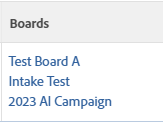

# Agregar tareas o problemas existentes al tablero [!DNL Workfront]

>[!IMPORTANT]
>
>Los flujos de trabajo solo están disponibles para un grupo específico de clientes.

Puede agregar cualquier tarea o problema a un tablero o flujo de trabajo en [!DNL Adobe Workfront] desde una vista de lista o informe, o desde los detalles del objeto.

## Requisitos de acceso

+++ Expanda para ver los requisitos de acceso para la funcionalidad en este artículo.

Debe tener el siguiente acceso para realizar los pasos de este artículo:

<table style="table-layout:auto">
 <col>
 <col>
 <tbody>
  <tr>
   <td role="rowheader">[!DNL Adobe Workfront] plan</td>
   <td> 
Cualquiera
 </td>
  </tr>
  <tr>
   <td role="rowheader">[!DNL Adobe Workfront] licencia</td>
   <td>
   
Nuevo: [!UICONTROL Standard]
 
   
o

   
Actual: [!UICONTROL Work] o superior

   </td>
  </tr>
  <tr>
   <td role="rowheader">Permisos de objeto</td>
   <td>[!UICONTROL View] o permisos superiores para la tarea o el problema </td>
  </tr>
 </tbody>
</table>

Para obtener más información sobre esta tabla, consulte [Requisitos de acceso en la documentación de Workfront](/help/quicksilver/administration-and-setup/add-users/access-levels-and-object-permissions/access-level-requirements-in-documentation.md).

+++

## Agregar tareas o problemas existentes a un tablero o flujo de trabajo desde una lista

{{step1-click-main-menu}}

1. Elija una de las siguientes opciones: **[!UICONTROL Proyectos]**, **[!UICONTROL Informes]** o **[!UICONTROL Paneles]**.
1. Vaya al proyecto, informe o panel que contiene la tarea o el problema que desea agregar al tablero o flujo de trabajo.
1. Seleccione una o varias tareas o problemas.

   Si selecciona una subtarea, también se agregará como una tarjeta en el tablero.

1. Haga clic en [!UICONTROL **Más**] > [!UICONTROL **Agregar a tableros**] o [!UICONTROL **Agregar a flujos de trabajo**].
1. En el cuadro de diálogo [!UICONTROL Agregar a], seleccione el tablero o flujo de trabajo al que desea agregar los elementos.

   En el caso de las placas, solo están disponibles las placas independientes, no las que forman parte de los flujos de trabajo.

1. Haga clic en [!UICONTROL **Agregar**].

   Para un tablero: la tarea o el problema se añaden al tablero como una tarjeta. Si el tablero tiene políticas de columna aplicadas para el estado, la tarjeta se añade en la columna correspondiente a su estado. De lo contrario, aparece en la primera columna de la izquierda, sin incluir la columna de entrada.

   Para obtener información sobre las directivas de columna, consulte [Administrar columnas del tablero](/help/quicksilver/agile/get-started-with-boards/manage-board-columns.md).

   Para un flujo de trabajo: la tarea o el problema se agregan a la lista de tarjetas del flujo de trabajo como una tarjeta no planeada.

## Agregar tareas o problemas existentes a un tablero o flujo de trabajo desde los detalles del objeto

{{step1-click-main-menu}}

1. Haga clic en [!UICONTROL **Proyectos**] y, a continuación, haga clic en el nombre de un proyecto para abrirlo.
1. Haga clic en [!UICONTROL **Tareas**] o [!UICONTROL **Problemas**] en el panel izquierdo.
1. Haga clic en la tarea, subtarea o problema que desee agregar a un tablero o flujo de trabajo.
1. Haga clic en el menú **[!UICONTROL Más]** junto al nombre del objeto y seleccione [!UICONTROL **Agregar a tableros**] o [!UICONTROL **Agregar a flujos de trabajo**].
1. En el cuadro de diálogo [!UICONTROL Agregar a], seleccione el tablero o flujo de trabajo al que desea agregar los elementos.

   En el caso de las placas, solo están disponibles las placas independientes, no las que forman parte de los flujos de trabajo.

1. Haga clic en [!UICONTROL **Agregar**].

   Para un tablero: la tarea o el problema se añaden al tablero como una tarjeta. Si el tablero tiene políticas de columna aplicadas para el estado, la tarjeta se añade en la columna correspondiente a su estado. De lo contrario, aparece en la primera columna de la izquierda, sin incluir la columna de entrada.

   Para obtener información sobre las directivas de columna, consulte [Administrar columnas del tablero](/help/quicksilver/agile/get-started-with-boards/manage-board-columns.md).

   Para un flujo de trabajo: la tarea o el problema se agregan a la lista de tarjetas del flujo de trabajo como una tarjeta no planeada.

## Mostrar los tableros asociados a una tarea o un problema de una lista

1. Vaya al proyecto, informe o panel que contiene la tarea o el problema cuya información desea ver en los tableros.
1. Seleccione una vista que incluya la columna Tableros o cree una nueva vista con la columna Tableros.
Para obtener información sobre las vistas, consulte [Crear o editar vistas en Adobe Workfront](/help/quicksilver/reports-and-dashboards/reports/reporting-elements/create-edit-views.md).
1. Haga clic en [!UICONTROL **Mostrar**] en la columna para mostrar la lista de tableros en los que se encuentra la tarea o el problema.

   

1. Haga clic en el nombre de un tablero para abrir la tarea o el problema conectado en el tablero.

   
