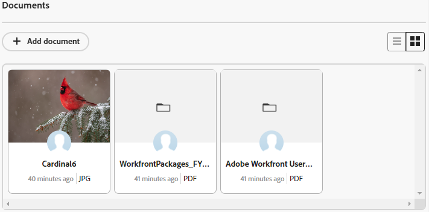

# Añadir documentos en tarjetas

Puede añadir documentos a las tarjetas conectadas en los paneles de Adobe Workfront. Cualquier documento que añada a la tarjeta estará disponible en la pestaña Documentos de la tarea o problema conectados, y los documentos añadidos a la tarea o al problema estarán visibles en la tarjeta. Se admiten los mismos tipos de archivo en ambas áreas. Para obtener más información sobre los documentos de Workfront, consulte [Añadir documentos a Adobe Workfront desde el sistema de archivos](/help/quicksilver/documents/adding-documents-to-workfront/add-documents-from-file-system.md).

>[!NOTE]
>
>Los documentos solo están disponibles en tarjetas conectadas. Para obtener más información, consulte [Usar tarjetas conectadas en los tableros](/help/quicksilver/agile/get-started-with-boards/connected-cards.md).

## Requisitos de acceso

+++ Expanda para ver los requisitos de acceso para la funcionalidad en este artículo.

<table style="table-layout:auto"> 
 <col> 
 <col> 
 <tbody> 
  <tr> 
   <td role="rowheader">Paquete de Adobe Workfront</td> 
   <td> 
Cualquiera
 </td> 
  </tr> 
  <tr> 
   <td role="rowheader">Licencia de Adobe Workfront</td> 
   <td> 
   
Colaborador o superior
 
   
Solicitud o superior

   </td> 
  </tr> 
   <tr>
   <td role="rowheader">Configuraciones de nivel de acceso</td>
   <td>Acceso de edición a documentos</td>
  </tr>
 </tbody> 
</table>

Para obtener más información, consulte [Requisitos de acceso en la documentación de Workfront](/help/quicksilver/administration-and-setup/add-users/access-levels-and-object-permissions/access-level-requirements-in-documentation.md).

+++

## Añadir un documento a una tarjeta

{{step1-to-boards}}

1. Abra la tarjeta conectada a la que desee añadir un documento.
1. Arrastre y suelte el archivo en el área [!UICONTROL Documentos], o bien haga clic en [!UICONTROL **Añadir documento**] para seleccionar un archivo.

   El archivo aparece en el área [!UICONTROL Documentos].

   

## Ver un documento existente de la tarjeta

1. En la tarjeta, busque el área [!UICONTROL Documentos]. Haga clic en el  para ver todos los documentos de una lista o haga clic en el  para ver los documentos de una galería.
1. Pase el puntero por encima de la miniatura del documento y haga clic en [!UICONTROL **Vista previa**] para ver el archivo en el explorador, o en [!UICONTROL **Descargar**] para descargar el archivo en el equipo.

   >[!NOTE]
   >
   >Los PDF no muestran una imagen en miniatura.
