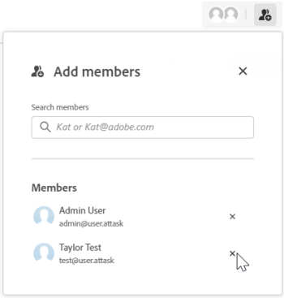

# Agregar o quitar miembros de un tablero

Para poder ver el tablero y asignarlo a las tarjetas, es necesario agregar personas y equipos al tablero como miembros.

## Requisitos de acceso

Debe tener el siguiente acceso para realizar los pasos de este artículo:

<table style="table-layout:auto"> 
 <col> 
 </col> 
 <col> 
 </col> 
 <tbody> 
  <tr> 
   <td role="rowheader"><strong>[!DNL Adobe Workfront] plan*</strong></td> 
   <td> 
Cualquiera
 </td> 
  </tr> 
  <tr> 
   <td role="rowheader"><strong>[!DNL Adobe Workfront] licencia*</strong></td> 
   <td> 
[!UICONTROL Request] o superior
 </td> 
  </tr> 
 </tbody> 
</table>

&#42;Para saber qué plan, tipo de licencia o acceso tiene, póngase en contacto con su [!DNL Workfront] administrador.

## Agregar miembros a un tablero

1. Haga clic en el **[!UICONTROL Menú principal]** icono  en la esquina superior derecha de [!DNL Adobe] Workfront y, a continuación, haga clic en **[!UICONTROL Tableros]**.
1. Cree un tablero nuevo o edite un tablero existente. Para obtener más información, consulte [Crear o editar un tablero](../../agile/get-started-with-boards/create-edit-board.md).
1. Haga clic en el **[!UICONTROL Agregar miembro]** icono .
1. En el **[!UICONTROL Agregar miembros]** , empiece a escribir un nombre y selecciónelo cuando aparezca en la lista.

   Puede seleccionar un miembro individual o un equipo. Si elige un equipo, éste se agregará al tablero. A continuación, los integrantes de cada equipo están disponibles para asignarlos a una tarjeta.

   >[!NOTE]
   >
   >Un usuario individual debe tener la variable **[!UICONTROL Ver]** o **[!UICONTROL Editar]** configurado en su nivel de acceso para los equipos o no podrán ver el tablero.

   

## Eliminar miembros de un tablero

1. Haga clic en el **[!UICONTROL Menú principal]** icono  en la esquina superior derecha de [!DNL Adobe] Workfront y, a continuación, haga clic en **[!UICONTROL Tableros]**.
1. Cree un tablero nuevo o edite un tablero existente. Para obtener más información, consulte [Crear o editar un tablero](../../agile/get-started-with-boards/create-edit-board.md).
1. Haga clic en el **[!UICONTROL Agregar miembro]** icono .
1. En el **[!UICONTROL Agregar miembros]** haga clic en la X situada junto al nombre de una persona o equipo para quitarlos del tablero.

   

   Al eliminar un miembro de un tablero, también se elimina de cualquier tarjeta a la que se asignara. Para las tarjetas conectadas, las asignaciones también se actualizan en la variable [!DNL Workfront] tarea o problema.

   Los miembros sólo se retiran de este consejo. No se eliminan de otros tableros a los que pertenecen.

   >[!NOTE]
   >
   >No se puede quitar el propietario del tablero.
