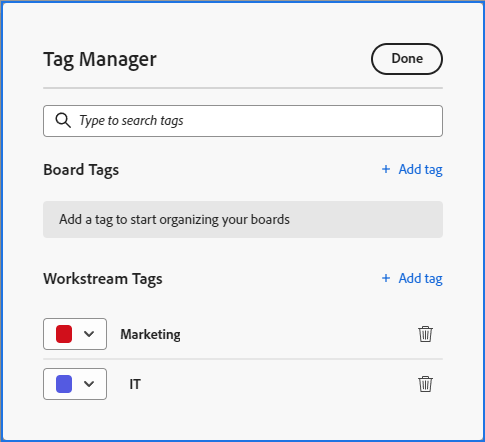

# Añadir etiquetas

Puede agregar etiquetas a las tarjetas para mostrar visualmente que son similares. A continuación, puede filtrar por esas etiquetas para mostrar tarjetas relacionadas.

>[!NOTE]
>
>Las etiquetas no se comparten entre tableros.

## Requisitos de acceso

Debe tener el siguiente acceso para realizar los pasos de este artículo:

<table style="table-layout:auto"> 
 <col> 
 </col> 
 <col> 
 </col> 
 <tbody> 
  <tr> 
   <td role="rowheader"><strong>[!DNL Adobe Workfront] plan*</strong></td> 
   <td> 
Cualquiera
 </td> 
  </tr> 
  <tr> 
   <td role="rowheader"><strong>[!DNL Adobe Workfront] licencia*</strong></td> 
   <td> 
[!UICONTROL Request] o superior
 </td> 
  </tr> 
 </tbody> 
</table>

&#42;Para saber qué plan, tipo de licencia o acceso tiene, póngase en contacto con el administrador de [!DNL Workfront].

## Creación de etiquetas para un tablero

{{step1-to-boards}}

1. Acceda a un tablero. Para obtener más información, consulte [Crear o editar un tablero](../../agile/get-started-with-boards/create-edit-board.md).
1. Haga clic en el menú **[!UICONTROL Más]**  junto al nombre del tablero y, a continuación, elija **[!UICONTROL Administrador de etiquetas]**.

   

1. En el cuadro de diálogo [!UICONTROL Administrador de etiquetas], seleccione [!UICONTROL **Agregar etiqueta**] en la sección [!UICONTROL Etiquetas de tablero].
1. Escriba el nombre de la etiqueta en el cuadro resaltado y, a continuación, elija un color para esta etiqueta en el menú desplegable. La etiqueta se guarda automáticamente.
1. (Condicional) Repita los pasos 4-5 para crear etiquetas adicionales.
1. Haga clic en **[!UICONTROL Listo]** en la esquina superior derecha del cuadro.

   

## Creación de etiquetas para un flujo de trabajo

>[!IMPORTANT]
>
>Los flujos de trabajo solo están disponibles para un grupo específico de clientes.

Las etiquetas de flujo de trabajo están disponibles para todos los tableros de un flujo de trabajo.

{{step1-to-boards}}

1. En el panel, haga clic en [!UICONTROL **Ver flujo de trabajo**] para abrir un flujo de trabajo.
1. Abra un tablero. Haga clic en el menú **[!UICONTROL Más]**  junto al nombre del tablero y, a continuación, elija **[!UICONTROL Administrador de etiquetas]**.

   O

   Haga clic en [!UICONTROL **Configurar**] para abrir el panel [!UICONTROL Configurar flujo de trabajo]. A continuación, haga clic en **[!UICONTROL Administrador de etiquetas]**.

1. En el cuadro de diálogo [!UICONTROL Administrador de etiquetas], seleccione [!UICONTROL **Agregar etiqueta**] en la sección Etiquetas de flujo de trabajo.
1. Escriba el nombre de la etiqueta en el cuadro resaltado y, a continuación, elija un color para esta etiqueta en el menú desplegable. La etiqueta se guarda automáticamente.
1. (Condicional) Repita los pasos 4-5 para crear etiquetas adicionales.
1. Haga clic en **[!UICONTROL Listo]** en la esquina superior derecha del cuadro.

   

## Añadir una etiqueta a una tarjeta

1. Acceda a un tablero.
1. Para editar los detalles de la tarjeta, haga clic en la tarjeta (no en el nombre de la tarjeta).

   O

   Haga clic en el menú **[!UICONTROL Más]** ![[!UICONTROL Más ]](assets/more-icon-spectrum.png) de la tarjeta y seleccione **[!UICONTROL Editar]**.

1. En el cuadro **[!UICONTROL Etiquetas]**, escriba el nombre de una etiqueta existente y selecciónela en los resultados de búsqueda.\
   O\
   Haga clic en el icono **[!UICONTROL Editar]**  y cree una etiqueta nueva en el Administrador de etiquetas. Haga clic en **Listo** para regresar a la tarjeta y, a continuación, seleccione la etiqueta en la tarjeta.
1. Haga clic en **Cerrar**.

## Edición de una etiqueta

1. Acceda a un tablero.
1. Haga clic en el menú **[!UICONTROL Más]**  junto al nombre del tablero y, a continuación, elija **[!UICONTROL Administrador de etiquetas]**.

   

1. (Condicional) Haga clic en el nombre de la etiqueta para editar el texto.
1. (Condicional) Haga clic en el menú desplegable [!UICONTROL color] para cambiar el color de la etiqueta.
1. Haga clic en **[!UICONTROL Listo]**.

## Quitar una etiqueta de una tarjeta

1. Acceda a un tablero.
1. Para editar los detalles de la tarjeta, haga clic en la tarjeta (no en el nombre de la tarjeta).

   O

   Haga clic en el menú **[!UICONTROL Más]** ![[!UICONTROL Más ]](assets/more-icon-spectrum.png) de la tarjeta y seleccione **[!UICONTROL Editar]**.

1. Busque la etiqueta que quiera quitar de la tarjeta y luego haga clic en el icono **[!UICONTROL Quitar]** .
1. Haga clic en **[!UICONTROL Cerrar]**.

## Eliminación de una etiqueta

1. Acceda a un tablero.
1. Haga clic en el menú **[!UICONTROL Más]** ![[!UICONTROL Más]](assets/more-icon-spectrum.png) junto al nombre del tablero y, a continuación, elija **[!UICONTROL Administrador de etiquetas]**.

   

1. Busque la etiqueta que quiera eliminar y luego haga clic en el icono **[!UICONTROL Eliminar]** .
1. Haga clic en **[!UICONTROL Listo]**.
