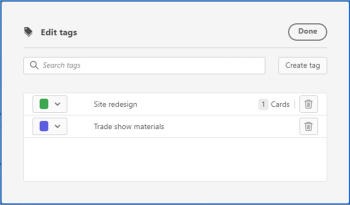

# Agregar etiquetas

Puede agregar etiquetas a las tarjetas para mostrar visualmente que son similares. A continuación, puede filtrar por esas etiquetas para mostrar las tarjetas relacionadas. Las etiquetas no se comparten entre tableros.

## Requisitos de acceso

Debe tener el siguiente acceso para realizar los pasos de este artículo:

<table style="table-layout:auto"> 
 <col> 
 </col> 
 <col> 
 </col> 
 <tbody> 
  <tr> 
   <td role="rowheader"><strong>[!DNL Adobe Workfront] plan*</strong></td> 
   <td> 
Cualquiera
 </td> 
  </tr> 
  <tr> 
   <td role="rowheader"><strong>[!DNL Adobe Workfront] licencia*</strong></td> 
   <td> 
[!UICONTROL Request] o superior
 </td> 
  </tr> 
 </tbody> 
</table>

&#42;Para saber qué plan, tipo de licencia o acceso tiene, póngase en contacto con su [!DNL Workfront] administrador.

## Crear etiquetas para el tablero

1. Haga clic en el **[!UICONTROL Menú principal]** icono  en la esquina superior derecha de [!DNL Adobe Workfront]y haga clic en **[!UICONTROL Tableros]**.
1. Acceda a un tablero. Para obtener más información, consulte [Crear o editar un tablero](../../agile/get-started-with-boards/create-edit-board.md).
1. Haga clic en el **[!UICONTROL Más]** menú  junto al nombre del tablero, a continuación, elija **[!UICONTROL Administrador de etiquetas]**.

   

1. En el **[!UICONTROL Editar etiquetas]** cuadro de diálogo, seleccione **[!UICONTROL Crear etiqueta]**.
1. Escriba el nombre de la etiqueta en el cuadro resaltado y, a continuación, elija un color para esta etiqueta en el menú desplegable.
1. Haga clic en el **[!UICONTROL Guardar]** para guardar la etiqueta, o **[!UICONTROL Cancelar]** para cancelar la creación de la etiqueta.

   

1. (Condicional) Repita los pasos del 4 al 6 para crear etiquetas adicionales.
1. Haga clic en **[!UICONTROL Listo]** en la esquina superior derecha del cuadro.

   

## Agregar una etiqueta a una tarjeta

1. Acceda a un tablero.
1. Para editar los detalles de la tarjeta, haga clic en la tarjeta (no en el nombre de la tarjeta).

   O

   Haga clic en el **[!UICONTROL Más]** menú ![[!UICONTROL Más menú]](assets/more-icon-spectrum.png) en la tarjeta y seleccione **[!UICONTROL Editar]**.

1. En el **[!UICONTROL Etiquetas]** , escriba el nombre de una etiqueta existente y selecciónela en los resultados de la búsqueda.\
   O\
   Haga clic en el **[!UICONTROL Editar]** icono &#x200B;  y cree una etiqueta nueva en el Administrador de etiquetas. Haga clic en **Listo** para volver a la tarjeta . La nueva etiqueta se añade automáticamente a la tarjeta.
1. Haga clic en **Cerrar**.

## Editar una etiqueta

1. Acceda a un tablero.
1. Haga clic en el **[!UICONTROL Más]** menú  junto al nombre del tablero, a continuación, elija **[!UICONTROL Administrador de etiquetas]**.

   

1. (Condicional) Haga clic en el nombre de la etiqueta para editar el texto.
1. (Condicional) Haga clic en el [!UICONTROL color] menú desplegable para cambiar el color de la etiqueta.
1. Haga clic en **[!UICONTROL Listo]**.

## Eliminar una etiqueta de una tarjeta

1. Acceda a un tablero.
1. Para editar los detalles de la tarjeta, haga clic en la tarjeta (no en el nombre de la tarjeta).

   O

   Haga clic en el **[!UICONTROL Más]** menú ![[!UICONTROL Más menú]](assets/more-icon-spectrum.png) en la tarjeta y seleccione **[!UICONTROL Editar]**.

1. Busque la etiqueta que desea eliminar de la tarjeta y, a continuación, haga clic en el botón **[!UICONTROL Eliminar]** icono .
1. Haga clic en **[!UICONTROL Cerrar]**.

## Eliminar una etiqueta

1. Haga clic en el **[!UICONTROL Menú principal]** icono  en la esquina superior derecha de [!DNL Adobe Workfront]y haga clic en **[!UICONTROL Tableros]**.
1. Acceda a un tablero. Para obtener más información, consulte [Crear o editar un tablero](../../agile/get-started-with-boards/create-edit-board.md).
1. Haga clic en el **[!UICONTROL Más]** Menú &#x200B; junto al nombre del tablero y, a continuación, elija **[!UICONTROL Administrador de etiquetas]**.

   

1. Busque la etiqueta que desee eliminar y haga clic en el botón **[!UICONTROL Eliminar]** icono .
1. Haga clic en **[!UICONTROL Listo]**.
