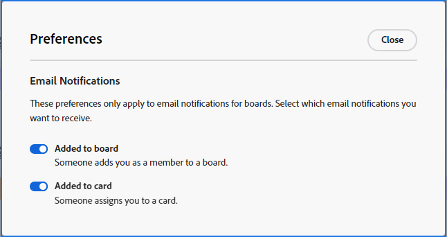

# Notificaciones por correo electrónico sobre preferencias de tableros

[!DNL Adobe Workfront] [!UICONTROL Boards] le envía un correo electrónico cuando se le ha añadido a un tablero y cuando se le ha asignado una tarjeta. Las notificaciones están activadas de forma predeterminada y puede seleccionar entre las preferencias de sus tableros qué correos electrónicos desea recibir.

Según la configuración de las notificaciones por correo electrónico, también recibirá un correo electrónico cuando esté etiquetado en un comentario en una tarjeta conectada. Para obtener más información, consulte [Modificar sus propias notificaciones por correo electrónico](/help/quicksilver/workfront-basics/using-notifications/activate-or-deactivate-your-own-event-notifications.md). En este momento, los usuarios etiquetados en comentarios en tarjetas ad hoc no reciben una notificación por correo electrónico.

## Requisitos de acceso

+++ Expanda para ver los requisitos de acceso para la funcionalidad en este artículo.

<table style="table-layout:auto"> 
 <col> 
 <col> 
 <tbody> 
  <tr> 
   <td role="rowheader">Paquete de Adobe Workfront</td> 
   <td> 
Cualquiera
 </td> 
  </tr> 
  <tr> 
   <td role="rowheader">Licencia de Adobe Workfront</td> 
   <td> 
   
Colaborador o superior
 
   
Solicitud o superior

   </td> 
  </tr> 
 </tbody> 
</table>

Para obtener más información, consulte [Requisitos de acceso en la documentación de Workfront](/help/quicksilver/administration-and-setup/add-users/access-levels-and-object-permissions/access-level-requirements-in-documentation.md).

+++

## Definir preferencias para correos electrónicos de tableros

{{step1-to-boards}}

1. Haga clic en [!UICONTROL **Preferencias**] en el panel de control de tableros.
1. Seleccione si desea recibir correos electrónicos para que se añadan a un tablero y se asignen a una tarjeta.

   

   Las preferencias que establezca para los correos electrónicos se aplicarán a todos los tableros.

