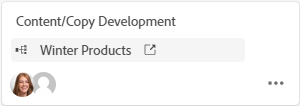

# Usar tarjetas conectadas en tableros

<!-- Audited: 2/2024 -->

Puede agregar una tarjeta en el tablero que esté conectada a tareas y problemas existentes en [!DNL Workfront].

Cuando se actualiza cualquiera de los siguientes detalles de la tarjeta en una ubicación, se actualiza automáticamente en la otra ubicación:

* [!UICONTROL Nombre]
* [!UICONTROL Descripción]
* [!UICONTROL Usuarios asignados]
* [!UICONTROL Estado]
* [!UICONTROL Fecha planificada de finalización]
* [!UICONTROL Estimación] / [!UICONTROL Puntos de la historia]
* [!UICONTROL Subtareas]
* [!UICONTROL Documentos]

Para sincronizar tarjetas conectadas con Workfront, haz clic en el menú **[!UICONTROL Más]** ![[!UICONTROL Menú Más]](assets/more-icon-spectrum.png) que está junto al nombre del tablero y selecciona **[!UICONTROL Sincronizar elementos conectados]**. Las tarjetas archivadas no se sincronizan con las tareas y problemas de Workfront. Si restaura una tarjeta, se volverá a sincronizar.

>[!NOTE]
>
>Una sola tarea o problema conectado solo se puede agregar una vez por tablero. La misma tarea o problema se puede conectar a varios tableros.

## Requisitos de acceso

+++ Expanda para ver los requisitos de acceso para la funcionalidad en este artículo.

Debe tener el siguiente acceso para realizar los pasos de este artículo:

<table style="table-layout:auto"> 
 <tbody> 
  <tr> 
   <td role="rowheader">[!DNL Adobe Workfront] plan</td> 
   <td> 
Cualquiera
 </td> 
  </tr> 
  <tr> 
   <td role="rowheader">[!DNL Adobe Workfront] licencia</td> 
   <td>
   
Nuevo: Colaborador o superior

   
O

   
Actual: Solicitud o superior

 </td> 
  </tr> 
  <tr>
   <td role="rowheader">Configuraciones de nivel de acceso</td>
   <td>
Ver o acceso superior a tareas y problemas
</td>
  </tr>
  <tr>
   <td role="rowheader">Permisos de objeto</td>
   <td>
Ver o permisos superiores de la tarea o el problema de Workfront

   
<strong>Nota:</strong> Los usuarios con permisos de visualización en una tarea o un problema no pueden realizar ninguna acción en las tarjetas conectadas a él, ni siquiera mover la tarjeta a otra columna del tablero. Ver usuarios solo pueden abrir la tarjeta para ver sus propiedades y abrir la tarea o el problema conectado. Para solicitar acceso adicional, abra la tarea o el problema y solicite acceso allí.</td>
  </tr>
 </tbody> 
</table>

Para obtener más información sobre esta tabla, consulte [Requisitos de acceso en la documentación de Workfront](/help/quicksilver/administration-and-setup/add-users/access-levels-and-object-permissions/access-level-requirements-in-documentation.md).

+++

## Agregar una tarjeta conectada

{{step1-to-boards}}

1. Acceda a un tablero. Para obtener más información, consulte [Crear o editar un tablero](../../agile/get-started-with-boards/create-edit-board.md).
1. Haga clic en **[!UICONTROL Agregar tarjeta] > [!UICONTROL Tarjeta conectada]**.
1. Elija un proyecto y, a continuación, elija una tarea o un problema para añadirlos como tarjeta en el tablero.

   Puede seleccionar varios objetos y todos se añadirán como tarjetas independientes.

   >[!NOTE]
   >
   >* En los resultados de la búsqueda sólo están disponibles los objetos para los que tiene permisos. Si un elemento está atenuado, ya se ha agregado al tablero.
   >* Cuando se filtra por **[!UICONTROL Proyectos de mi propiedad]** o **[!UICONTROL Proyectos en los que participo]**, no se incluyen los proyectos que equivalen a un estado Completo, Inactivo o Rechazado. Puede seguir buscando esos proyectos con el filtro **[!UICONTROL Todos]**.

1. Haga clic en **[!UICONTROL Agregar]**.

   

   La tarjeta se agrega en la parte inferior de la columna situada más a la izquierda. El objeto [!DNL Workfront] conectado y sus usuarios asignados se muestran en la tarjeta.

   

1. Haga clic en  para abrir la tarea o el problema [!DNL Workfront] en una nueva pestaña del explorador.
1. Para editar los detalles de la tarjeta, haga clic en la tarjeta (no en el nombre de la tarjeta).

   O

   Haga clic en el menú **[!UICONTROL Más]**  de la tarjeta y seleccione **[!UICONTROL Editar]**.

1. En el cuadro **[!UICONTROL Detalles de la tarjeta]**, agregue o actualice la siguiente información:

   <table style="table-layout:auto"> 
    <tbody> 
     <tr> 
      <td role="rowheader"><strong>[!UICONTROL Nombre]</strong></td> 
      <td>Al cambiar el nombre también se cambia el nombre del objeto [!DNL Workfront] conectado.</td> 
     </tr> 
     <tr> 
      <td role="rowheader"><strong>[!UICONTROL Descripción]</strong></td> 
      <td>Al cambiar la descripción también se cambia la descripción del objeto [!DNL Workfront] conectado. Puede añadir direcciones URL en la descripción, que se convertirán en vínculos en los que se puede hacer clic cuando se guarde la tarjeta.</td> 
     </tr>
     <tr>
      <td role="rowheader"><strong>[!UICONTROL Columna]</strong></td>
      <td>Seleccione la columna de la tarjeta.</td>
     </tr>
     <tr>
      <td role="rowheader"><strong>[!UICONTROL Estado]</strong></td>
      <td>
Seleccione un estado para la tarjeta. Los valores predeterminados son [!UICONTROL New], [!UICONTROL In Progress] y [!UICONTROL Complete], pero también están disponibles todos los estados personalizados definidos para el elemento de [!DNL Workfront].

      
Si tiene habilitadas las directivas de columna para actualizar valores de campo, al cambiar el estado de la tarjeta se mueve automáticamente la tarjeta a la columna correspondiente. Para obtener más información, consulte "Definir configuración y directivas de columna" en el artículo <a href="/help/quicksilver/agile/get-started-with-boards/manage-board-columns.md" class="MCXref xref">Administrar columnas del tablero</a>.

      
Si hace clic en <strong>[!UICONTROL Mark Complete]</strong> en la parte superior de la tarjeta, el estado cambiará automáticamente a Complete.
</td>
     </tr>
     <tr>
      <td role="rowheader"><strong>[!UICONTROL Finalización planificada]</strong></td>
      <td>Al cambiar esta fecha, también se cambia la fecha planificada de finalización del objeto [!DNL Workfront] conectado.</td>
     </tr>
      <tr>
      <td role="rowheader"><strong>[!UICONTROL Estimación]</strong></td>
      <td>
Número de horas que se completará la tarjeta.

Al cambiar la estimación también se cambia el valor de los puntos de la historia en el objeto [!DNL Workfront] conectado.
</td>
     </tr>
     <tr>
      <td role="rowheader"><strong>[!UICONTROL Asignaciones]</strong></td>
      <td>
Para asignar más personas o un equipo a la tarjeta, haga clic en <strong>[!UICONTROL Agregar asignación]</strong> y empiece a escribir un nombre en el campo de búsqueda. A continuación, selecciónelo cuando se muestre en la lista de resultados. Puede agregar individuos y equipos. Solo se permite una asignación de equipo en una tarjeta conectada.

      
Las personas asignadas que seleccione también se asignarán a la tarea o al problema de [!DNL Workfront].
</td>
     </tr>
     <tr>
      <td role="rowheader"><strong>[!UICONTROL Etiquetas]</strong></td>
      <td>
Busque y seleccione etiquetas para la tarjeta.

      
Para obtener información sobre cómo crear nuevas etiquetas, consulte <a href="../../agile/get-started-with-boards/add-tags.md" class="MCXref xref">Agregar etiquetas</a>.
</td>
     </tr>
     <tr>
      <td role="rowheader"><strong>[!UICONTROL Campos personalizados]</strong></td>
      <td>
Cualquier campo personalizado que agregue se mostrará en esta área.

      
Para obtener más información, consulte <a href="/help/quicksilver/agile/get-started-with-boards/customize-fields-on-card.md">Personalizar qué campos se muestran en una tarjeta</a>.
</td>
     </tr>
     <tr>
     <tr>
      <td role="rowheader"><strong>[!UICONTROL Subtarea]</strong></td>
      <td>
Cualquier subtarea existente para la tarea aparecerá en esta sección. Haga clic en <strong>[!UICONTROL Agregar subtarea]</strong> para agregar una nueva subtarea.

      
El contador de la parte superior de la sección muestra el número de subtareas completadas y el número total de subtareas.

      
Para obtener más información acerca de las subtareas, vea <a href="/help/quicksilver/agile/get-started-with-boards/manage-subtasks-on-boards.md">Administrar subtareas en tableros</a>.
</td>
     </tr>
     <tr> 
      <td role="rowheader"><strong>[!UICONTROL Lista de comprobación]</strong></td>
      <td>
Haga clic en <strong>[!UICONTROL Agregar elemento de lista de comprobación]</strong>. A continuación, escriba el título del elemento y presione Entrar. Se agrega otro elemento automáticamente. Siga introduciendo títulos para añadir más elementos.

      
El contador de la parte superior de la lista de comprobación muestra el número de elementos completados y el número total de elementos.
 
Para obtener más información acerca de los elementos de la lista de comprobación, vea <a href="/help/quicksilver/agile/get-started-with-boards/manage-checklist-items.md">Administrar elementos de la lista de comprobación en tarjetas</a>.
</td>
     </tr>
     <tr>
      <td role="rowheader"><strong>[!UICONTROL Documentos]</strong></td>
      <td>Para un documento existente, pasa el ratón sobre la miniatura del documento y haz clic en <strong>Vista previa</strong> para ver el archivo en el explorador o en <strong>Descargar</strong> para descargar el archivo en tu equipo. Para ver un documento nuevo, consulte <a href="/help/quicksilver/agile/get-started-with-boards/add-documents-on-cards.md">Agregar documentos en tarjetas</a>.</td>
     </tr>
     <tr>
      <td role="rowheader"><strong>[!UICONTROL Horas]</strong></td>
      <td>Consulte "Registrar horas en una tarjeta conectada", a continuación.</td>
     </tr>
     <tr>
      <td role="rowheader"><strong>[!UICONTROL Comentarios]</strong></td>
      <td>
Haga clic en el campo <strong>[!UICONTROL Nuevo comentario]</strong> y escriba el comentario. Utilice las herramientas de formato para dar formato al texto. Para etiquetar a una persona o equipo, utilice el cuadro de búsqueda situado en la parte inferior del área de comentarios. El usuario no tiene que ser miembro del tablero. Los usuarios etiquetados en tarjetas conectadas recibirán notificaciones por correo electrónico.

Haga clic en <strong>[!UICONTROL Enviar]</strong> para agregar el comentario a la tarjeta.

      
Para obtener más información sobre los comentarios, consulte <a href="/help/quicksilver/workfront-basics/updating-work-items-and-viewing-updates/update-work.md">Actualizar trabajo</a>.
</td>
     </tr>
     <tr> 
      <td role="rowheader"><strong>[!UICONTROL Actividad del sistema]</strong></td> 
      <td>
Si tiene <strong>Actividad del sistema</strong> habilitada como sección de tarjeta, la actividad se muestra en esta área.
 
Para obtener más información, consulte <a href="/help/quicksilver/agile/get-started-with-boards/customize-fields-on-card.md">Personalizar qué campos se muestran en una tarjeta</a> y <a href="/help/quicksilver/administration-and-setup/set-up-workfront/system-tracked-update-feeds/system-tracked-update-feeds.md">Actualizaciones con seguimiento del sistema</a>.
</td>
     </tr>     
    </tbody> 
   </table>

   Utilice el panel de navegación izquierdo para desplazarse entre secciones de campos de los detalles de la tarjeta.

1. Haga clic en **[!UICONTROL Cerrar]** para regresar al tablero.
El objeto conectado, los usuarios asignados, las etiquetas, la fecha de vencimiento, el contador de la lista de comprobación, las horas estimadas y el estado se muestran en la tarjeta.

   

## Desconectar una tarjeta conectada

Puede desconectar una tarjeta conectada de su objeto Workfront y la tarjeta permanecerá en el tablero como una tarjeta ad hoc que puede editar.

Para desconectar a nivel de placa:

1. Acceda al tablero.
1. Haga clic en el menú **[!UICONTROL Más]**  de la tarjeta conectada y seleccione **[!UICONTROL Desconectar]**.
1. Haz clic en **[!UICONTROL Desconectar]** en el mensaje de confirmación.

Para desconectar en el nivel de la tarjeta:

1. Acceda al tablero y abra la tarjeta conectada.
1. Haga clic en el menú **[!UICONTROL Más]**  del área Conexión de los detalles de la tarjeta y seleccione **[!UICONTROL Desconectar]**.
1. Haz clic en **[!UICONTROL Desconectar]** en el mensaje de confirmación.

## Conversión de una tarjeta ad hoc en una tarjeta conectada

Después de crear una tarjeta ad hoc, puede convertirla en una tarjeta conectada. Para obtener más información acerca de las tarjetas ad hoc, consulte [Agregar una tarjeta ad hoc a un tablero](/help/quicksilver/agile/get-started-with-boards/add-card-to-board.md).

1. Acceda al tablero y abra la tarjeta ad hoc.
1. Compruebe el nombre y la descripción en la tarjeta. Se agregarán a la tarea o al problema que cree en [!DNL Workfront].
1. En el área [!UICONTROL Conexión] de los detalles de la tarjeta, haga clic en **[!UICONTROL Conectar con Workfront]**.
1. En la ventana [!UICONTROL Conectar tarjeta], seleccione si está creando una tarea o un problema.
1. Busque y seleccione un proyecto al que agregar la tarea o el problema.

   >[!NOTE]
   >
   >* En los resultados de la búsqueda sólo están disponibles los objetos para los que tiene permisos.
   >* Cuando se filtra por **[!UICONTROL Proyectos de mi propiedad]** o **[!UICONTROL Proyectos en los que participo]**, no se incluyen los proyectos que equivalen a un estado [!UICONTROL Completado], [!UICONTROL Inactivo] o [!UICONTROL Rechazado]. Puede seguir buscando esos proyectos con el filtro **[!UICONTROL Todos]**.

1. Haga clic en **[!UICONTROL Conectar]**.

   

   El nombre del proyecto se muestra en el área Conexión en los detalles de la tarjeta.

1. Haga clic en **[!UICONTROL Cerrar]** para regresar al tablero.

## Registrar horas en una tarjeta conectada

Debe tener los permisos correctos para registrar horas en la tarea o el problema conectado.

Los campos de registro de hora no se muestran en las tarjetas conectadas de forma predeterminada. Debe habilitar [!UICONTROL **Horas**] en el área de [!UICONTROL Configurar] en [!UICONTROL Tarjetas]. Para obtener más información, consulte [Personalizar qué campos se muestran en una tarjeta](/help/quicksilver/agile/get-started-with-boards/customize-fields-on-card.md).

1. Introduzca el número de horas para la tarea o el problema.
1. Seleccione un [!UICONTROL Tipo de hora] en el menú desplegable, si es diferente al predeterminado.
1. Haga clic en [!UICONTROL **Registrar tiempo**].

   

   El tiempo registrado en la tarjeta también se guarda en la tarea o el problema conectado.

Registrar la hora en la tarjeta es lo mismo que registrar la hora en una tarea o un problema. Para obtener más información, consulte &quot;Registrar tiempo en un proyecto, tarea o problema&quot; en el artículo [Registrar tiempo](/help/quicksilver/timesheets/create-and-manage-timesheets/log-time.md).

