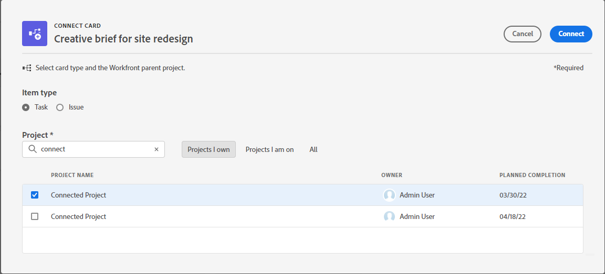

# Usar tarjetas conectadas en tableros

Puede agregar una tarjeta en el tablero que esté conectada a tareas y problemas existentes en [!DNL Workfront].

Cuando se actualiza cualquiera de los siguientes detalles de la tarjeta en una ubicación, se actualiza automáticamente en la otra ubicación:

* [!UICONTROL Nombre]
* [!UICONTROL Descripción]
* [!UICONTROL Personas asignadas]
* [!UICONTROL Estado]
* [!UICONTROL Fecha de finalización planificada]
* [!UICONTROL Estimación] / [!UICONTROL Puntos de la historia]

>[!NOTE]
>Una sola tarea o problema conectado solo se puede agregar una vez por tablero. La misma tarea o problema se puede conectar a varios tableros.

## Requisitos de acceso

Debe tener el siguiente acceso para realizar los pasos de este artículo:

<table style="table-layout:auto"> 
 <tbody> 
  <tr> 
   <td role="rowheader"><strong>[!DNL Adobe Workfront] plan*</strong></td> 
   <td> 
Cualquiera
 </td> 
  </tr> 
  <tr> 
   <td role="rowheader"><strong>[!DNL Adobe Workfront] licencia*</strong></td> 
   <td> 
[!UICONTROL Request] o superior
 </td> 
  </tr> 
  <tr>
   <td role="rowheader"><strong>Configuraciones de nivel de acceso*</strong></td>
   <td>
[!UICONTROL View] o acceso superior a tareas y problemas
</td>
  </tr>
  <tr>
   <td role="rowheader"><strong>Permisos de objeto</strong></td>
   <td>
[!UICONTROL View] o permisos superiores para la tarea o el problema de Workfront
</td>
  </tr>
 </tbody> 
</table>

&#42;Para saber qué plan, tipo de licencia o acceso tiene, póngase en contacto con su [!DNL Workfront] administrador.

## Agregar una tarjeta conectada

1. Haga clic en **[!UICONTROL Menú principal]** icono  en la esquina superior derecha de Adobe Workfront, haga clic en **[!UICONTROL Tableros]**.
1. Acceda a un tablero. Para obtener más información, consulte [Crear o editar un tablero](../../agile/get-started-with-boards/create-edit-board.md).
1. Clic **[!UICONTROL Añadir tarjeta] > [!UICONTROL Tarjeta conectada]**.
1. Elija un proyecto y, a continuación, elija una tarea o un problema para añadirlos como tarjeta en el tablero.

   Puede seleccionar varios objetos y todos se añadirán como tarjetas independientes.

   >[!NOTE]
   >
   >* En los resultados de la búsqueda sólo están disponibles los objetos para los que tiene permisos. Si un elemento está atenuado, ya se ha agregado al tablero.
   >* Cuando filtra por **[!UICONTROL Proyectos de mi propiedad]** o **[!UICONTROL Proyectos en los que trabajo]** Sin embargo, los proyectos que equivalen a un estado completo, muerto o rechazado no se incluyen. Puede seguir buscando esos proyectos con la variable **[!UICONTROL Todo]** filtro.

1. Clic **[!UICONTROL Añadir]**.

   

   La tarjeta se agrega en la parte inferior de la columna situada más a la izquierda. Los conectados [!DNL Workfront] y sus usuarios asignados se muestran en la tarjeta.

   >[!NOTE]
   >
   >Si hay un usuario asignado en [!DNL Workfront] la tarea o el problema no es un miembro del tablero, no se han asignado a la tarjeta.

   

1. Clic  para abrir [!DNL Workfront] tarea o problema en una nueva pestaña del explorador.
1. Para editar los detalles de la tarjeta, haga clic en la tarjeta (no en el nombre de la tarjeta).

   O

   Haga clic en **[!UICONTROL Más]** menú  en la tarjeta y seleccione **[!UICONTROL Editar]**.

1. En el **[!UICONTROL Detalles de tarjeta]** , agregue o actualice la siguiente información:

   <table style="table-layout:auto"> 
    <tbody> 
     <tr> 
      <td role="rowheader"><strong>[!UICONTROL Nombre]</strong></td> 
      <td> 
Al cambiar el nombre, también se cambia el nombre del [!DNL Workfront] objeto.
 </td> 
     </tr> 
     <tr> 
      <td role="rowheader"><strong>[!UICONTROL Descripción]</strong></td> 
      <td> 
Al cambiar la descripción, también se cambia la descripción del [!DNL Workfront] objeto.
 </td> 
     </tr> 
     <tr>
      <td role="rowheader"><strong>[!UICONTROL Asignados]</strong></td>
      <td>
Para asignar más personas o un equipo a la tarjeta, empiece a escribir un nombre en el campo de búsqueda y, a continuación, selecciónelo cuando se muestre en la lista. Puede agregar individuos y equipos. Solo se permite una asignación de equipo en una tarjeta conectada.

      
Los usuarios asignados deben ser miembros del tablero o no aparecerán en la lista de selección. Cuando un equipo es miembro del tablero, se puede asignar a cada uno de los integrantes del equipo a la tarjeta.

      
Las personas asignadas que seleccione también se asignan a la tarea o al problema en [!DNL Workfront].
</td>
     </tr>
     <tr>
      <td role="rowheader"><strong>[!UICONTROL Columna]</strong></td>
      <td>
Seleccione la columna de la tarjeta.
</td>
     </tr>
     <tr>
      <td role="rowheader"><strong>[!UICONTROL Estado]</strong></td>
      <td>
Seleccione un estado para la tarjeta. Los valores predeterminados son [!UICONTROL New], [!UICONTROL In Progress] y [!UICONTROL Complete], pero cualquier estado personalizado definido para el elemento en [!DNL Workfront] también están disponibles.

      
Si tiene habilitadas las directivas de columna para actualizar valores de campo, al cambiar el estado de la tarjeta se mueve automáticamente la tarjeta a la columna correspondiente. Para obtener más información, consulte "Definición de la configuración y las directivas de columna" en el artículo <a href="/help/quicksilver/agile/get-started-with-boards/manage-board-columns.md" class="MCXref xref">Administrar columnas del tablero</a>.

      
Si hace clic <strong>[!UICONTROL Marcar como completado]</strong> en la parte superior de la tarjeta, el estado cambia automáticamente a Completado.
</td>
     </tr>
     <tr>
      <td role="rowheader"><strong>[!UICONTROL Finalización planificada]</strong></td>
      <td>
Al cambiar esta fecha, también se cambia la fecha planificada de finalización del [!DNL Workfront] objeto.
</td>
     </tr>
      <tr>
      <td role="rowheader"><strong>[!UICONTROL Estimación]</strong></td>
      <td>
Número de horas que se completará la tarjeta.

Si utiliza la inclusión de la función anticipada para [!DNL Workfront] [!UICONTROL Tableros], al cambiar la estimación también se cambia el valor de los puntos de la historia en el [!DNL Workfront] objeto.

Si no selecciona las primeras funciones, este campo es solo una entrada manual y el valor no puede ser superior a 99.
</td>
     </tr>
     <tr>
      <td role="rowheader"><strong>[!UICONTROL Etiquetas]</strong></td>
      <td>
Busque y seleccione etiquetas para la tarjeta.

      
Para obtener información sobre la creación de etiquetas nuevas, consulte <a href="../../agile/get-started-with-boards/add-tags.md" class="MCXref xref">Añadir etiquetas</a>.
</td>
     </tr>
     <tr> 
      <td role="rowheader"><strong>[!UICONTROL Elementos de lista de comprobación]</strong> </td> 
      <td> 
Clic <strong>[!UICONTROL Agregar elemento de lista de comprobación]</strong>. A continuación, escriba el título del elemento y presione Entrar. Se agrega otro elemento automáticamente. Siga introduciendo títulos para añadir más elementos.
 
El contador de la parte superior de la lista de comprobación muestra el número de elementos completados y el número total de elementos.
 
Para obtener más información sobre los elementos de la lista de comprobación, consulte <a href="/help/quicksilver/agile/get-started-with-boards/manage-checklist-items.md">Administrar elementos de listas de comprobación en tarjetas</a>.
</td>
     </tr>
    </tbody> 
   </table>

1. Clic **[!UICONTROL Cerrar]** para volver al tablero.
El objeto conectado, los usuarios asignados, las etiquetas, la fecha de vencimiento, el contador de la lista de comprobación, las horas estimadas y el estado se muestran en la tarjeta.

   

## Desconectar una tarjeta conectada

Puede desconectar una tarjeta conectada de su objeto Workfront y la tarjeta permanecerá en el tablero como una tarjeta ad hoc que puede editar.

Para desconectar a nivel de placa:

1. Acceda al tablero.
1. Haga clic en **[!UICONTROL Más]** menú  en la tarjeta conectada y seleccione **[!UICONTROL Desconectar]**.
1. Clic **[!UICONTROL Desconectar]** en el mensaje de confirmación.

Para desconectar en el nivel de la tarjeta:

1. Acceda al tablero y abra la tarjeta conectada.
1. Haga clic en **[!UICONTROL Más]** menú  en el área Conexión de los detalles de la tarjeta y seleccione **[!UICONTROL Desconectar]**.
1. Clic **[!UICONTROL Desconectar]** en el mensaje de confirmación.

## Conversión de una tarjeta ad hoc en una tarjeta conectada

Después de crear una tarjeta ad hoc, puede convertirla en una tarjeta conectada. Para obtener más información sobre las tarjetas ad hoc, consulte [Añadir una tarjeta ad hoc a un tablero](/help/quicksilver/agile/get-started-with-boards/add-card-to-board.md).

1. Acceda al tablero y abra la tarjeta ad hoc.
1. Compruebe el nombre y la descripción en la tarjeta. Se agregarán a la tarea o al problema que cree en [!DNL Workfront].
1. En el [!UICONTROL Conexión] del área de detalles de la tarjeta, haga clic en **[!UICONTROL Conexión con Workfront]**.
1. En el [!UICONTROL Conectar tarjeta] , seleccione si está creando una tarea o un problema.
1. Busque y seleccione un proyecto al que agregar la tarea o el problema.

   >[!NOTE]
   >
   >* En los resultados de la búsqueda sólo están disponibles los objetos para los que tiene permisos.
   >* Cuando filtra por **[!UICONTROL Proyectos de mi propiedad]** o **[!UICONTROL Proyectos en los que trabajo]**, proyectos que equivalen a [!UICONTROL Completar], [!UICONTROL Inactivo], o [!UICONTROL Rechazado] no se incluyen los estados. Puede seguir buscando esos proyectos con la variable **[!UICONTROL Todo]** filtro.

1. Clic **[!UICONTROL Connect]**.

   

   El nombre del proyecto se muestra en el área Conexión en los detalles de la tarjeta.

1. Clic **[!UICONTROL Cerrar]** para volver al tablero.

## Registrar horas en una tarjeta conectada

>[!NOTE]
>
>Esta función solo está disponible a través de la inclusión de funciones anticipada para tableros de Workfront.

Debe tener los permisos correctos para registrar horas en la tarea o el problema conectado.

Los campos de registro de hora no se muestran en las tarjetas conectadas de forma predeterminada. Debe activar [!UICONTROL **Horas**] en el [!UICONTROL Configurar] área bajo [!UICONTROL Tarjetas]. Para obtener más información, consulte [Personalizar los campos que se muestran en una tarjeta](/help/quicksilver/agile/get-started-with-boards/customize-fields-on-card.md).

1. Introduzca el número de horas para la tarea o el problema.
1. Seleccione un [!UICONTROL Tipo de hora] en el menú desplegable, si es diferente a la predeterminada.
1. Clic [!UICONTROL **Hora de registro**].

   

   El tiempo registrado en la tarjeta también se guarda en la tarea o el problema conectado.

Registrar la hora en la tarjeta es lo mismo que registrar la hora en una tarea o un problema. Para obtener más información, consulte &quot;Registrar tiempo en un proyecto, tarea o problema&quot; en el artículo [Registrar tiempo](/help/quicksilver/timesheets/create-and-manage-timesheets/log-time.md).

