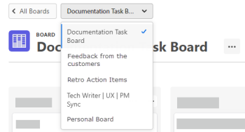

# Crear o editar un tablero

<!-- Audited: 12/2023 -->

Desde el [!UICONTROL tableros] , puede crear un tablero nuevo o editar uno existente.

## Requisitos de acceso

Debe tener el siguiente acceso para realizar los pasos de este artículo:

<table style="table-layout:auto"> 
 <col> 
 <col> 
 <tbody> 
  <tr> 
   <td role="rowheader">[!DNL Adobe Workfront] plan</td> 
   <td> 
Cualquiera
 </td> 
  </tr> 
    <tr> 
   <td role="rowheader">[!DNL Adobe Workfront] licencia</td> 
   <td> 
Nuevo: Colaborador o superior 

 
o
 

Actual: [!UICONTROL Request] o superior 
 
</td> 
  </tr>
 </tbody> 
</table>

Para obtener más información sobre esta tabla, consulte [Requisitos de acceso en la documentación de Workfront](/help/quicksilver/administration-and-setup/add-users/access-levels-and-object-permissions/access-level-requirements-in-documentation.md).

## Crear nuevo tablero

{{step1-to-boards}}

1. Clic **[!UICONTROL Añadir tablero]**.

1. Seleccione una plantilla para el tablero.

   | Plantilla | Descripción |
   |---------|----------|
   | Tablero básico | Se proporcionan tres columnas predeterminadas en el tablero. Puede agregar nuevas columnas y cambiar el nombre de las columnas predeterminadas o eliminarlas. 
Se proporcionan tres columnas predeterminadas en el tablero. Puede agregar nuevas columnas y cambiar el nombre de las columnas predeterminadas o eliminarlas. |
   | Tablero Kanban | Se proporcionan las siguientes columnas en el tablero: Registro de pendientes, Nuevo, En curso, Completado y En espera. Puede agregar nuevas columnas y cambiar el nombre de las columnas predeterminadas o eliminarlas.
Para utilizar el registro de pendientes, debe configurar filtros para la columna de entrada. Para obtener más información, consulte [Agregar una columna de entrada a un tablero](/help/quicksilver/agile/use-boards-agile-planning-tools/add-intake-column-to-board.md). 
Para revisar las directivas predeterminadas de cada columna, haga clic en [!UICONTROL **Más** menú] en una columna y seleccione [!UICONTROL **Editar**]. Puede cambiar cualquiera de estas directivas preconfiguradas. Para obtener más información, consulte [Administrar columnas del tablero](/help/quicksilver/agile/get-started-with-boards/manage-board-columns.md). |
   | Tablero retrospectivo | En el tablero se proporcionan las siguientes columnas: ¿Qué ha ido bien? ¿Qué se podría mejorar? ¿A quién debemos homenajear? ¿Qué podemos hacer para avanzar más rápido? Puede agregar nuevas columnas y cambiar el nombre de las columnas predeterminadas o eliminarlas. 
No se aplican políticas de columna. |
   | Tablero dinámico | Se proporcionan las siguientes columnas en el tablero: No seleccionado, Nuevo, En curso, En espera y Completado. Puede agregar nuevas columnas y cambiar el nombre de las columnas predeterminadas o eliminarlas. (Se puede cambiar el nombre de la columna No seleccionada, pero no eliminarla. Esta columna contiene todas las tarjetas con un estado que no coincide con ninguno de los demás estados de columna). 
Las políticas de columna predeterminadas asignan tarjetas a las columnas en función de su estado. Para obtener más información, consulte [Administrar columnas del tablero](/help/quicksilver/agile/get-started-with-boards/manage-board-columns.md). |

1. Para un tablero dinámico únicamente, siga los pasos del asistente de configuración:

   1. Escriba un nombre para el tablero y haga clic en [!UICONTROL **Siguiente**].
   1. Busque y seleccione. [!DNL Workfront] [!UICONTROL **Proyectos**] para incluir tareas y problemas en el tablero.
   1. Busque y seleccione. [!UICONTROL **Asignaciones**] para incluir tareas y problemas en el tablero.

      Todos los objetos aparecen en el tablero como tarjetas conectadas.

      El [!UICONTROL **Tarjetas que se agregan**] counter muestra cuántas tarjetas habrá en el tablero. Por ejemplo, si selecciona un proyecto con 100 tareas y problemas, el contador mostrará 100. Si agrega una asignación de usuario y esa persona está asignada a 5 tareas en el proyecto, el contador muestra 5.

      >[!NOTE]
      >
      >El límite de tarjetas para los tableros dinámicos es de 700 tareas y 700 problemas, lo que hace un total de 1400 tarjetas. Un alto número de tarjetas en el tablero puede afectar el rendimiento del tablero.

   1. (Opcional) Seleccione [!UICONTROL **No archivar tarjetas completadas**] para incluir las tareas y los problemas completados en el tablero como tarjetas visibles en la columna Completado. Cuando esta opción no está seleccionada, las tarjetas completadas en el momento de la creación del tablero se incorporan al tablero como tarjetas archivadas.

      >[!NOTE]
      >
      >De forma predeterminada, las tarjetas archivadas no se muestran en el tablero. Para mostrar las tarjetas archivadas, debe activar una configuración y filtrar el tablero para mostrar las tarjetas archivadas. Para obtener más información, consulte [Personalizar los campos que se muestran en una tarjeta](/help/quicksilver/agile/get-started-with-boards/customize-fields-on-card.md) y [Filtrar y buscar en un tablero](/help/quicksilver/agile/get-started-with-boards/filter-search-in-board.md).

   1. (Opcional) Haga clic en [!UICONTROL **Uso de filtros avanzados**] para mostrar opciones de filtro adicionales.

      Es el mismo proceso que crear un filtro en una columna de entrada. Para obtener más información, consulte [Agregar una columna de entrada a un tablero](/help/quicksilver/agile/use-boards-agile-planning-tools/add-intake-column-to-board.md).

      Si actualiza los filtros de un panel dinámico después de crearlo, se restablecerán los ajustes de la tarjeta que no formen parte de la tarea o del problema de Workfront (como las etiquetas).

   1. Después de añadir los filtros, haga clic en [!UICONTROL **Crear tablero**].

1. Escriba un nombre para el tablero en la **[!UICONTROL Tablero]** y pulse Intro.
1. Configure el tablero según sea necesario.

   Para obtener más información, consulte [Agregar o quitar miembros de un tablero](../../agile/get-started-with-boards/add-members-to-board.md), [Administrar columnas del tablero](../../agile/get-started-with-boards/manage-board-columns.md), [Añadir una tarjeta ad hoc a un tablero](../../agile/get-started-with-boards/add-card-to-board.md), y [Usar tarjetas conectadas en tableros](/help/quicksilver/agile/get-started-with-boards/connected-cards.md).

1. Clic **[!UICONTROL Todos los tableros]** para volver al tablero de tableros.

   También puede localizar el menú desplegable etiquetado con el nombre del tablero actual y hacer clic en él para cambiar a otro tablero.

   

## Editar un tablero existente

{{step1-to-boards}}

1. En el tablero, seleccione el tablero que desea abrir.
1. Edite el tablero según sea necesario. Puede hacer clic en el nombre del tablero para cambiarle el nombre.

   Para obtener más información, consulte [Agregar o quitar miembros de un tablero](../../agile/get-started-with-boards/add-members-to-board.md), [Administrar columnas del tablero](../../agile/get-started-with-boards/manage-board-columns.md), y [Agregar una tarjeta a un tablero](../../agile/get-started-with-boards/add-card-to-board.md).

1. Clic **[!UICONTROL Todos los tableros]** para volver al tablero de tableros.

   También puede localizar el menú desplegable etiquetado con el nombre del tablero actual y hacer clic en él para cambiar a otro tablero.
