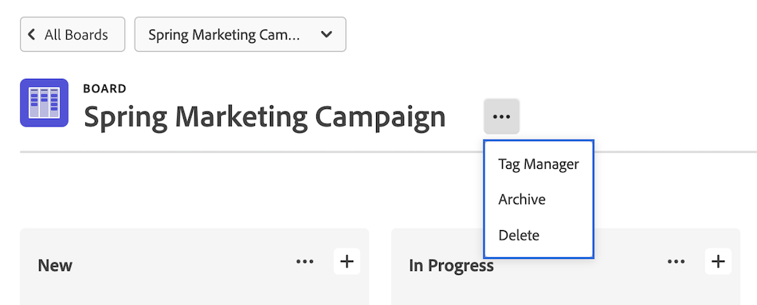
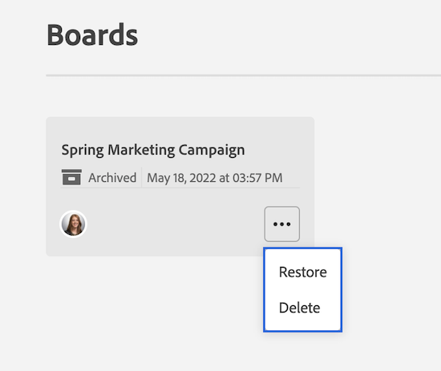

# Eliminar o archivar un tablero

Puede eliminar o archivar un tablero en [!DNL Workfront]. Al eliminar un tablero de forma permanente, se eliminará de [!DNL Workfront], mientras que al archivar un tablero, se conservarán todas las tarjetas y se podrá restaurar más adelante.

Solo el propietario del tablero puede eliminar el tablero.

## Requisitos de acceso

+++ Expanda para ver los requisitos de acceso para la funcionalidad en este artículo.

<table style="table-layout:auto"> 
 <col> 
 <col> 
 <tbody> 
  <tr> 
   <td role="rowheader">Paquete de Adobe Workfront</td> 
   <td> 
Cualquiera
 </td> 
  </tr> 
  <tr> 
   <td role="rowheader">Licencia de Adobe Workfront</td> 
   <td> 
   
Colaborador o superior
 
   
Solicitud o superior

   </td> 
  </tr> 
 </tbody> 
</table>

Para obtener más información, consulte [Requisitos de acceso en la documentación de Workfront](/help/quicksilver/administration-and-setup/add-users/access-levels-and-object-permissions/access-level-requirements-in-documentation.md).

+++

## Eliminar un tablero

Al eliminar un tablero, se quita de forma permanente de [!DNL Workfront] y no se puede restaurar. Todas las tarjetas del tablero también se eliminan junto con el tablero.

{{step1-to-boards}}

1. En el panel de control, seleccione el tablero que desea abrir.
1. Haga clic en el menú **[!UICONTROL Más]** ![[!UICONTROL Más]](assets/more-icon-spectrum.png) junto al nombre del tablero y seleccione **[!UICONTROL Eliminar]**. A continuación, haga clic en **[!UICONTROL Eliminar tablero]** en el mensaje de confirmación.

   >[!NOTE]
   >
   >Solo puede eliminar tableros que haya creado o de los que se le haya asignado el nombre de propietario, no tableros a los que se le haya añadido como miembro.

   

## Archivar un tablero

Los tableros archivados conservan todas las tarjetas y asignaciones. Cualquier usuario puede archivar o restaurar un tablero en cualquier momento.

{{step1-to-boards}}

1. En el panel de control, seleccione el tablero que desea abrir.
1. Haga clic en el menú **[!UICONTROL Más]** ![[!UICONTROL Menú más]](assets/more-icon-spectrum.png) que está junto al nombre del tablero y seleccione **[!UICONTROL Archivo]**.

   

## Restaurar un tablero

Se puede restaurar una placa archivada en cualquier momento. Cualquier usuario puede restaurar un tablero archivado.

{{step1-to-boards}}

1. En el panel, haga clic en el icono de filtro  y seleccione **[!UICONTROL Tableros archivados]**.
1. Busque el tablero que desea restaurar, haga clic en el menú **[!UICONTROL Más]**  junto al nombre del tablero y seleccione **[!UICONTROL Restaurar]**.

   
