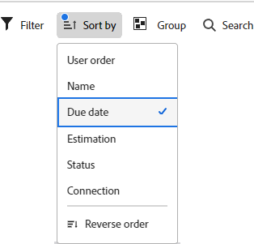

# Filtrar y buscar en un tablero

Puede filtrar un tablero para mostrar:

* Tarjetas asignadas a determinadas personas
* Tarjetas con ciertas etiquetas
* Tarjetas con un estado específico
* Tarjetas con vencimiento en un intervalo de tiempo determinado
* Tarjetas archivadas
* Tarjetas conectadas a un proyecto específico

Al ordenar el tablero, se ordenan todas las tarjetas de las columnas. No puede ordenar una sola columna y la columna de registro de pendientes o de entrada no está ordenada.

La búsqueda también le ayuda a localizar una tarjeta específica en el tablero.

Cuando se aplican filtros, se muestra un indicador en el tablero . Clic **[!UICONTROL Borrar todo]** para eliminar todos los filtros del tablero, y haga clic en **[!UICONTROL Ocultar filtros]** para cerrar el panel de filtro.

## Requisitos de acceso

Debe tener el siguiente acceso para realizar los pasos de este artículo:

<table style="table-layout:auto"> 
 <col> 
 <col> 
 <tbody> 
  <tr> 
   <td role="rowheader"><strong>[!DNL Adobe Workfront] plan*</strong></td> 
   <td> 
Cualquiera
 </td> 
  </tr> 
  <tr> 
   <td role="rowheader"><strong>[!DNL Adobe Workfront] licencia*</strong></td> 
   <td> 
[!UICONTROL Request] o superior
 </td> 
  </tr> 
 </tbody> 
</table>

&#42;Para saber qué plan, tipo de licencia o acceso tiene, póngase en contacto con su [!DNL Workfront] administrador.

## Filtrar un tablero por personas asignadas

1. Haga clic en **[!UICONTROL Menú principal]** icono  en la esquina superior derecha de [!DNL Adobe Workfront], luego haga clic en **[!UICONTROL Tableros]**.
1. Acceda a un tablero. Para obtener más información, consulte [Crear o editar un tablero](../../agile/get-started-with-boards/create-edit-board.md).
1. Clic [!UICONTROL **Filtrar**], expanda el [!UICONTROL Miembros] y seleccione la persona o personas cuyas tarjetas desee ver. También puede mostrar las tarjetas sin asignar.

   

## Filtrado de tableros por etiquetas

1. Acceda al tablero.
1. Clic [!UICONTROL **Filtrar**], expanda el [!UICONTROL Etiquetas] y seleccione las etiquetas que desee ver.

   

## Filtrar un tablero por estado

1. Acceda al tablero.
1. Clic [!UICONTROL **Filtrar**], expanda el [!UICONTROL Estados] y seleccione los tipos de estado que desee ver.

   También puede ocultar las tarjetas completadas.

   

## Filtrar un tablero por fecha de vencimiento

1. Acceda al tablero.
1. Clic [!UICONTROL **Filtrar**], expanda el [!UICONTROL Fecha de vencimiento] y seleccione las opciones de fecha que desee ver.

   Solo se muestran las tarjetas en los intervalos de fechas seleccionados.

   

## Filtrar un tablero para mostrar tarjetas archivadas

De forma predeterminada, solo se muestran las tarjetas activas en un tablero. Puede filtrar el tablero para que también muestre las tarjetas archivadas.

1. Acceda al tablero.
1. Clic [!UICONTROL **Filtrar**], expanda el [!UICONTROL Tarjetas archivadas] y seleccione. **[!UICONTROL Tarjetas archivadas]** para mostrar cualquier tarjeta archivada.

   El filtro muestra el número de tarjetas archivadas.

   

1. Seleccionar **[!UICONTROL Tarjetas archivadas]** de nuevo para desactivar la opción y mostrar solo las tarjetas activas.

## Filtrar un tablero por conexión

1. Acceda al tablero.
1. Clic [!UICONTROL **Filtrar**], expanda el [!UICONTROL Conexión] y seleccione la sección [!DNL Workfront] proyectos para las tarjetas conectadas que desee ver.

   También puede mostrar tarjetas que no estén conectadas a un proyecto.

   

## Ordenar en un tablero

Al seleccionar una opción para ordenar, se ordenan todas las columnas. No puede ordenar una sola columna y la columna de registro de pendientes o de entrada no está ordenada.

1. Acceda al tablero.
1. Clic [!UICONTROL **Ordenar por**] y seleccione [!UICONTROL **Nombre**], [!UICONTROL **Fecha de vencimiento**], [!UICONTROL **Estimación**], [!UICONTROL **Estado**], o [!UICONTROL **Conexión**].

   La conexión (nombre de proyecto) se aplica solo a tarjetas conectadas y las demás opciones ordenarán tarjetas conectadas y ad hoc en las columnas.

   La opción &quot;orden del usuario&quot; devuelve las tarjetas en el orden en que se establecieron manualmente, antes de que se aplicaran otras opciones de ordenación. Este es el orden predeterminado para las columnas.

1. Seleccionar [!UICONTROL **Orden inverso**] para ordenar las columnas en orden inverso a la opción ordenar.

   La flecha del icono de ordenación indica si las columnas se ordenan en orden ascendente o descendente.

   Cuando se aplica una ordenación distinta de la predeterminada, se muestra un indicador en el icono de ordenación .

   

## Buscar en un tablero

1. Acceda al tablero.
1. Clic [!UICONTROL **Buscar**] y escriba un término de búsqueda. A continuación, pulse Intro.

   Se muestran todas las tarjetas que contienen el término de búsqueda.

   Haga clic en la X para borrar la búsqueda.

   
