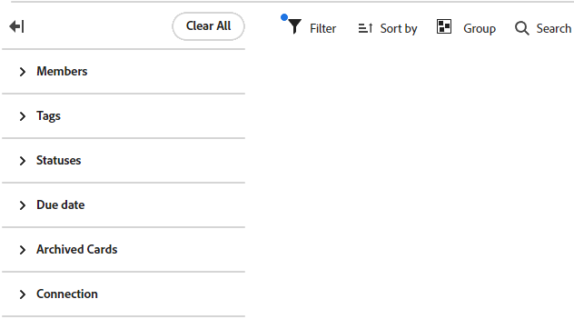

# Filtrar y buscar en un tablero

Puede filtrar un tablero para mostrar:

* Tarjetas asignadas a determinadas personas
* Tarjetas con determinadas etiquetas
* Tarjetas con un estado específico
* Tarjetas con vencimiento en un lapso de tiempo determinado
* Tarjetas archivadas
* Tarjetas conectadas a un proyecto específico

Al ordenar el tablero, se ordenan todas las tarjetas de las columnas. No puede ordenar una sola columna y la columna de registro de asuntos pendientes o de entrada no está ordenada.

La búsqueda también ayuda a localizar una tarjeta específica en el tablero.

Cuando se aplican filtros, se muestra un indicador en el tablero . Haga clic en **[!UICONTROL Clear All]** para quitar todos los filtros del tablero y, a continuación, haga clic en el icono de contraer para cerrar el panel de filtro.

## Requisitos de acceso

+++ Expanda para ver los requisitos de acceso para la funcionalidad en este artículo.

<table style="table-layout:auto"> 
 <col> 
 <col> 
 <tbody> 
  <tr> 
   <td role="rowheader">paquete de Adobe Workfront</td> 
   <td> 
Cualquiera
 </td> 
  </tr> 
  <tr> 
   <td role="rowheader">Licencia de Adobe Workfront</td> 
   <td> 
   
Colaborador o superior
 
   
Solicitud o superior

   </td> 
  </tr> 
 </tbody> 
</table>

Para obtener más información sobre el contenido de esta tabla, consulte [Requisitos de acceso en la documentación de Workfront](/help/quicksilver/administration-and-setup/add-users/access-levels-and-object-permissions/access-level-requirements-in-documentation.md).

+++

## Filtrar un tablero por usuarios asignados

{{step1-to-boards}}

1. Acceda a un tablero. Para obtener más información, consulte [Crear o editar un tablero](../../agile/get-started-with-boards/create-edit-board.md).
1. Haga clic en [!UICONTROL **Filter**], expanda la sección [!UICONTROL Members] y seleccione la persona o personas cuyas tarjetas desee ver. También puede mostrar las tarjetas sin asignar.

   

## Filtrar un tablero por etiquetas

1. Acceda al tablero.
1. Haga clic en [!UICONTROL **Filter**], expanda la sección [!UICONTROL Tags] y seleccione las etiquetas que desee ver.

   

## Filtrar un tablero por estado

1. Acceda al tablero.
1. Haga clic en [!UICONTROL **Filter**], expanda la sección [!UICONTROL Statuses] y seleccione los tipos de estado que desee ver.

   También puede ocultar las tarjetas completadas.

   

## Filtrar un tablero por fecha de vencimiento

1. Acceda al tablero.
1. Haga clic en [!UICONTROL **Filter**], expanda la sección [!UICONTROL Due Date] y seleccione las opciones de fecha que desee ver.

   Solo se muestran las tarjetas en los intervalos de fechas seleccionados.

   

## Filtrar un tablero para mostrar tarjetas archivadas

De forma predeterminada, solo se muestran las tarjetas activas de un tablero. Puede filtrar el tablero para que también muestre las tarjetas archivadas.

1. Acceda al tablero.
1. Haga clic en [!UICONTROL **Configure**] a la derecha del tablero para abrir el panel Configurar.
1. Expanda [!UICONTROL **Cards**].
1. Active [!UICONTROL **Mostrar tarjetas archivadas en el tablero**].
1. Haga clic en [!UICONTROL **Filtro**], expanda la sección [!UICONTROL Tarjetas archivadas] y seleccione **[!UICONTROL Tarjetas archivadas]** para mostrar cualquier tarjeta archivada.

   El filtro muestra el número de tarjetas archivadas.

   

   >[!NOTE]
   >
   >La sección [!UICONTROL Tarjetas archivadas] no está disponible en el filtro si no ha activado la opción de configuración para mostrar las tarjetas archivadas. Para obtener más información, consulte [Personalizar los campos que se muestran en una tarjeta](/help/quicksilver/agile/get-started-with-boards/customize-fields-on-card.md).

1. Vuelva a seleccionar **[!UICONTROL Tarjetas archivadas]** para borrar la opción y mostrar solo las tarjetas activas.

## Filtrar un tablero por conexión

1. Acceda al tablero.
1. Haga clic en [!UICONTROL **Filtro**], expanda la sección [!UICONTROL Conexión] y seleccione los proyectos de [!DNL Workfront] de las tarjetas conectadas que desee ver.

   También puede mostrar tarjetas que no estén conectadas a un proyecto.

   

## Ordenar en un tablero

Al seleccionar una opción para ordenar, se ordenan todas las columnas. No puede ordenar una sola columna y la columna de registro de asuntos pendientes o de entrada no está ordenada.

1. Acceda al tablero.
1. Haga clic en [!UICONTROL **Ordenar por**] y seleccione [!UICONTROL **Nombre**], [!UICONTROL **Fecha de vencimiento**], [!UICONTROL **Estimación**], [!UICONTROL **Estado**] o [!UICONTROL **Conexión**].

   La conexión (nombre del proyecto) se aplica únicamente a tarjetas conectadas y las demás opciones ordenarán tarjetas conectadas y ad hoc en las columnas.

   La opción “orden del usuario” devuelve las tarjetas en el orden en que se establecieron manualmente, antes de que se aplicaran otras opciones de ordenación. Este es el orden predeterminado para las columnas.

1. Seleccione [!UICONTROL **Orden inverso**] para ordenar las columnas en orden inverso a la opción de ordenación.

   La flecha del icono de ordenación indica si las columnas se ordenan en orden ascendente o descendente.

   Cuando se aplica una ordenación distinta de la predeterminada, se muestra un indicador en el icono de ordenación .

   

## Buscar en un tablero

1. Acceda al tablero.
1. Haga clic en [!UICONTROL **Buscar**] y escriba un término de búsqueda. A continuación, presione Intro.

   Se muestran todas las tarjetas que contienen el término de búsqueda.

   Haga clic en la X para borrar la búsqueda.

   
