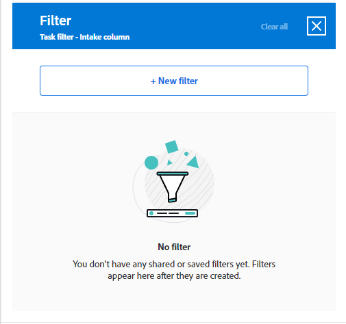

# Agregar una columna de entrada a un tablero

Si lo desea, puede agregar una columna de entrada al tablero que recupere automáticamente las tareas y los problemas como tarjetas conectadas cuando se agreguen en [!DNL Workfront], según los filtros que defina. La columna de entrada puede servir como columna de registro de asuntos pendientes para un equipo de Kanban, como ubicación de entrada para que un equipo de asistencia vea los problemas a medida que se añaden a una cola de solicitudes o para cualquier otro fin que necesite.

Solo se permite una columna de entrada en un tablero, que siempre aparece como la columna situada más a la izquierda.

La columna de entrada no está disponible en un tablero dinámico. Sin embargo, puede actualizar los filtros que definen qué tarjetas se llevan a un tablero dinámico. Cuando cambia estos filtros en un panel dinámico, se restablece la configuración de la tarjeta que no forma parte de la tarea o del problema de Workfront (por ejemplo, las etiquetas).

>[!NOTE]
>
>Por motivos de seguridad, solo el propietario de un tablero puede cambiar los filtros de tablero en el panel Configurar.

La columna de admisión está limitada a 300 tareas y 300 problemas. El orden predeterminado de los elementos de la columna de entrada es el siguiente:

Tareas:

* Orden principal: nombre del proyecto
* Orden secundario: estructura del desglose de trabajo

Problemas:

* Orden principal: nombre del proyecto
* Orden secundario: número de referencia

>[!IMPORTANT]
>
>Se recomienda actualizar el tablero con frecuencia si varios usuarios trabajan en el tablero al mismo tiempo. Actualizar la página ayuda a mantener actualizados los cambios visuales en el tablero y evita que problemas como las tarjetas duplicadas se muevan al tablero desde la columna de entrada.
>
>Para sincronizar con Workfront e incluir nuevas tareas y problemas en el tablero o en la columna de entrada, haz clic en el menú **[!UICONTROL Más]** ![[!UICONTROL Menú Más]](assets/more-icon-spectrum.png) junto al nombre del tablero y selecciona **[!UICONTROL Sincronizar elementos conectados]**.

Para obtener más información sobre las columnas, consulte [Administrar columnas del tablero](/help/quicksilver/agile/get-started-with-boards/manage-board-columns.md). Para obtener información sobre las tarjetas conectadas, consulte [Usar tarjetas conectadas en tableros](/help/quicksilver/agile/get-started-with-boards/connected-cards.md).

## Requisitos de acceso

+++ Expanda para ver los requisitos de acceso para la funcionalidad en este artículo.

Debe tener el siguiente acceso para realizar los pasos de este artículo:

<table style="table-layout:auto"> 
 <col> 
 <col> 
 <tbody> 
  <tr> 
   <td role="rowheader">[!DNL Adobe Workfront]</td> 
   <td> 
Cualquiera
 </td> 
  </tr> 
  <tr> 
   <td role="rowheader">[!DNL Adobe Workfront] licencia</td> 
   <td> 
   
Nuevo: [!UICONTROL Contributor] o superior
 
   
o

   
Actual: [!UICONTROL Request] o superior

   </td> 
  </tr> 
 </tbody> 
</table>

Para obtener más información sobre esta tabla, consulte [Requisitos de acceso en la documentación de Workfront](/help/quicksilver/administration-and-setup/add-users/access-levels-and-object-permissions/access-level-requirements-in-documentation.md).

+++

## Creación de una columna de entrada mediante filtros simples

{{step1-to-boards}}

1. Acceda a un tablero. Para obtener más información, consulte [Crear o editar un tablero](../../agile/get-started-with-boards/create-edit-board.md).
1. Haga clic en **[!UICONTROL Configurar]** a la derecha del tablero para abrir el panel Configurar.
1. Expandir **[!UICONTROL Tablero]**.
1. Activar **[!UICONTROL introducir elementos de forma dinámica en el tablero]**.

   

   La columna de entrada se añade a la izquierda del tablero. Permanece en blanco hasta que se le aplican filtros.

1. (Opcional) Busque [!DNL Workfront] [!UICONTROL **Proyectos**] y selecciónelos.
1. (Opcional) Busque y seleccione el usuario o equipo [!UICONTROL **Asignaciones**].
1. Seleccione [!UICONTROL **Incluir trabajo completado**] para mostrar las tareas y los problemas con el estado Completado en la columna de entrada.

   >[!NOTE]
   >
   >Si esta opción no está seleccionada, cuando las tarjetas en otros estados se marquen como completadas, se &quot;caerán&quot; del tablero y ya no se mostrarán.

1. Haga clic en [!UICONTROL **Aplicar**].

   Todos los objetos aparecen en la columna de entrada del tablero como tarjetas conectadas.

   

## Creación de una columna de entrada con filtros avanzados

{{step1-to-boards}}

1. Acceda a un tablero. Para obtener más información, consulte [Crear o editar un tablero](../../agile/get-started-with-boards/create-edit-board.md).
1. Haga clic en **[!UICONTROL Configurar]** a la derecha del tablero para abrir el panel Configurar.
1. Expandir **[!UICONTROL Tablero]**.
1. Activar **[!UICONTROL introducir elementos de forma dinámica en el tablero]**.

   La columna de entrada se añade a la izquierda del tablero. Permanece en blanco hasta que se le aplican filtros.

1. Haga clic en [!UICONTROL **Usar filtros avanzados**].
1. Haga clic en **[!UICONTROL Agregar orígenes de filtro]** y seleccione **[!UICONTROL Tareas]** o **[!UICONTROL Problemas]**.

   

   >[!NOTE]
   >
   >Puede filtrar la columna de entrada para incluir tareas y problemas, pero debe configurar los filtros por separado para cada tipo de objeto.
   >
   >Además, los filtros guardados y los filtros predeterminados del sistema están disponibles para su selección.

1. En el panel de filtros, haga clic en **[!UICONTROL Nuevo filtro]** para comenzar.

   

1. Genere el filtro y haga clic en **[!UICONTROL Guardar como nuevo]**.

   

   Este ejemplo muestra un filtro para tareas de un proyecto específico que están en estado de [!UICONTROL Nuevo] o [!UICONTROL En curso].

   >[!NOTE]
   >
   >Se recomienda no utilizar el comodín &quot;Yo&quot; (usuario que ha iniciado sesión) en un filtro de tablero, ya que no se garantiza que siempre se muestren tareas o problemas para el usuario que ha iniciado sesión. Una vez configurado el tablero con las tareas y los problemas correctos, puede filtrar el tablero para mostrar los elementos de un usuario asignado específico. Para obtener más información, vea [Filtrar y buscar en un tablero](/help/quicksilver/agile/get-started-with-boards/filter-search-in-board.md).

   Para obtener más información acerca de cómo crear un filtro, vea la sección &quot;Crear o editar un filtro en el generador estándar&quot; en el artículo [Crear o editar filtros en [!DNL Adobe Workfront]](/help/quicksilver/reports-and-dashboards/reports/reporting-elements/create-filters.md).

1. Asigne un nombre al filtro y haga clic en **[!UICONTROL Guardar]**.

   

   Asignar al filtro un nombre único le permite buscarlo más adelante.

1. El filtro aparece en la lista de filtros guardados y se aplica automáticamente a la columna de entrada. Haga clic en la X situada en la parte superior del panel de filtro para cerrarla.

   

1. (Opcional) Para compartir el filtro con otros usuarios, pase el ratón sobre el filtro guardado, haga clic en el **[!UICONTROL icono de menú Más]**  y seleccione **[!UICONTROL Compartir]**. Elija los usuarios o equipos con los que compartir en el cuadro Compartir filtros. Para obtener más información, vea [Compartir un filtro, vista o agrupación](/help/quicksilver/reports-and-dashboards/reports/reporting-elements/share-filter-view-grouping.md).
1. (Opcional) Para incluir tareas y problemas en la columna de entrada, haga clic en **[!UICONTROL Filtrar fuentes]** y seleccione el otro objeto para crear otro filtro.
1. Cuando termine de agregar filtros, revise la columna de entrada para comprobar que aparecen las tareas y los problemas correctos.

   

   >[!NOTE]
   >
   >Puede actualizar los filtros en cualquier momento abriendo el panel Configurar, haciendo clic en **[!UICONTROL Filtrar fuentes]** y seleccionando **[!UICONTROL Tareas]** o **[!UICONTROL Problemas]**.

## Utilizar la columna de entrada

Las tarjetas de la columna de entrada no se pueden editar hasta que las mueva a otras columnas del tablero. Puede hacer clic en la tarjeta para abrirla en una vista de solo lectura, o bien, hacer clic en  para abrir la tarea o el problema en una nueva pestaña del explorador.

Puede reordenar manualmente los elementos de la columna de entrada.

Los iconos de la parte superior derecha de la columna de entrada muestran cuántas tarjetas hay actualmente en la columna y cuántos filtros se aplican.

1. (Opcional) Para buscar un elemento en la columna de entrada, haga clic en  en la columna.
1. (Opcional) Para mover una tarjeta de la columna de entrada a otra columna, arrastre y suelte la tarjeta en la posición en la que desee que aparezca.

   O

   Haga clic en el **[!UICONTROL Más]** icono de menú  de la tarjeta y seleccione **[!UICONTROL Mover]**. A continuación, en el cuadro **[!UICONTROL Mover elemento]**, elija otra columna y seleccione **[!UICONTROL Mover]**.

1. (Opcional) Para eliminar la columna de entrada, haga clic en el icono de menú **[!UICONTROL Más]**  y seleccione **[!UICONTROL Eliminar]**.
