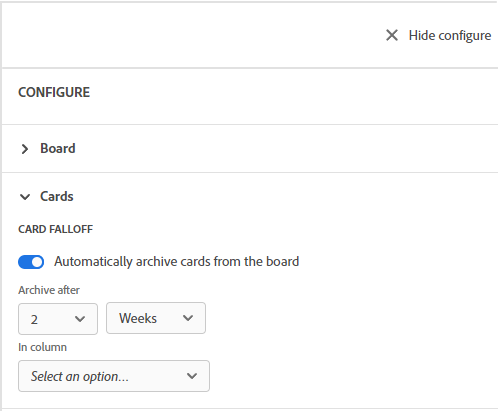

# Configurar la caída de tarjetas

Puede configurar un panel para que se archiven las tarjetas o &quot;se caigan&quot; del panel según una programación. Puede configurar las tarjetas de una columna en particular para que se caigan del tablero en un determinado número de días o semanas.

Cuando una tarjeta se cae del tablero, se archiva. Puede mostrar tarjetas archivadas con un filtro. Para obtener más información, consulte [Filtrar y buscar en un panel](/help/quicksilver/agile/get-started-with-boards/filter-search-in-board.md).

## Requisitos de acceso

+++ Expanda para ver los requisitos de acceso para la funcionalidad en este artículo.

<table style="table-layout:auto"> 
 <col> 
 <col> 
 <tbody> 
  <tr> 
   <td role="rowheader">Paquete de Adobe Workfront</td> 
   <td> 
Cualquiera
 </td> 
  </tr> 
  <tr> 
   <td role="rowheader">Licencia de Adobe Workfront</td> 
   <td> 
   
Colaborador o superior
 
   
Solicitud o superior

   </td> 
  </tr> 
 </tbody> 
</table>

Para obtener más información, consulte [Requisitos de acceso en la documentación de Workfront](/help/quicksilver/administration-and-setup/add-users/access-levels-and-object-permissions/access-level-requirements-in-documentation.md).

+++

## Configurar la caída de tarjetas

{{step1-to-boards}}

1. Acceda a un tablero. Para obtener más información, consulte [Crear o editar un tablero](../../agile/get-started-with-boards/create-edit-board.md).
1. Haga clic en **[!UICONTROL Configurar]**, a la derecha del tablero, para abrir el panel Configurar.
1. Expanda **[!UICONTROL Cards]**.
1. Activar **[!UICONTROL Archivar automáticamente las tarjetas del tablero]**.

   

1. Seleccione cuándo desea archivar las tarjetas del tablero. Puede elegir hasta 8 semanas o hasta 60 días.

   La fecha se determina a partir de la última modificación de la tarjeta.

1. Seleccione la columna de la que desea quitar las tarjetas.
1. Haz clic en **[!UICONTROL Guardar]** en el mensaje de confirmación.
1. Haga clic en **[!UICONTROL Ocultar configuración]** para cerrar el panel [!UICONTROL Configurar]. Los ajustes de configuración se aplican automáticamente al actualizar el tablero.
