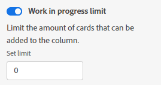

# Administrar el límite de [!UICONTROL Trabajo en curso] (WIP) en un tablero

Puede configurar un límite de [!UICONTROL trabajo en curso] (WIP) para cada columna de un tablero.

El límite de trabajo en curso es simplemente una advertencia visual y no le impide tener más elementos en cada columna que el límite establecido.

## Requisitos de acceso

+++ Expanda para ver los requisitos de acceso para la funcionalidad en este artículo.

<table style="table-layout:auto"> 
 <col> 
 <col> 
 <tbody> 
  <tr> 
   <td role="rowheader">Paquete de Adobe Workfront</td> 
   <td> 
Cualquiera
 </td> 
  </tr> 
  <tr> 
   <td role="rowheader">Licencia de Adobe Workfront</td> 
   <td> 
   
Colaborador o superior
 
   
Solicitud o superior

   </td> 
  </tr> 
 </tbody> 
</table>

Para obtener más información, consulte [Requisitos de acceso en la documentación de Workfront](/help/quicksilver/administration-and-setup/add-users/access-levels-and-object-permissions/access-level-requirements-in-documentation.md).

+++

## Definir el límite de WIP en una columna

{{step1-to-boards}}

1. Acceda a un tablero. Para obtener más información, consulte [Crear o editar un tablero](../../agile/get-started-with-boards/create-edit-board.md).
1. Busque la columna a la que desee agregar el límite de trabajo en curso.

   Para agregar una nueva columna, consulte [Administrar columnas del tablero](/help/quicksilver/agile/get-started-with-boards/manage-board-columns.md).

1. Haga clic en el menú **[!UICONTROL Más]** de la columna y seleccione **[!UICONTROL Editar]** para abrir el área de Configuración.
1. En [!UICONTROL Directivas de columna], habilite la directiva **[!UICONTROL Trabajo en curso] límite** para limitar el número de tarjetas que se pueden agregar a la columna.
1. Escriba el número de límite en el campo **[!UICONTROL Establecer límite]**.

   

   El número de tarjetas y el límite se muestran en la parte superior de la columna. Si la columna contiene más tarjetas que el límite, el contador se vuelve rojo.

   

1. Haga clic en **[!UICONTROL Cerrar]** para salir del área de [!UICONTROL Configuración] y ver la columna y sus tarjetas.
