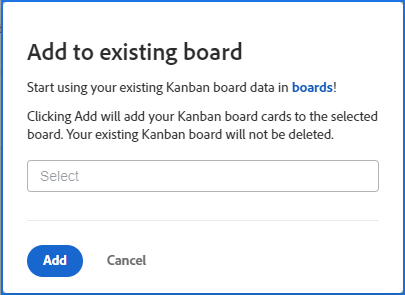

# Migrar tarjetas Kanban de equipo ágil a tableros de Workfront

Puede migrar los elementos de trabajo de un tablero Kanban de un equipo Agile a un tablero de Workfront nuevo o existente. Al ejecutar la migración, todas las tarjetas del tablero Kanban se copian en el tablero de Workfront. No se le permite elegir tarjetas específicas.

La ubicación de las tarjetas en el tablero de Workfront se basa en las políticas de columna. (Por ejemplo, una directiva podría mover todas las tarjetas con el estado “En curso” a una columna específica. Para obtener más información sobre las directivas de columna, consulte [Administrar columnas del tablero](/help/quicksilver/agile/get-started-with-boards/manage-board-columns.md).) Si no hay directivas o las tarjetas no coinciden con las directivas, las tarjetas se colocan en la columna situada más a la izquierda del tablero. En este momento, las tarjetas de la columna Registro de asuntos pendientes del tablero heredado no se añaden al de Workfront.

Las tarjetas no se eliminan del tablero Kanban del equipo ágil. Los cambios de estado de las tarjetas se sincronizan con ambos tableros. Puede mantener ambos tableros activos hasta que quiera cambiar a los tableros de Workfront.

## Requisitos de acceso

+++ Expanda para ver los requisitos de acceso para la funcionalidad en este artículo.

<table style="table-layout:auto"> 
 <col> 
 <col> 
 <tbody> 
  <tr> 
   <td role="rowheader">paquete de Adobe Workfront</td> 
   <td> 
Cualquiera
 </td> 
  </tr> 
  <tr> 
   <td role="rowheader">Licencia de Adobe Workfront</td> 
   <td> 
   
Colaborador o superior
 
   
Solicitud o superior

   </td> 
  </tr> 
 </tbody> 
</table>

Para obtener más información sobre el contenido de esta tabla, consulte [Requisitos de acceso en la documentación de Workfront](/help/quicksilver/administration-and-setup/add-users/access-levels-and-object-permissions/access-level-requirements-in-documentation.md).

+++

## Migración de tarjetas Kanban a un nuevo tablero

{{step1-to-team}}

1. Acceda a un tablero Kanban.
1. Haga clic en [!UICONTROL **Add to Boards**] y seleccione [!UICONTROL **New Board**].
1. En el cuadro de diálogo [!UICONTROL Add to new board], escriba un nombre para el nuevo tablero (el nombre del tablero [!UICONTROL Kanban] actual se muestra automáticamente) y haga clic en [!UICONTROL **Add**].

   

1. (Opcional) En el mensaje de operación realizada correctamente que aparece, haga clic en el vínculo para abrir el nuevo tablero.

## Migración de tarjetas Kanban a un tablero existente

{{step1-to-team}}

1. Acceda a un tablero Kanban.
1. Haga clic en [!UICONTROL **Add to Boards**] y seleccione [!UICONTROL **Existing Board**].
1. En el cuadro de diálogo [!UICONTROL Add to existing board], busque y seleccione el tablero al que migrar las tarjetas. A continuación, haga clic en [!UICONTROL **Add**].

   

1. (Opcional) En el mensaje de éxito que aparece, haga clic en el vínculo para abrir el tablero.
