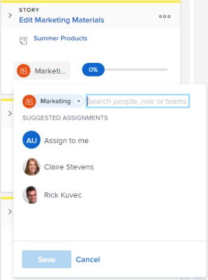

# Asignar usuarios a una historia en el tablero [!UICONTROL Kanban]

Puede asignar usuarios a historias directamente en el panel Kanban.

## Requisitos de acceso

+++ Expanda para ver los requisitos de acceso para la funcionalidad en este artículo.

<table style="table-layout:auto"> 
 <col> 
 </col> 
 <col> 
 </col> 
 <tbody> 
  <tr> 
   <td role="rowheader">Paquete de Adobe Workfront</td> 
   <td> 
Cualquiera
 </td> 
  </tr> 
  <tr> 
   <td role="rowheader">Licencia de Adobe Workfront</td> 
   <td> 
Estándar
 
   
Trabajo o superior
 </td> 
  </tr>
 </tbody> 
</table>

Para obtener más información, consulte [Requisitos de acceso en la documentación de Workfront](/help/quicksilver/administration-and-setup/add-users/access-levels-and-object-permissions/access-level-requirements-in-documentation.md).

+++

## Asignar usuarios a una historia en el tablero [!UICONTROL Kanban]

{{step1-to-team}}

1. (Opcional) Haga clic en el icono **[!UICONTROL Cambiar de equipo]**  y, a continuación, seleccione un nuevo equipo Kanban en el menú desplegable o busque un equipo en la barra de búsqueda.

1. Vaya al tablero [!UICONTROL Kanban] de Agile donde desee asignar usuarios.
1. Vaya al mosaico de la historia del tablero [!UICONTROL Kanban] en el que desea añadir un usuario.
1. Haga clic en el avatar del equipo en el mosaico de la historia (o en un avatar de usuario si ya se ha asignado uno), empiece a escribir el nombre del usuario que desea asignar a la historia y, a continuación, haga clic en el nombre cuando aparezca. También puede elegir un usuario diferente.

   >[!TIP]
   >
   >También puede asignar una función a una historia. Solo puede asignar usuarios activos y funciones activas.

   
