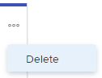

# Eliminar historias o problemas del tablero [!UICONTROL Kanban]

Puede eliminar una historia o un problema del tablero [!UICONTROL Kanban]. Cuando elimina una historia o un problema, se mueve a la papelera de reciclaje durante 30 días y solo el administrador del sistema puede recuperarlo.

## Requisitos de acceso

+++ Expanda para ver los requisitos de acceso para la funcionalidad en este artículo.

<table style="table-layout:auto"> 
 <col> 
 </col> 
 <col> 
 </col> 
 <tbody> 
  <tr> 
   <td role="rowheader">Paquete de Adobe Workfront</td> 
   <td> 
Cualquiera
 </td> 
  </tr> 
  <tr> 
   <td role="rowheader">Licencia de Adobe Workfront</td> 
   <td> 
Estándar
 
   
Trabajo o superior
 </td> 
  </tr>
  <tr> 
   <td role="rowheader">Permisos de objeto</td> 
   <td>Administrar el acceso a la tarea o al problema </td> 
  </tr> 
 </tbody> 
</table>

Para obtener más información, consulte [Requisitos de acceso en la documentación de Workfront](/help/quicksilver/administration-and-setup/add-users/access-levels-and-object-permissions/access-level-requirements-in-documentation.md).

+++

## Eliminar una historia o un problema

{{step1-to-team}}

1. (Opcional) Haga clic en el icono **[!UICONTROL Cambiar de equipo]**  y, a continuación, seleccione un nuevo equipo [!UICONTROL Kanban] en el menú desplegable o busque un equipo en la barra de búsqueda.
1. Haga clic en el icono **[!UICONTROL Más]** de la historia o el problema y seleccione **[!UICONTROL Eliminar]**.

   

1. En el mensaje de confirmación, haga clic en **[!UICONTROL Sí, eliminarlo]**.
