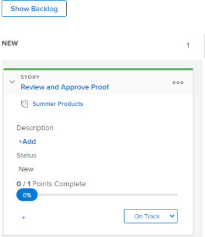

# Editar información de la historia

## Comprender qué información se puede ver y editar {#understand-what-information-can-be-viewed-and-edited}

Al ver un mosaico de historia en el tablero [!UICONTROL Kanban], está disponible la información de la siguiente tabla. Puede editar la mayor parte de la información en línea, directamente desde el mosaico de artículo.

<table style="table-layout:auto"> 
 <col> 
 <col> 
 <col> 
 <thead> 
  <tr> 
   <th><strong>Información</strong> </th> 
   <th><strong>Visible</strong> </th> 
   <th><strong>En línea editable</strong> </th> 
  </tr> 
 </thead> 
 <tbody> 
  <tr> 
   <td>El nombre de la historia con un vínculo directamente a la tarea o al problema</td> 
   <td>✓</td> 
   <td> </td> 
  </tr> 
  <tr> 
   <td> 
El nombre del proyecto con un vínculo directamente al proyecto
 </td> 
   <td>✓ </td> 
   <td> </td> 
  </tr> 
  <tr> 
   <td> 
La cantidad de puntos u horas completadas en la historia y la cantidad de puntos u horas asignadas a la historia Estos números se utilizan para calcular y mostrar el porcentaje completado de cada historia.
 </td> 
   <td>✓</td> 
   <td> </td> 
  </tr> 
  <tr> 
   <td> 
[!UICONTROL Percent Complete] para cada artículo y problema. [!UICONTROL El porcentaje completado] de la iteración se calcula según el [!UICONTROL Porcentaje completado] de cada artículo. 
 
Al actualizar [!UICONTROL Porcentaje completado] para una historia o un problema, puede elegir cualquier número entre 0 y 100.
 </td> 
   <td>✓</td> 
   <td>✓</td> 
  </tr> 
  <tr> 
   <td> 
A quién se asigna la historia
 </td> 
   <td>✓</td> 
   <td>✓</td> 
  </tr> 
  <tr> 
   <td> 
Color o categoría del mosaico
 </td> 
   <td>✓</td> 
   <td>✓</td> 
  </tr> 
  <tr> 
   <td> 
Cualquier campo adicional (incluidos los campos personalizados) que se pueda haber agregado a la vista Agile modificando la vista Agile, tal como se describe en "Creación y personalización de una vista Agile" en <a href="../../reports-and-dashboards/reports/reporting-elements/views-overview.md" class="MCXref xref">Información general de vistas en [!DNL Adobe Workfront]</a>
 </td> 
   <td>✓</td> 
   <td>✓</td> 
  </tr> 
 </tbody> 
</table>

## Requisitos de acceso

+++ Expanda para ver los requisitos de acceso para la funcionalidad en este artículo.

Debe tener el siguiente acceso para realizar los pasos de este artículo:

<table style="table-layout:auto"> 
 <col> 
 </col> 
 <col> 
 </col> 
 <tbody> 
  <tr> 
   <td role="rowheader">[!DNL Adobe Workfront] plan</td> 
   <td> 
Cualquiera
 </td> 
  </tr> 
  <tr> 
   <td role="rowheader">[!DNL Adobe Workfront] licencia</td> 
   <td> 
Nuevo: [!UICONTROL Standard]
 
   o
   
Actual: [!UICONTROL Work] o superior
 </td> 
  </tr>
 </tbody> 
</table>

Para obtener más información sobre esta tabla, consulte [Requisitos de acceso en la documentación de Workfront](/help/quicksilver/administration-and-setup/add-users/access-levels-and-object-permissions/access-level-requirements-in-documentation.md).

+++

## Ver y editar información en un mosaico de artículo

{{step1-to-team}}

1. (Opcional) Haga clic en el icono **[!UICONTROL Cambiar equipo]**  y, a continuación, seleccione un nuevo equipo Kanban en el menú desplegable o busque un equipo en la barra de búsqueda.

1. Vaya al tablero [!UICONTROL Kanban].
1. Expanda el mosaico de artículo para ver todos los campos asociados con el artículo.

   

1. (Opcional) Para editar un campo, haga clic en el campo y realice los cambios necesarios.
Debe tener [!UICONTROL Editar] derechos sobre la tarea o el problema para editar el mosaico de la historia.
Para obtener más información sobre cada campo y si se puede editar, consulte [Comprender qué información se puede ver y editar](#understand-what-information-can-be-viewed-and-edited).

>[!NOTE]
>
>Para cambiar el [!UICONTROL Porcentaje completado], debe escribir un número entre 0 y 100. El campo no es un control deslizante que se pueda mover.
