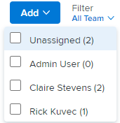

# Filtrar por usuario en el tablero [!UICONTROL Kanban]

Puede utilitzar el filtro de un tablero [!UICONTROL Kanban] para ver qué elementos de trabajo están asociados a otros usuarios y cuáles no se han asignado.

## Requisitos de acceso

+++ Expanda para ver los requisitos de acceso para la funcionalidad en este artículo.

<table style="table-layout:auto"> 
 <col> 
 </col> 
 <col> 
 </col> 
 <tbody> 
  <tr> 
   <td role="rowheader">Paquete de Adobe Workfront</td> 
   <td> 
Cualquiera
 </td> 
  </tr> 
  <tr> 
   <td role="rowheader">Licencia de Adobe Workfront</td> 
   <td> 
Estándar
 
   
Trabajo o superior
 </td> 
  </tr>
 </tbody> 
</table>

Para obtener más información, consulte [Requisitos de acceso en la documentación de Workfront](/help/quicksilver/administration-and-setup/add-users/access-levels-and-object-permissions/access-level-requirements-in-documentation.md).

+++

## Filtrar por usuario en el tablero Kanban

{{step1-to-team}}

1. (Optional) Haga clic en el icono **[!UICONTROL Cambiar equipo]**, y, a continuación, seleccione un nuevo equipo Kanban en el menú desplegable o busque un equipo en la barra de búsqueda.

1. Ir a un tablero [!UICONTROL Kanban].
1. Haga clic en el menú desplegable [!UICONTROL Filtro] que hay a la derecha del tablero [!UICONTROL Kanban].
1. Seleccione uno o más usuarios, o **[!UICONTROL Sin asignar]**.

   >[!NOTE]
   >
   >* Los totales de columna no cambian según los resultados filtrados. Los totales de columna muestran los totales de todos los elementos de trabajo del tablero. Se muestra un máximo de cincuenta tarjetas de forma predeterminada, pero se puede hacer clic en **[!UICONTROL Mostrar más]** para mostrar tarjetas adicionales.
   >* Los filtros no se aplican a la columna [!UICONTROL Registro de asuntos pendientes].

   
