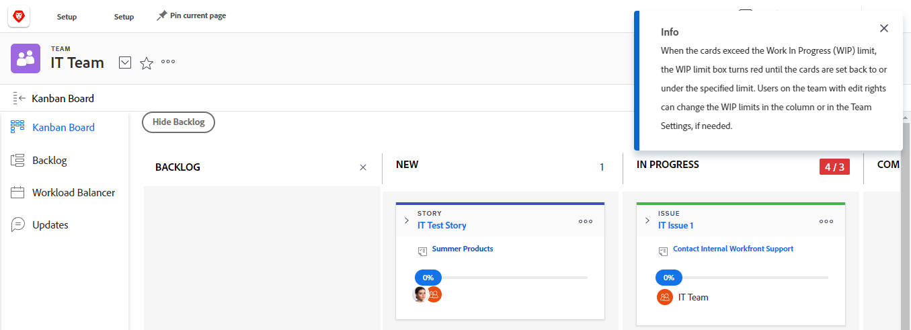

# Administrar el límite de [!UICONTROL trabajo en curso] (WIP) en el tablero Kanban

Puede configurar un límite de [!UICONTROL Work in Progress] (WIP) para cada columna del tablero [!UICONTROL Kanban], tal como se describe en el artículo [Configurar Kanban](../../agile/get-started-with-agile-in-workfront/configure-kanban.md).

El límite de trabajo en curso es simplemente una advertencia visual y no impide que su equipo tenga más elementos en cada columna de estado que el límite establecido.

## Requisitos de acceso

+++ Expanda para ver los requisitos de acceso para la funcionalidad en este artículo.

<table style="table-layout:auto"> 
 <col> 
 </col> 
 <col> 
 </col> 
 <tbody> 
  <tr> 
   <td role="rowheader">Paquete de Adobe Workfront</td> 
   <td> 
Cualquiera
 </td> 
  </tr> 
  <tr> 
   <td role="rowheader">Licencia de Adobe Workfront</td> 
   <td> 
Estándar
 
   
Trabajo o superior
 </td> 
  </tr>
 </tbody> 
</table>

Para obtener más información sobre el contenido de esta tabla, consulte [Requisitos de acceso en la documentación de Workfront](/help/quicksilver/administration-and-setup/add-users/access-levels-and-object-permissions/access-level-requirements-in-documentation.md).

+++

## Ver el límite de [!UICONTROL Work in Progress] (WIP) en el tablero [!UICONTROL Kanban]

When a WIP limit is configured for your Agile team, it is displayed in the upper-right corner of each column on the Kanban board (except for the [!UICONTROL Complete] column).

Any time the limit is exceeded for any column on the [!UICONTROL Kanban] board, the limit is highlighted in red and a message is displayed.

## Actualizar el límite de [!UICONTROL Work in Progress] (WIP) desde el tablero [!UICONTROL Kanban]

Los integrantes del equipo con derechos [!UICONTROL Edit] pueden actualizar el límite de WIP para cada columna de estado directamente desde el tablero [!UICONTROL Kanban]. También se puede actualizar el límite de WIP como se describe en el artículo [Configurar Kanban](../../agile/get-started-with-agile-in-workfront/configure-kanban.md).

{{step1-to-team}}

1. (Opcional) Haga clic en el icono **[!UICONTROL Switch team]**  y, a continuación, seleccione un nuevo equipo de [!UICONTROL Kanban] en el menú desplegable o busque un equipo en la barra de búsqueda.

1. En el tablero [!UICONTROL Kanban], localice el límite de WIP en la esquina superior derecha de cada columna.
1. Haga clic en el límite de WIP que desee modificar y, a continuación, especifique un nuevo límite.
1. Pulse **[!UICONTROL Enter]**.
