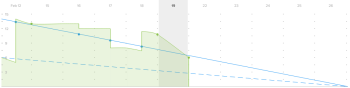
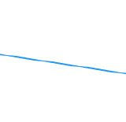

# Descripción general de la tabla de correspondencias de Agile

El gráfico desplegable proporciona una representación visual de cómo progresan los artículos a través de la iteración. La tasa de interrupción real se mide con respecto a la tasa de interrupción ideal para la cronología de iteración.

El gráfico desplegable se ajusta según el día seleccionado. El día actual es el valor predeterminado. Cuando se selecciona un día anterior, todos los datos del gráfico desplegable y todos los valores de la [!UICONTROL estado de finalización] encima del gráfico de desglose se vuelven a calcular para representar los datos tal como estaban al final del día seleccionado. (Puede seleccionar días anteriores o el día actual; no puede seleccionar días en el futuro).

## Indicadores visuales

El gráfico desplegable contiene los siguientes indicadores visuales:

<table style="table-layout:auto"> 
 <col> 
 <col> 
 <tbody> 
  <tr> 
   <td role="rowheader">  </td> 
   <td> 
Tasa de interrupción ideal basada en el momento en que comenzó la iteración.
 
Esta línea no se muestra si el ámbito de la iteración nunca cambia (las horas o los puntos nunca se agregan o eliminan).
 
Esta línea se muestra como plana cuando el trabajo se realiza en un día libre. Para obtener más información, consulte <a title="Uso de la tabla de correspondencias Agile" href="#how-days-off-affect-the-burndown-chart" class="MCXref xref">Cómo afectan los días de descanso al gráfico desplegable</a>.
 </td> 
  </tr> 
  <tr> 
   <td role="rowheader">  </td> 
   <td> 
Tasa de salida ideal basada en artículos o tareas actuales.
 
La tasa de explosión ideal actual (línea azul sólida) difiere de la tasa de explosión ideal original (línea azul punteada) cuando se agregan o eliminan horas o puntos de la iteración después de que comienza la iteración.
 
Esta línea se muestra como plana cuando el trabajo se realiza en un día libre.
 
Para obtener más información, consulte <a title="Uso de la tabla de correspondencias Agile" href="#how-days-off-affect-the-burndown-chart" class="MCXref xref">Cómo afectan los días de descanso al gráfico desplegable</a>.
 </td> 
  </tr> 
  <tr> 
   <td role="rowheader">  </td> 
   <td> 
La tasa de división real se muestra en rojo cuando la tasa de división es inferior a la ideal (quedan más puntos o horas por día que el cálculo de desglose ideal).
 
La siguiente fórmula se utiliza para calcular la tasa de conversión real:
 
[SUM(valor de punto o hora del trabajo en curso * porcentaje completado) + valor de punto o hora del trabajo completado]
 </td> 
  </tr> 
  <tr> 
   <td role="rowheader">  </td> 
   <td> 
La tasa de división real se muestra en verde cuando la tasa de división es igual o mejor que el ideal (el resto de puntos por día es igual o menor que el cálculo de desglose ideal).
 
La siguiente fórmula se utiliza para calcular la tasa de conversión real:
 
[SUM(valor de punto o hora del trabajo en curso * porcentaje completado) + valor de punto o hora del trabajo completado]
 </td> 
  </tr> 
  <tr> 
   <td role="rowheader">  </td> 
   <td> 
Cambio de ámbito (se añaden o eliminan horas o puntos de la iteración).
 
Los cambios de ámbito siempre se muestran como una línea vertical a mitad del día. Además, se muestra un punto azul en medio de cualquier día en el que se haya producido un cambio de ámbito.
 
El eje vertical del gráfico desplegable muestra los puntos u horas del artículo.
 </td> 
  </tr> 
  <tr> 
   <td role="rowheader">  </td> 
   <td> 
Cambio en el intervalo de fechas (la duración de la iteración aumenta o disminuye).
 
Se muestra un punto azul en medio de cualquier día en el que se cambió la duración de la iteración.
 </td> 
  </tr> 
  <tr> 
   <td role="rowheader">  </td> 
   <td> 
Se muestra un punto verde o rojo en la tasa de pérdida real cada vez que se quema el trabajo. (Cuando la tasa de pérdidas real de ese día es roja, el punto es rojo; cuando la tasa de cancelación real de ese día es verde, el punto es verde).
 
El trabajo se quema cuando se produce cualquiera de las siguientes situaciones:
 
    <ul> 
     <li> El [!UICONTROL Porcentaje completado] se incrementa en el artículo. El [!UICONTROL Porcentaje completado] aumenta cuando: 
      <ul> 
       <li> 
Modificado manualmente
 </li> 
       <li> 
El número de puntos u horas se actualiza en el artículo
 </li> 
      </ul></li>  
     <li>El estado del artículo se cambia a [!UICONTROL Complete]</li> 
    </ul> </td> 
  </tr> 
 </tbody> 
</table>

## Cómo afectan los días de descanso al gráfico desplegable {#how-days-off-affect-the-burndown-chart}

La programación predeterminada definida en [!DNL Workfront] afecta al gráfico desglosado excluyendo los días libres (fines de semana y días festivos) de la lista desglosada. El gráfico de desglose utiliza la programación predeterminada para definir los días laborables (como se describe en  [Crear una programación](../../../administration-and-setup/set-up-workfront/configure-timesheets-schedules/create-schedules.md)).

Los equipos móviles pueden incorporar días no laborables específicos del equipo definiendo una programación alternativa (como se describe en el artículo [Usar una programación de equipo alternativa para gráficos de desglose](../../../agile/use-scrum-in-an-agile-team/burndown/use-alt--team-schedule-burndown-charts.md)). A continuación, esta programación alternativa se refleja en el gráfico desplegable de cualquier iteración asignada al equipo. La programación alternativa solo afecta al gráfico de desglose.

Los días de descanso se reflejan en el gráfico desplegable solo si:

* El trabajo se había registrado anteriormente en un día libre. (Se muestra el día en que se registró el trabajo).

   Cuando el trabajo está conectado a un día libre:

   * Cualquier trabajo registrado no se incluye al calcular la interrupción ideal porque el equipo no está programado para realizar ningún trabajo.
   * Las líneas de desglose ideales (la línea azul sólida y la línea azul discontinua) se muestran como planas en el gráfico de desglose para cualquier día en que se haya terminado el trabajo o el día en que se esté viendo el gráfico de desglose (si se está viendo en un día libre).
   * El trabajo registrado se incluye al calcular otras estadísticas de desglose, como la finalización estimada y el promedio de puntos u horas por día.

* Está viendo el gráfico desplegable un día libre. (El día que está viendo se muestra en el gráfico desplegable).
* Completa el trabajo restante total de la iteración en un día libre.

   Cuando un usuario completa el trabajo restante total para la iteración en un día libre, la variable [!UICONTROL Finalización estimada] muestra la fecha en la que se completó la iteración.

   Al planificar la iteración, si establece la fecha de finalización de la iteración para un día que no es de trabajo y la iteración se rastrea para que finalice a tiempo, la variable [!UICONTROL Finalización estimada] la fecha se establece para el último día laborable anterior a la fecha de finalización de la iteración que haya establecido (ya que el trabajo no está programado para quemarse en días no laborables).

   La fecha de finalización de la iteración se especifica cuando se planifica la iteración, tal como se describe en el artículo [Crear una iteración](../../../agile/use-scrum-in-an-agile-team/iterations/create-an-iteration.md).
