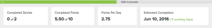

# Resumen del estado de finalización de iteración

La información de finalización descrita en este artículo se muestra encima del gráfico desplegable.

Porcentaje de finalización en una iteración:

Esta información indica el estado de finalización de la iteración para el día que está seleccionado actualmente en el gráfico desplegable. De forma predeterminada, el estado de finalización se muestra en función de la fecha del día actual.

La siguiente información está disponible:

* **[!UICONTROL Porcentaje completado]:** Progreso general de la iteración

   [!UICONTROL Porcentaje completado] se ajusta según el porcentaje completado de cada artículo o tarea dentro de la iteración, incluidos los artículos o tareas que solo se han completado parcialmente.

   El color de la variable [!UICONTROL Porcentaje completado] la barra de estado se muestra en rojo o verde para que coincida con el color de la tasa de interrupción real. Se muestra en rojo cuando la tasa de división es inferior al ideal (quedan más puntos o horas por día que el cálculo de desglose ideal) y se muestra en verde cuando la tasa de división es igual o mejor que el ideal (se restan puntos iguales o menores por día que el cálculo de desglose ideal).

* **[!UICONTROL Artículos completados]:** (Disponible solo en iteraciones) El número de artículos marcados [!UICONTROL Completar]. Esto se muestra en relación con la cantidad total de artículos en la iteración. Por ejemplo, &quot;3 de 6&quot; indica que se han marcado 3 de los 6 artículos de la iteración [!UICONTROL Completar].
* **[!UICONTROL Puntos/horas completados]:** (Disponible solo en iteraciones) El número de puntos u horas marcados [!UICONTROL Completar]. Se muestra en relación con el número total de puntos u horas en la iteración. Por ejemplo, &quot;5 de 11&quot; indica que se han marcado 5 de los 11 artículos de la iteración [!UICONTROL Completar]. Este número está directamente relacionado con la variable [!UICONTROL Porcentaje completado] y se actualiza al mismo tiempo [!UICONTROL Porcentaje completado] se actualiza.

   Los puntos y las horas están asociados a los artículos. Cuando se marca un artículo [!UICONTROL Completar], los puntos u horas asociados con ese artículo se marcan como Completada.

   De forma predeterminada, se utilizan puntos. Puede cambiar esto modificando la configuración de su equipo, tal como se describe en [Crear un equipo ágil](../../../agile/get-started-with-agile-in-workfront/create-an-agile-team.md).

* **[!UICONTROL Puntos/horas por día]:** (Disponible solo en iteraciones) El número promedio de puntos u horas marcados [!UICONTROL Completar] cada día desde el principio de la iteración hasta el día actual.

   Esto se calcula mediante el total de puntos u horas completadas, dividido por el número total de días hasta el día actual. (Los días parciales se registran como un día completo).

   Esta información puede resultar útil al planificar una iteración futura.

* **[!UICONTROL Finalización estimada]:** La fecha estimada en la que se completará la iteración, según la tasa actual en Puntos / Horas por día (para iteraciones).

   Cuando la variable [!UICONTROL Finalización estimada] La fecha es posterior a la fecha de finalización definida para la iteración, el número de días laborables restantes se muestra como rojo entre paréntesis junto al [!UICONTROL Finalización estimada] fecha.

   Cuando la variable [!UICONTROL Finalización estimada] fecha anterior a la fecha de finalización planificada de la iteración, el número de días laborables restantes se muestra en verde. (La fecha de finalización de la iteración se especifica cuando se planifica la iteración, tal como se describe en [Crear una iteración](../../../agile/use-scrum-in-an-agile-team/iterations/create-an-iteration.md); la fecha de finalización del proyecto es la [!UICONTROL Fecha de finalización planeada]o es la fecha actual si la variable [!UICONTROL Fecha de finalización planeada] es en el pasado. La variable [!UICONTROL Fecha de finalización planeada] para el proyecto se calcula en función de la duración de las tareas del proyecto). Al planificar la iteración, si establece la fecha de finalización de la iteración para un día que no es de trabajo y la iteración está rastreando para finalizar a tiempo, la fecha de finalización estimada se establece para el último día laborable antes de la fecha de finalización de la iteración que configuró (porque el trabajo no está programado para ser quemado en días que no sean de trabajo).

   Por ejemplo, &quot;(+9 días)&quot; indica que la fecha de finalización estimada es 9 días hábiles después de la fecha de finalización planificada de la iteración.

   Para obtener más información, consulte [Resumen del estado de finalización de iteración](#Understanding-How-Days-Off-Affect-the-Burndown-Chart).
