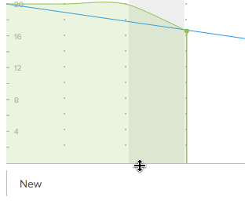

# Cambiar el tamaño y contraer el gráfico de evolución

Puede cambiar el tamaño o contraer el gráfico de desactivación para ajustar el espacio que ocupa en el tablero de artículos.

Los cambios que realice en el tamaño o visibilidad del gráfico desplegable sólo serán visibles para usted y se restablecerán cuando borre la caché del explorador.

## Requisitos de acceso

+++ Expanda para ver los requisitos de acceso para la funcionalidad en este artículo.

<table style="table-layout:auto"> 
 <col> 
 </col> 
 <col> 
 </col> 
 <tbody> 
  <tr> 
   <td role="rowheader">Paquete de Adobe Workfront</td> 
   <td> 
Cualquiera
 </td> 
  </tr> 
  <tr> 
   <td role="rowheader">Licencia de Adobe Workfront</td> 
   <td> 
Luz o superior
 
   
Revisión o superior
 </td> 
  </tr>
 </tbody> 
</table>

Para obtener más información sobre el contenido de esta tabla, consulte [Requisitos de acceso en la documentación de Workfront](/help/quicksilver/administration-and-setup/add-users/access-levels-and-object-permissions/access-level-requirements-in-documentation.md).

+++

## Cambiar el tamaño de la gráfica de descarga

{{step1-to-team}}

1. (Opcional) Haga clic en el icono **[!UICONTROL Cambiar equipo]**  y, a continuación, seleccione un nuevo equipo de [!UICONTROL Scrum] en el menú desplegable o busque un equipo en la barra de búsqueda.

1. Vaya a la iteración que contiene el gráfico desplegable que desea cambiar el tamaño.
1. Pasar por encima de la línea inferior del gráfico desplegable y, a continuación, arrastrar el gráfico hasta el tamaño deseado.
   

## Contraer el gráfico de interrupción

{{step1-to-team}}

1. (Opcional) Haga clic en el icono **[!UICONTROL Cambiar equipo]**  y, a continuación, seleccione un nuevo equipo de [!UICONTROL Scrum] en el menú desplegable o busque un equipo en la barra de búsqueda.

1. Vaya a la iteración que contiene el gráfico desplegable que desea contraer.
1. Haga clic en el icono de flecha situado a la izquierda de la barra de estado [!UICONTROL Porcentaje completado].
