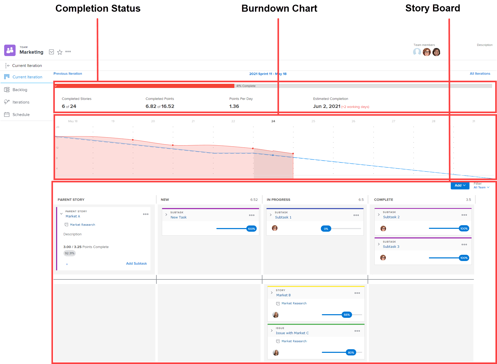

# Información general sobre las iteraciones

Las iteraciones de Agile constan de tres áreas: estado de finalización, evolución y tablero de historias.

Para obtener información sobre el gráfico de evolución y el estado de finalización, consulte la sección [[!UICONTROL Evolución]](../../../agile/use-scrum-in-an-agile-team/burndown/burndown.md).

Para obtener más información sobre el tablero de historias, consulte la sección del tablero de [[!UICONTROL Scrum]](../../../agile/use-scrum-in-an-agile-team/scrum-board/scrum-board.md).
