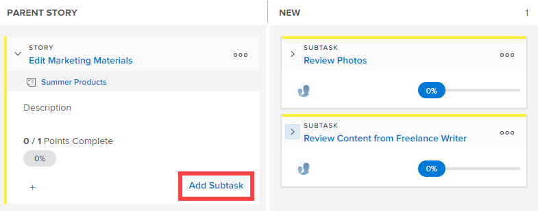

# Añadir una subtarea a una historia existente en el tablero de [!UICONTROL Scrum]

Al crear subtareas para historias existentes, tenga en cuenta lo siguiente:

**Cuando el valor de [!UICONTROL Modo de finalización] del proyecto está establecido en [!UICONTROL Manual]:**

* Al mover una historia principal con subtareas a [!UICONTROL Completado], se actualiza la historia principal al 100 % y el [!UICONTROL Estado] a [!UICONTROL Completado]. Las subtareas no se actualizan.
* Para actualizar el [!UICONTROL Porcentaje completado] de la historia, debe actualizarlo desde la pestaña [!UICONTROL Historias] o desde la página [!UICONTROL Detalles] del objeto.

**Cuando la configuración de [!UICONTROL Modo de finalización] del proyecto está establecida en [!UICONTROL Automático]**:

* Al mover una historia principal con subtareas a [!UICONTROL Completado], se actualiza la historia principal al 100 % y el [!UICONTROL Estado] a [!UICONTROL Completado]. Las subtareas también se actualizan al 100 % y [!UICONTROL Estado] se actualiza a [!UICONTROL Completado].
* Para actualizar el [!UICONTROL Porcentaje completado] de la historia, debe actualizar el [!UICONTROL Porcentaje completado] para cualquier subtarea. El [!UICONTROL porcentaje completado] para la historia se calcula en función del [!UICONTROL porcentaje completado] de todas las subtareas.

## Requisitos de acceso

+++ Expanda para ver los requisitos de acceso para la funcionalidad en este artículo.

Debe tener el siguiente acceso para realizar los pasos de este artículo:

<table style="table-layout:auto"> 
 <tbody> 
  <tr> 
   <td role="rowheader">[!DNL Adobe Workfront] plan</td> 
   <td> 
Cualquiera
 </td> 
  </tr> 
  <tr> 
   <td role="rowheader">[!DNL Adobe Workfront] licencia</td> 
   <td> 
Nuevo: [!UICONTROL Standard]
 
   o
   
Actual: [!UICONTROL Work] o superior
 </td> 
  </tr>
   <tr> 
   <td role="rowheader">Permisos de objeto</td> 
   <td>Acceso [!UICONTROL Contribute] o [!UICONTROL Manage] a la tarea en la que se encuentra la subtarea </td> 
  </tr>
 </tbody> 
</table>

Para obtener más información sobre el contenido de esta tabla, consulte [Requisitos de acceso en la documentación de Workfront](/help/quicksilver/administration-and-setup/add-users/access-levels-and-object-permissions/access-level-requirements-in-documentation.md).

+++

## Añadir una subtarea a una historia existente en el tablero de Scrum

{{step1-to-team}}

1. (Opcional) Haga clic en el icono **[!UICONTROL Cambiar de equipo]**  y, a continuación, seleccione un nuevo equipo de Scrum en el menú desplegable o busque un equipo en la barra de búsqueda.

1. Vaya a la iteración Agile o al proyecto que contiene la historia en la que desea añadir una subtarea. Para obtener información sobre cómo navegar a una iteración, consulte [Ver una iteración](../../../agile/use-scrum-in-an-agile-team/iterations/view-iteration.md).
1. Vaya al mosaico de la historia en el tablero de historia donde desea añadir una subtarea.
1. Haga clic en **[!UICONTROL Añadir subtarea]** en la tarjeta de historia principal para crear una subtarea para la historia.

   

   O

   Haga clic en **[!UICONTROL Añadir subtarea]** en un mosaico de subtarea para crear una subtarea para la subtarea.

   [!DNL Workfront] admite infinitos niveles de subtareas, pero solo se muestran dos niveles (subtareas de subtareas) en el tablero de historia Agile.

   

   Al añadir una subtarea a una historia que actualmente no tiene una calle, la tarea principal se promociona a la columna [!UICONTROL Historia principal] y la subtarea se mueve dentro de la calle.

1. Especifique la siguiente información:

   <table style="table-layout:auto">
    <col>
    <col>
    <tbody>
     <tr>
      <td role="rowheader"><strong>[!UICONTROL Subtask Name]</strong></td>
      <td> Especifique un nombre para la subtarea.</td>
     </tr>
     <tr>
      <td role="rowheader"><strong>[!UICONTROL Description]</strong></td>
      <td>Especifique una descripción para la subtarea.</td>
     </tr>
     <tr>
      <td role="rowheader"><strong>[!UICONTROL Estimate]</strong></td>
      <td>Especifique la estimación para la subtarea. 
Tenga en cuenta lo siguiente al crear estimaciones:

       <ul>
        <li>Si su equipo Agile está configurado para estimar las historias en puntos, de forma predeterminada 1 punto equivale a 8 horas. Las estimaciones se añaden como [!UICONTROL Planned Hours] en la historia.</li>
        <li>Las estimaciones combinadas para todas las subtareas determinan la estimación de la historia principal. Para obtener más información, consulte <a href="../../../agile/use-scrum-in-an-agile-team/scrum-board/update-status-of-stories-and-subtasks.md" class="MCXref xref">Actualizar el estado de las historias y subtareas en el tablero de Scrum</a>.</li>
        <li>Cuando se crea una nueva subtarea, el campo [!UICONTROL Estimate] ya está establecido. Si restablece la estimación en la subtarea, restablece la estimación en la historia principal (porque la historia principal es la suma de todas sus subtareas).</li>
       </ul> </td>
     </tr>
     <tr>
      <td role="rowheader"><strong>[!UICONTROL Planned Hours]</strong></td>
      <td> (Disponible solo en proyectos) Especifique el número de horas planificadas para la tarea.</td>
     </tr>
     <tr>
      <td role="rowheader"><strong>[!UICONTROL Assignment]</strong></td>
      <td>Empiece escribiendo el nombre del equipo al que desea asignar la subtarea y, a continuación, haga clic en él cuando aparezca en la lista desplegable.</td>
     </tr>
    </tbody>
   </table>

1. Haga clic en **[!UICONTROL Crear]**.
