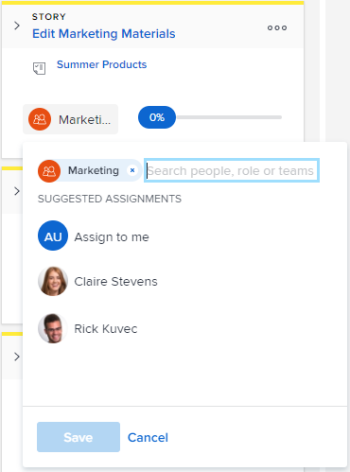

# Asignar usuarios a una historia en el tablero de [!UICONTROL Scrum]

## Requisitos de acceso

+++ Expanda para ver los requisitos de acceso para la funcionalidad en este artículo.

Debe tener el siguiente acceso para realizar los pasos de este artículo:

<table style="table-layout:auto"> 
 <tbody> 
  <tr> 
   <td role="rowheader">[!DNL Adobe Workfront] plan</td> 
   <td> 
Cualquiera
 </td> 
  </tr> 
  <tr> 
   <td role="rowheader">[!DNL Adobe Workfront] licencia</td> 
   <td> 
Nuevo: [!UICONTROL Standard]
 
   o
   
Actual: [!UICONTROL Work] o superior
 </td> 
  </tr>
 </tbody> 
</table>

Para obtener más información, consulte [Requisitos de acceso en la documentación de Workfront](/help/quicksilver/administration-and-setup/add-users/access-levels-and-object-permissions/access-level-requirements-in-documentation.md).

+++

## Asignar usuarios a una historia en el tablero de [!UICONTROL Scrum]

{{step1-to-team}}

1. (Opcional) Haga clic en el icono **[!UICONTROL Cambiar equipo]**  y, a continuación, seleccione un nuevo equipo de [!UICONTROL Scrum] en el menú desplegable o busque un equipo en la barra de búsqueda.

1. Vaya a la iteración Agile o al proyecto que contiene el guion gráfico donde desea asignar usuarios. Para obtener información sobre cómo navegar a una iteración, consulte [Ver una iteración](../../../agile/use-scrum-in-an-agile-team/iterations/view-iteration.md).
1. Vaya al mosaico de la historia en el tablero de la historia donde desea añadir un usuario.
1. Haga clic en el avatar del equipo en el mosaico de la historia (o en un avatar de usuario si ya se ha asignado uno), empiece a escribir el nombre del usuario que desea asignar a la historia y, a continuación, haga clic en el nombre cuando aparezca. También puede elegir un usuario diferente.

   >[!TIP]
   >
   >También puede asignar una función a una historia. Solo puede asignar usuarios activos y funciones activas.

   
