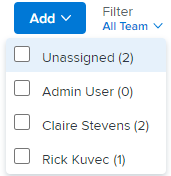

# Filtrar por usuario en la variable [!UICONTROL Anulación] tablero

Puede utilizar el filtro del panel de control para ver qué elementos de trabajo están asociados con otros usuarios y cuáles no están asignados.

## Requisitos de acceso

Debe tener el siguiente acceso para realizar los pasos de este artículo:

<table style="table-layout:auto"> 
 <col> 
 </col> 
 <col> 
 </col> 
 <tbody> 
  <tr> 
   <td role="rowheader"><strong>[!DNL Adobe Workfront] plan*</strong></td> 
   <td> 
Cualquiera
 </td> 
  </tr> 
  <tr> 
   <td role="rowheader"><strong>[!DNL Adobe Workfront] licencia*</strong></td> 
   <td> 
[!UICONTROL Work] o superior
 </td> 
  </tr> 
  <tr> 
   <td role="rowheader"><strong>Configuraciones de nivel de acceso*</strong></td> 
   <td> 
[!UICONTROL Worker] o superior
 
Nota: Si todavía no tiene acceso, pregunte a su [!DNL Workfront] administrador si establecen restricciones adicionales en su nivel de acceso. Para obtener información sobre cómo se [!DNL Workfront] administrador puede cambiar el nivel de acceso, consulte <a href="../../../administration-and-setup/add-users/configure-and-grant-access/create-modify-access-levels.md" class="MCXref xref">Crear o modificar niveles de acceso personalizados</a>.
 </td> 
  </tr> 
 </tbody> 
</table>

&#42;Para saber qué plan, tipo de licencia o acceso tiene, póngase en contacto con su [!DNL Workfront] administrador.

## Filtrar por usuario en el panel de control

1. Haga clic en el **[!UICONTROL Menú principal]** icono  en la esquina superior derecha de [!DNL Adobe Workfront]y haga clic en **[!UICONTROL Equipos]**.

1. (Opcional) Haga clic en el **[!UICONTROL Cambiar equipo]** icono , seleccione un nuevo equipo de Anulación en el menú desplegable o busque un equipo en la barra de búsqueda.

1. Vaya a una iteración activa.
1. Haga clic en el [!UICONTROL Filtro] menú desplegable en el lado derecho del [!UICONTROL examinar] tablero.
1. Seleccione el nombre del usuario o **[!UICONTROL No asignado]**.

>[!NOTE]
>
>Los totales de columnas no cambian según los resultados filtrados. Los totales de columna muestran los totales de todos los elementos de trabajo del tablero.

