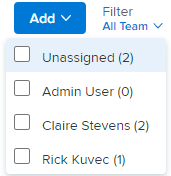

# Filtrar por usuario en el tablero de [!UICONTROL Scrum]

Puede utilizar el filtro del tablero de Scrum para ver qué elementos de trabajo están asociados con otros usuarios y cuáles no están asignados.

## Requisitos de acceso

+++ Expanda para ver los requisitos de acceso para la funcionalidad en este artículo.

Debe tener el siguiente acceso para realizar los pasos de este artículo:

<table style="table-layout:auto"> 
 <tbody> 
  <tr> 
   <td role="rowheader">[!DNL Adobe Workfront] plan</td> 
   <td> 
Cualquiera
 </td> 
  </tr> 
  <tr> 
   <td role="rowheader">[!DNL Adobe Workfront] licencia</td> 
   <td> 
Nuevo: [!UICONTROL Standard]
 
   o
   
Actual: [!UICONTROL Work] o superior
 </td> 
  </tr>
 </tbody> 
</table>

Para obtener más información, consulte [Requisitos de acceso en la documentación de Workfront](/help/quicksilver/administration-and-setup/add-users/access-levels-and-object-permissions/access-level-requirements-in-documentation.md).

+++

## Filtrar por usuario en el tablero de Scrum

{{step1-to-team}}

1. Haga clic en el icono **[!UICONTROL Cambiar equipo]**  y, a continuación, seleccione un nuevo equipo de Scrum en el menú desplegable o busque un equipo en la barra de búsqueda.

1. Navegue hasta una iteración activa.
1. Haga clic en el menú desplegable [!UICONTROL Filtro] que se encuentra en el lado derecho del tablero de [!UICONTROL Scrum].
1. Seleccione el nombre del usuario o **[!UICONTROL Sin asignar]**.

>[!NOTE]
>
>Los totales de columna no cambian según los resultados filtrados. Los totales de columna muestran los totales de todos los elementos de trabajo del tablero.

