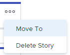

# Administrar historias y problemas en la placa [!UICONTROL Scrum]

Puede mover un artículo o un problema desde la placa [!UICONTROL Scrum] a otra iteración o al registro atrasado, o eliminarlo de la placa [!UICONTROL Scrum]. Cuando elimina una historia o un problema, se mueve a la papelera de reciclaje durante 30 días y solo el administrador del sistema puede recuperarlo.

Para quitar una tarea o un problema de la iteración sin eliminarla o enviarla al trabajo atrasado, vaya al proyecto y quite el equipo ágil de la columna de asignación. Esto quita la tarea o el problema del panel de Scrum, pero permanece en el proyecto.

## Requisitos de acceso

+++ Expanda para ver los requisitos de acceso para la funcionalidad en este artículo.

Debe tener el siguiente acceso para realizar los pasos de este artículo:

<table style="table-layout:auto"> 
 <tbody> 
  <tr> 
   <td role="rowheader">[!DNL Adobe Workfront] plan</td> 
   <td> 
Cualquiera
 </td> 
  </tr> 
  <tr> 
   <td role="rowheader">[!DNL Adobe Workfront] licencia</td> 
   <td> 
Nuevo: [!UICONTROL Standard]
 
   o
   
Actual: [!UICONTROL Work] o superior
 </td> 
  </tr>
   <tr> 
   <td role="rowheader">Permisos de objeto</td> 
   <td>Acceso de [!UICONTROL Manage] a la tarea o problema </td> 
  </tr>
 </tbody> 
</table>

Para obtener más información sobre el contenido de esta tabla, consulte [Requisitos de acceso en la documentación de Workfront](/help/quicksilver/administration-and-setup/add-users/access-levels-and-object-permissions/access-level-requirements-in-documentation.md).

+++

## Mover un artículo o problema desde la placa [!UICONTROL Scrum]

{{step1-to-team}}

1. Haga clic en el icono **[!UICONTROL Cambiar equipo]** , a continuación seleccione un equipo de Scrum en el menú desplegable o busque un equipo en la barra de búsqueda.
1. En el panel izquierdo, seleccione **[!UICONTROL Iteraciones]** para elegir una iteración específica o seleccione **[!UICONTROL Iteración actual]**.
1. Haga clic en el icono **[!UICONTROL More]** en el artículo o problema y seleccione **[!UICONTROL Move to]**.

   

1. En el mensaje de confirmación, elija:

   <table style="table-layout:auto">
    <tr>
        <td><strong>[!UICONTROL Otra iteración]</strong></td>
        <td>Seleccione esta opción para mover el elemento a otra iteración y, a continuación, elija a qué iteración se moverá el artículo o problema. Si no se definen iteraciones futuras, no se puede mover el elemento.</td>
    </tr>
    <tr>
        <td><strong>[!UICONTROL Backlog]</strong></td>
        <td>Seleccione esta opción para mover el artículo o el problema al trabajo atrasado del equipo.</td>
    </tr>
   </table>

   >[!NOTE]
   >
   >Los elementos de trabajo [!UICONTROL Fecha de inicio planificada] y [!UICONTROL Fecha de finalización planificada] se ven afectados por un ajuste de la página [!UICONTROL Editar equipo]. Para obtener más información, consulte la sección [[!UICONTROL Configurar] cómo se aplican las fechas al añadir elementos de trabajo a una iteración](../../../agile/get-started-with-agile-in-workfront/configure-scrum.md#configur5) en el artículo [Configurar Scrum](../../../agile/get-started-with-agile-in-workfront/configure-scrum.md).

1. Haga clic en **[!UICONTROL Mover]**.

## Borrar un artículo o problema de la placa [!UICONTROL Scrum]

{{step1-to-team}}

1. Haga clic en el icono **[!UICONTROL Cambiar equipo]** , a continuación seleccione un equipo de Scrum en el menú desplegable o busque un equipo en la barra de búsqueda.
1. En el panel izquierdo, seleccione **[!UICONTROL Iteraciones]** para elegir una iteración específica o seleccione **[!UICONTROL Iteración actual]**.
1. Haga clic en el icono **[!UICONTROL Más]** del artículo o problema, y seleccione **[!UICONTROL Eliminar historia]** o **[!UICONTROL Eliminar problema]**.

   

1. En el mensaje de confirmación, haga clic en **[!UICONTROL Sí, eliminarlo]**.
