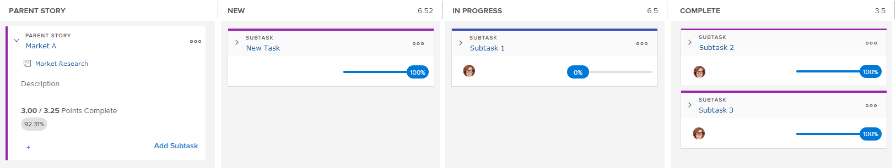

# [!UICONTROL Anulación] información general del tablero

La variable [!UICONTROL Anulación] se muestra el tablero de artículos ágil junto con el estado de finalización y el gráfico de desglose. Estos componentes ágiles están disponibles en las siguientes situaciones en [!UICONTROL Adobe Workfront]:

* En iteraciones ágiles. Para obtener más información sobre el uso del tablero de historia ágil, el gráfico de desglose y el estado de finalización en un entorno totalmente ágil (con registros atrasados y una iteración), consulte [Trabajar en un entorno ágil](../../../agile/work-in-an-agile-environment/work-in-an-agile-environment.md).
* Cuando vea un proyecto en una vista ágil. Para obtener información sobre cómo puede aprovechar el tablero de artículos ágil, el gráfico desplegable y el estado de finalización dentro de un proyecto existente, consulte [Administrar un proyecto en la vista Águila](../../../manage-work/projects/manage-projects/manage-projects-in-agile-view.md).

## Diseño y funciones del tablero de artículos

El tablero de historia consta de los siguientes elementos:

* **[!UICONTROL Artículo principal] Columna:** A diferencia de las otras columnas del panel de artículos, la variable  [!UICONTROL Artículo principal]  no es un estado de tarea, sino que existe para albergar cualquier artículo que contenga subtareas en la iteración o proyecto. En esta columna solo pueden residir los artículos principales que tengan al menos una subtarea en el tablero de artículos. Los artículos principales en sí no cambian de estado a estado en el tablero de artículos.

   En una iteración, esta columna aparece en el tablero de artículos solo cuando uno o más artículos del tablero de artículos contienen al menos una subtarea que cumple los siguientes requisitos:

   * Asignada al mismo equipo ágil que la tarea principal
   * Pertenece a la iteración

      En un proyecto, esta columna aparece cada vez que una tarea tiene al menos una subtarea.

      

* **Estados de tareas:** Indique el progreso de un artículo a través de la iteración o proyecto en función de la columna de estado en la que se encuentra el artículo.

   Los estados de tareas se pueden personalizar para el proyecto modificando la vista ágil, tal como se describe en [Creación o personalización de una vista Águila](../../../reports-and-dashboards/reports/reporting-elements/views-overview.md#customizing-an-agile-view) en [Información general sobre vistas en [!UICONTROL Adobe Workfront]](../../../reports-and-dashboards/reports/reporting-elements/views-overview.md).

* **Lane Swim:** Cuando un artículo principal y sus subtareas aparecen en el panel de artículos, se crea un carril de natación específicamente para el artículo y sus subtareas. Esto proporciona una distinción visual para ver mejor cómo progresan las subtareas de un artículo en el tablero de artículos.

   En una iteración, los carriles de natación aparecen en el panel de artículos solo cuando un artículo del panel de artículos contiene al menos una subtarea que cumple los siguientes requisitos:

   * Asignada al mismo equipo ágil que la tarea principal
   * Pertenece a la iteración

   En un proyecto, las rutas de navegación aparecen cada vez que una tarea tiene al menos una subtarea o una tarea principal.

* **Historias individuales:** Debajo de las rutas de navegación se muestran historias y problemas individuales en el tablero de la historia. Esto proporciona una distinción visual de las historias que forman parte de un carril de nado.

## Relación entre subtareas y artículos

Si un artículo contiene subtareas, no se puede actualizar ninguna información sobre el artículo principal en sí (como puntos/horas o porcentaje completado). Además, no se puede mover el artículo por el tablero de artículos para actualizar su estado. Cualquier cambio que realice en las subtareas del artículo se verá reflejado en el artículo. Los puntos u horas de artículo combinados para todas las subtareas determinan los puntos u horas del artículo principal.

Por ejemplo, si una historia tiene una sola subtarea valorada en 4 puntos, la historia misma también tiene 4 puntos. Si cambia el valor del punto de subtarea a 3, el valor del punto del artículo principal se cambia a 3. Si crea otra subtarea en el mismo artículo y establece el valor de punto para esa subtarea en 4, el valor de punto del artículo cambia a 7 para reflejar el valor de punto combinado para ambas subtareas.

Esta misma lógica se aplica a las subtareas de segundo nivel (subtareas de subtareas). Si una subtarea tiene una o más subtareas de segundo nivel, la subtarea se calcula en función de las subtareas de segundo nivel.

## Relación entre el Comité de Historia y los atrasos

>[!NOTE]
>
>La información de esta sección se aplica solo a las vistas ágiles en una iteración; las vistas ágiles de un proyecto no utilizan un registro acumulado. (Para obtener más información sobre las diferencias entre las vistas ágiles de una iteración y de un proyecto, consulte &quot;Diferencias al usar la variable [!UICONTROL Águila] Ver los versículos de un proyecto en una iteración&quot; en [Administrar un proyecto en la vista Águila](../../../manage-work/projects/manage-projects/manage-projects-in-agile-view.md).)

El trabajo acumulado de la iteración solo muestra artículos o subtareas en los que puede establecer una estimación. Si un artículo principal tiene subtareas que se muestran en el tablero de artículos (porque están asignadas al mismo equipo ágil y pertenecen a la iteración), la tarea principal no se muestra en el trabajo pendiente. En este caso, solo las subtareas se muestran en el registro de trabajo pendiente, mientras que las subtareas y el artículo principal se muestran en el tablero de artículos.

Por ejemplo, supongamos que el artículo A contiene la subtarea 1 y la subtarea 2 (y que ambas subtareas están asignadas al mismo equipo ágil). En esta situación, el artículo A se muestra en el panel de historia en un carril de nado con la subtarea 1 y la subtarea 2. Sin embargo, solo la Subtarea 1 y la Subtarea 2 se muestran en el registro acumulado.

Esta misma lógica se aplica a las subtareas de segundo nivel (subtareas de subtareas). Si una subtarea tiene una o más subtareas de segundo nivel asignadas al mismo equipo ágil y pertenece a la iteración, solo la subtarea de segundo nivel se muestra en el trabajo pendiente.

Para obtener más información sobre el trabajo pendiente, consulte [Administrar el trabajo atrasado ágil](../../../agile/work-in-an-agile-environment/manage-the-agile-backlog.md).
