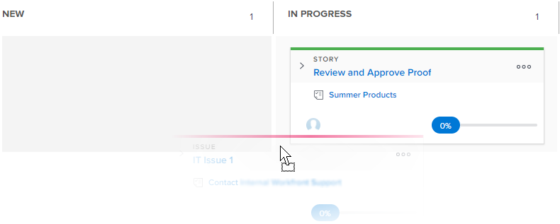

# Actualizar el estado de las historias y subtareas en el tablero de [!UICONTROL Scrum]

Puede cambiar el estado de una historia directamente desde el panel de historias de Agile para reflejar cómo progresan las historias a través de la iteración o el proyecto.

>[!NOTE]
>
>Solo los estados seleccionados en la sección [!UICONTROL Tablero de historias] del área de configuración del equipo están disponibles en el tablero de [!UICONTROL Scrum] y en el menú desplegable de estado. Para obtener más información, consulte [Configurar Scrum](../../../agile/get-started-with-agile-in-workfront/configure-scrum.md).

## Requisitos de acceso

+++ Expanda para ver los requisitos de acceso para la funcionalidad en este artículo.

Debe tener el siguiente acceso para realizar los pasos de este artículo:

<table style="table-layout:auto"> 
 <tbody> 
  <tr> 
   <td role="rowheader">[!DNL Adobe Workfront] plan</td> 
   <td> 
Cualquiera
 </td> 
  </tr> 
  <tr> 
   <td role="rowheader">[!DNL Adobe Workfront] licencia</td> 
   <td> 
Nuevo: [!UICONTROL Standard]
 
   o
   
Actual: [!UICONTROL Work] o superior
 </td> 
  </tr>
 </tbody> 
</table>

Para obtener más información, consulte [Requisitos de acceso en la documentación de Workfront](/help/quicksilver/administration-and-setup/add-users/access-levels-and-object-permissions/access-level-requirements-in-documentation.md).

+++

## Actualizar el estado de una historia o subtarea

{{step1-to-team}}

1. Haga clic en el icono **[!UICONTROL Cambiar equipo]**  y, a continuación, seleccione un nuevo equipo de Scrum en el menú desplegable o busque un equipo en la barra de búsqueda.

1. Navegue hasta una iteración activa.
1. Arrastre una historia desde una columna de estado del tablero de historias hasta otra columna.\
   
