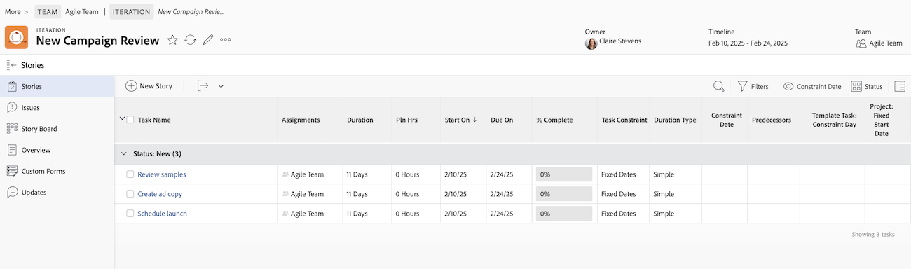

# Crear una historia Agile

Puede crear un artículo ágil en una iteración de varias formas. Después de crear un artículo ágil, puede agregar subtareas al artículo.

Cuando se agrega un artículo o una subtarea en una iteración, el tipo de duración se establece en [!UICONTROL Simple] y la restricción de tarea se establece en Fechas fijas, con las fechas bloqueadas dentro de la iteración. No se puede modificar el tipo de duración o la restricción de tarea en una iteración. Además, la duración de la tarea debe ser mayor que 0 minutos.

Para obtener información sobre cómo administrar el artículo después de agregarlo a la iteración, vea [Iteraciones](../../agile/use-scrum-in-an-agile-team/iterations/iterations.md).

## Requisitos de acceso

+++ Expanda para ver los requisitos de acceso para la funcionalidad en este artículo.

<table style="table-layout:auto"> 
 <col> 
 </col> 
 <col> 
 </col> 
 <tbody> 
  <tr> 
   <td role="rowheader">Paquete de Adobe Workfront</td> 
   <td> 
Cualquiera
 </td> 
  </tr> 
  <tr> 
   <td role="rowheader">Licencia de Adobe Workfront</td> 
   <td> 
Estándar
 
   
Trabajo o superior
 </td> 
  </tr>
  <tr> 
   <td role="rowheader">Permisos de objeto</td> 
   <td>Administrar el acceso al proyecto en el que se encuentra el artículo </td> 
  </tr> 
 </tbody> 
</table>

Para obtener más información sobre el contenido de esta tabla, consulte [Requisitos de acceso en la documentación de Workfront](/help/quicksilver/administration-and-setup/add-users/access-levels-and-object-permissions/access-level-requirements-in-documentation.md).

+++

## Crear una historia Agile en una iteración

1. Vaya a la iteración ágil en la que desea crear la historia:

   {{step1-to-team}}

   1. (Opcional) Haga clic en el icono de **[!UICONTROL Cambiar equipo]**  y, a continuación, seleccione un nuevo equipo de Scrum en el menú desplegable o busque un equipo en la barra de búsqueda.

   1. En el panel izquierdo, seleccione **[!UICONTROL Iteraciones]** para elegir una iteración específica o seleccione **[!UICONTROL Iteración actual]**.
   1. Haga clic en el nombre de la iteración específica en la que desea crear un artículo.

   

1. Haga clic en **[!UICONTROL Nuevo artículo].**
1. Especifique la siguiente información:

   <table style="table-layout:auto">
    <col>
    <col>
    <tbody>
     <tr>
      <td role="rowheader"><strong>[!UICONTROL Nombre del artículo]</strong></td>
      <td>Escriba un nombre para el artículo.</td>
     </tr>
     <tr>
      <td role="rowheader"><strong>[!UICONTROL Description]</strong></td>
      <td>Escriba una descripción para el artículo.</td>
     </tr>
     <tr>
      <td role="rowheader"><strong>[!UICONTROL Ready]</strong></td>
      <td>Seleccione esta opción si el artículo está listo para añadirse a una iteración. Cuando se selecciona esta opción, se indica a los usuarios qué artículos del trabajo pendiente están listos para añadirse a una iteración. Se puede agregar un artículo a una iteración, esté o no marcado como <strong>[!UICONTROL Ready].</strong></td>
     </tr>
     <tr>
      <td role="rowheader"><strong>[!UICONTROL Estimación] (puntos)</strong></td>
      <td>Especifique la estimación del artículo. Si su equipo de Agile está configurado para estimar historias en puntos, por defecto 1 punto es igual a 8 horas. Las estimaciones se añaden como [!UICONTROL Planned Hours] en la historia. Por ejemplo, si calcula un artículo como 3 puntos, el comportamiento predeterminado es agregar 24 [!UICONTROL Horas planeadas] al artículo. Si un artículo contiene subtareas, recuerde que las estimaciones combinadas de todas las subtareas determinan la estimación del artículo principal. Para obtener más información, consulte <a href="../../agile/use-scrum-in-an-agile-team/iterations/add-stories-to-existing-iteration.md" class="MCXref xref">Añadir historias a una iteración existente</a>.</td>
     </tr>
     <tr>
      <td role="rowheader"><strong>[!UICONTROL Parent Project]</strong></td>
      <td>Comience a escribir el nombre del proyecto al que se asociará este artículo. De forma predeterminada, el color del artículo se muestra como el mismo color que otros artículos de este proyecto. El estado del proyecto debe establecerse en [!UICONTROL Current]. Si el estado del proyecto no es [!UICONTROL Current], no se muestra en el menú desplegable.</td>
     </tr>
     <tr>
      <td role="rowheader"><strong>[!UICONTROL Parent Task]</strong></td>
      <td>Después de elegir un proyecto principal, tiene la opción de elegir una tarea principal. Al seleccionar una tarea principal, el artículo se crea como una subtarea de la tarea principal en el proyecto seleccionado. Comience a escribir el nombre de la tarea principal del artículo y, a continuación, haga clic en ella cuando aparezca en la lista desplegable.</td>
     </tr>
     <tr>
      <td role="rowheader"><strong>[!UICONTROL Custom Forms]</strong></td>
      <td>Seleccione los formularios personalizados que desee agregar al artículo.</td>
     </tr>
    </tbody>
   </table>

1. Haga clic en **[!UICONTROL Guardar artículo]**.

## Crear una historia ágil en el trabajo atrasado

Puedes crear una historia ágil a partir del trabajo atrasado ágil, como se describe en la sección [Crear nuevas historias en el trabajo atrasado](../../agile/work-in-an-agile-environment/manage-the-agile-backlog.md#creating-new-stories) en el artículo [[!UICONTROL Administrar] el trabajo atrasado ágil](../../agile/work-in-an-agile-environment/manage-the-agile-backlog.md).

## Agregar una tarea o un problema como artículo ágil

Puede añadir una tarea o un problema existente como artículo a una iteración. Para obtener más información, consulte [Agregar artículos a una iteración existente](../../agile/use-scrum-in-an-agile-team/iterations/add-stories-to-existing-iteration.md) o [Agregar artículos y problemas desde el tablero [!UICONTROL Scrum]](../../agile/use-scrum-in-an-agile-team/scrum-board/add-story-from-scrum-board.md).

## Creación de subtareas en un artículo ágil

Puede crear una subtarea en un artículo ágil mediante uno de los métodos siguientes:

* Utilizando la ficha **[!UICONTROL Subtareas]**, como se describe en [Crear subtareas](../../manage-work/tasks/create-tasks/create-subtasks.md#creating-subtasks) en [Crear subtareas](../../manage-work/tasks/create-tasks/create-subtasks.md).

* Directamente desde el guion gráfico, como se describe en [Crear una iteración](../../agile/use-scrum-in-an-agile-team/iterations/create-an-iteration.md).
