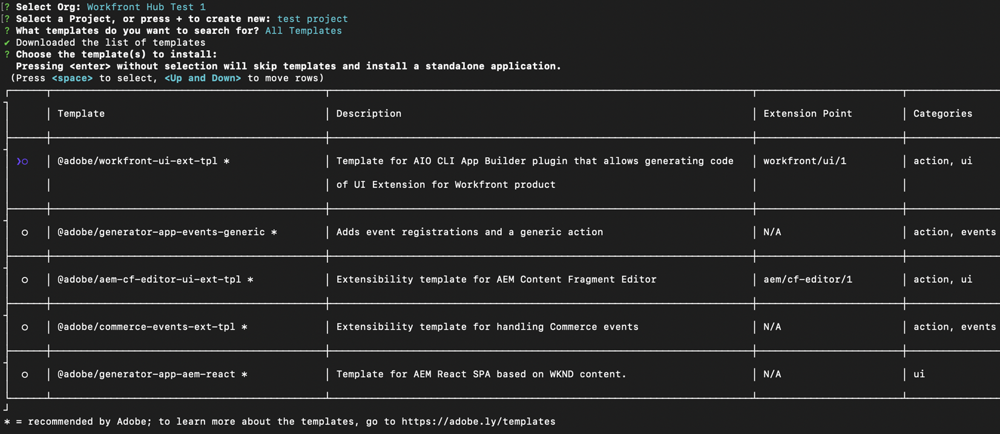
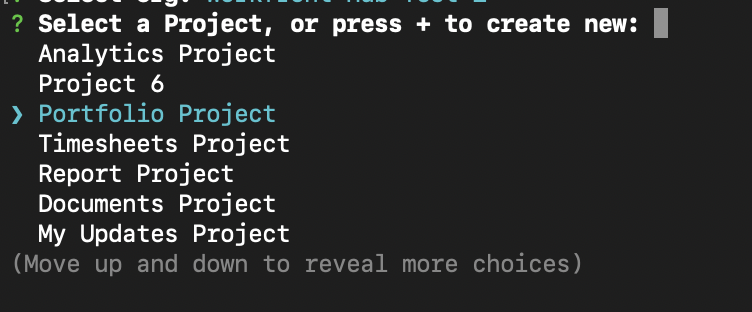

# Creación de aplicaciones personalizadas para Workfront con Adobe App Builder

Las extensiones de la interfaz de usuario de Workfront, con tecnología Adobe App Builder, permiten a los clientes y socios crear experiencias de usuario personalizadas. Estas herramientas mejoran la eficiencia, ofrecen experiencias conectadas y sin problemas, y mejoran significativamente la satisfacción del usuario, y ayudan a las empresas a realizar su visión única.

Por ejemplo, sin las extensiones de la interfaz de usuario de Workfront, es posible que un administrador de proyectos tenga que cambiar entre Workfront y un sistema de seguimiento de tiempo independiente para registrar horas. Con las extensiones de la interfaz de usuario, el seguimiento del tiempo se puede integrar directamente en la experiencia de Workfront, lo que optimiza el flujo de trabajo y ahorra tiempo. Además, puede agregar componentes personalizados para mejorar la facilidad de uso, automatizar tareas repetitivas y mejorar la administración de contenido con funciones como etiquetado de metadatos y previsualizaciones de contenido. Adobe App Builder también ofrece escalabilidad y una sólida administración de identidades (IMS), lo que garantiza una personalización segura y eficaz a cualquier escala.

Las extensiones de IU de Workfront ofrecen varias ventajas clave:

* Personalización precisa: las interfaces de software estándar a menudo no cumplen todos los requisitos empresariales. Las extensiones de IU permiten a los desarrolladores modificar y ampliar la interfaz de usuario predeterminada para satisfacer necesidades comerciales específicas.
* Integración del sistema: las extensiones de IU facilitan la integración de otros sistemas, lo que garantiza flujos de trabajo sin problemas y coherencia de los datos.
* Escalabilidad: a medida que las empresas crecen, las extensiones de la interfaz de usuario se pueden desarrollar para añadir nuevas funcionalidades sin necesidad de una revisión completa del sistema.
* Tiempo de desarrollo reducido: las herramientas y los puntos de extensión creados previamente reducen significativamente el tiempo y el esfuerzo necesarios para implementar las funciones personalizadas.
* Mejora en la adopción de usuarios: Una experiencia de usuario optimizada puede mejorar significativamente la adopción de software. Los elementos de la IU personalizados diseñados para coincidir con las preferencias del usuario pueden mejorar las tasas de adopción y la satisfacción general.
* Al aprovechar las extensiones de la interfaz de usuario de Workfront, las empresas pueden crear experiencias de usuario adaptadas que mejoren la eficacia, la integración y la satisfacción del usuario.

Una vez creada una aplicación en el App Builder de Adobe, un administrador de Workfront puede agregarla al menú principal de Workfront y al panel de navegación izquierdo con plantillas de diseño. Un usuario con la plantilla de diseño que hace clic en la aplicación ve la aplicación incrustada en Workfront, en lugar de tener que abrirla por separado.

En este artículo se describe cómo acceder a App Builder y utilizar una plantilla para crear una aplicación.

Para obtener información sobre cómo agregar una aplicación personalizada a las plantillas de diseño, consulte [Personalizar el menú principal con una plantilla de diseño](/help/quicksilver/administration-and-setup/customize-workfront/use-layout-templates/customize-main-menu.md) y [Personalizar el panel izquierdo con una plantilla de diseño](/help/quicksilver/administration-and-setup/customize-workfront/use-layout-templates/customize-left-panel.md).

## Requisitos previos

Debe tener lo siguiente:

* Una cuenta de Workfront habilitada para IMS
* Un equipo de desarrollo con nodo v18 y npm
* Licencia de App Builder

## Acceso a Adobe App Builder

Para crear extensiones de IU, debe tener acceso a Adobe App Builder en Adobe Developer Console.

Encontrará más instrucciones en el [sitio de Adobe Developer](https://developer.adobe.com/uix/docs/guides/get-access/).

### Añadir desarrolladores a Adobe Admin Console

>[!IMPORTANT]
>
>Asegúrese de haber seleccionado la organización IMS correcta para todos los pasos siguientes. Si pertenece a varias organizaciones, es posible seleccionar la incorrecta. Asegúrese de actuar bajo la organización correcta, que generalmente aparece en la esquina superior derecha.

1. Vaya a Producción: https://adminconsole.adobe.com/

1. En la sección **Usuarios**, haga clic en **Desarrolladores** > **Agregar desarrolladores**.

   

   >[!NOTE]
   >
   >Si no ve una opción para administrar desarrolladores, no tiene un producto que permita el acceso a desarrolladores.

1. Añada el correo electrónico del usuario. Debe buscar usuarios existentes que ya se hayan agregado desde Admin Console.

1. Agregue los productos necesarios al perfil de desarrollador y haga clic en **Guardar**.\
   

### Obtener acceso a App Builder

Las organizaciones deben colaborar con sus administradores de cuentas para adquirir App Builder.

Si AppBuilder está configurado correctamente, debería ver Crear proyecto a partir de una plantilla como parte de la creación de un nuevo proyecto.

## Cree un nuevo proyecto en Adobe Developer Console

Debe utilizar Adobe Developer Console para crear la extensión de la interfaz de usuario.

Encontrará más instrucciones en el [sitio de Adobe Developer](https://developer.adobe.com/uix/docs/guides/creating-project-in-dev-console/).

1. Inicie sesión en Adobe Developer Console con su Adobe ID.

1. Elija su cuenta y su perfil u organización.

1. Haga clic en **Crear proyecto a partir de la plantilla** en el área de Inicio rápido o haga clic en **Crear nuevo proyecto > Proyecto a partir de la plantilla**.

   >[!IMPORTANT]
   >
   >Si no ve la opción de crear un proyecto a partir de una plantilla, significa que no está configurado correctamente en Admin Console y no tiene acceso al catálogo de App Builder. Esta opción solo se muestra cuando tiene acceso a AppBuilder.

   

1. Seleccione **App Builder**.

1. Escriba un **título de proyecto** y **nombre de aplicación**. Ambos tienen valores predeterminados, pero es más fácil identificar el proyecto que desea más adelante si personaliza el valor.

1. Deje seleccionado **Incluir tiempo de ejecución**.

1. Haga clic en **Guardar**.

## Utilizar CLI de Adobe Developer (aio)

Adobe proporciona una CLI de código abierto que puede utilizar para crear la aplicación de App Builder.

Encontrará instrucciones adicionales en GitHub y en el sitio de Adobe Developer:

* https://github.com/adobe/aio-cli
* https://developer.adobe.com/app-builder/docs/getting_started/first_app/

1. Para instalar la herramienta (asegúrese de que está en el nodo v18 primero) ejecute: `npm install -g @adobe/aio-cli`.
1. Inicie el terminal e inicie sesión en AIO con el comando: `aio login`. Si tiene problemas al iniciar sesión en la organización de IMS correcta, intente `aio login -f` para forzar una solicitud de inicio de sesión. Utilice `aio where` para ver qué organización ha iniciado sesión en la organización de IMS correcta. para obtener más información, use `aio config`.
1. Inicie la configuración de la aplicación ejecutando: `aio app init example-app` asegúrese de reemplazar &quot;example-app&quot; por el nombre de la aplicación. Si no está seguro de los nombres de las aplicaciones, puede ver una lista de nombres de aplicaciones con el comando `aio console project list`.
1. Seleccione la organización y el proyecto en las opciones proporcionadas.

   
   

1. Examine todas las plantillas disponibles y elija **@adobe/workfront-ui-ext-tpl** para su proyecto.

   

1. Seleccione e introduzca el nombre del proyecto que ha creado en Adobe Developer Console.

   

1. Responda a las indicaciones de la solicitud:

   * Asigne un nombre a la extensión.
   * Proporcione un resumen descriptivo de la funcionalidad de la extensión.
   * Seleccione un número de versión inicial para empezar.
   * La plantilla crea el código para un botón de navegación principal si selecciona &quot;Añadir un botón personalizado al elemento del menú principal&quot; cuando se le solicita &quot;¿Qué desea hacer a continuación?&quot;.

   

1. Confirme la finalización seleccionando He terminado. La generación de código a partir de la plantilla está en curso.

   

1. Espere hasta que vea un mensaje que indique que la inicialización de la aplicación ha finalizado. A continuación, puede abrir el proyecto en un IDE (se recomienda Visual Studio Code) y tener acceso a la carpeta src.

   Para obtener más información sobre las carpetas y los archivos del proyecto, consulte el [sitio para desarrolladores de Adobe](https://developer.adobe.com/app-builder/docs/get_started/app_builder_get_started/first-app#anatomy-of-an-app-builder-application).

Para obtener más información sobre las carpetas y los archivos del proyecto, consulte el [sitio de Adobe Developer](https://developer.adobe.com/app-builder/docs/get_started/app_builder_get_started/first-app#anatomy-of-an-app-builder-application).

## Cree las extensiones en VSCode.

La configuración del archivo App.js es necesaria para habilitar la navegación mediante el menú principal de Workfront o la navegación secundaria (panel izquierdo).

La configuración del archivo ExtensionRegistration.js es necesaria para mostrar las extensiones en las plantillas de diseño de Workfront.

Los siguientes ejemplos muestran cómo se agregan aplicaciones personalizadas al menú principal de Workfront y al panel izquierdo de un objeto mediante las extensiones de la interfaz de usuario.

### Configurar ExtensionRegistration.js

Para permitir aplicaciones personalizadas en el menú principal de Workfront:

1. Vaya a ExtensionRegistration.js.

En la función ExtensionRegistration, debería ver el siguiente código. Este código se creó automáticamente mediante la plantilla. Este código se puede añadir para crear elementos de menú adicionales. Asegúrese de reemplazar los ID y las direcciones URL.

    &quot;
    mainMenu: {
    
    getItems() {
    
    return [
    
    {
    
    id: &#39;main-menu-label&#39;,
    
    url: &#39;/index.html#/main-menu-label&#39;,
    
    label: &#39;Main menu label&#39;,
    
    icon: icon1,
    
    },
    
    ];
    
    },
    
    }
    &quot;

1. Agregue el siguiente fragmento de código:

   

   Este ejemplo muestra un elemento del menú principal. Debe actualizar el ID, la etiqueta, el icono y la URL con los nombres correctos para su aplicación. Al agregar varios elementos, asegúrese de que el ID sea único.

1. Guarde el trabajo.

### Permitir aplicaciones personalizadas en el panel de navegación izquierdo de Workfront

Para permitir aplicaciones personalizadas en la navegación del panel izquierdo de Workfront:

1. Vaya a ExtensionRegistration.js.
1. En la función ExtensionRegistration, agregue el siguiente fragmento de código:

   ```
   secondaryNav: {
   
   TASK: {  
   
       getItems() {       return [         {           id: "TASK", 
   
   label: "My TASK",           icon: metricsIcon,           url: "/myTask",  
   
           },  
   
       ];  
   
       },  
   
   },  
   
   },  
   ```

   

   * Este ejemplo muestra un elemento de navegación del panel izquierdo denominado My Task. Debe actualizar el ID, la etiqueta, el icono y la URL con los nombres correctos para su aplicación.
   * Este ejemplo muestra un elemento de navegación del panel izquierdo para el tipo de objeto Project. Debe crear estos elementos por separado para cada objeto donde se admitan en Workfront. Están disponibles los siguientes objetos: proyecto, tarea, problema, portafolio y programa.

1. Guarde el trabajo.

### Incrustar una aplicación mediante un formulario personalizado de Workfront

El punto de extensión del widget de formularios es una capacidad de extensión de la interfaz de usuario en Adobe Workfront que le permite crear widgets personalizados que se pueden incrustar en formularios personalizados de Workfront. A diferencia de otros puntos de extensión que agregan elementos de navegación u opciones de menú, los widgets proporcionan una forma de mostrar contenido personalizado en paneles dedicados dentro de campos de formulario personalizados.

Los widgets son componentes modulares de la interfaz de usuario que se pueden agregar a formularios personalizados de Workfront como campos de formulario. Proporcionan una forma de mostrar funcionalidad personalizada, visualizaciones de datos o contenido externo directamente en interfaces de formulario personalizadas, lo que permite a los usuarios interactuar con la lógica personalizada mientras rellenan los formularios.

#### Configuración de una extensión de widget

Al igual que los puntos de extensión de la interfaz de usuario para el menú principal y la navegación secundaria, el punto de extensión &quot;widgets&quot; se configura dentro del objeto de métodos del componente `ExtensionRegistration`, normalmente en el campo `ExtensionRegistration.js`. Esto significa que el uso del widget de formularios solo requiere agregar un elemento &quot;widget&quot; en `extesionregistration` con una ruta válida en su app.js:

```
javascript 


Apply to ExtensionReg... 

widgets: { 

  getItems() { 

    return [ 

      { 

        id: "test2", 

        url: "/index.html#/widgets1", 

        label: "Test Widget with dimensions", 

        dimensions: { 

          height: 450, 

          width: 300, 

          maxHeight: 600, 

          maxWidth: 400, 

        }, 

      }, 

      { 

        id: "test", 

        url: "/index.html#/widgets1", 

        label: "Test Widget without dimensions", 

      }, 

    ]; 

  }, 

}, 
```

#### Propiedades de configuración del widget

**Propiedades requeridas**

* id (cadena): Identificador único del widget. Debe ser único en todos los widgets de la extensión.

* url (cadena): La ruta URL al contenido del widget. Esto debe apuntar a una ruta en la extensión que procese el componente Widget.

* label (cadena): Nombre para mostrar del widget que aparece en la interfaz de selección de campos de formulario personalizados.

**Propiedades opcionales**

* dimensions (objeto): especifica las dimensiones de visualización del widget. Todas las propiedades son opcionales y estas son las únicas dimensiones posibles:

* altura (número): altura del widget en píxeles

* anchura (número): anchura del widget en píxeles

* maxHeight (number): altura máxima del widget en píxeles

* maxWidth (número): Ancho máximo del widget en píxeles

**Propiedades de Dimension**

El objeto de dimensiones permite controlar las restricciones de tamaño y diseño del widget:

* altura y anchura: establezca el tamaño inicial o preferido del widget

* maxHeight y maxWidth: establezca límites superiores para evitar que el widget se vuelva demasiado grande

* Comportamiento interactivo: los widgets pueden ser interactivos dentro de estas restricciones

* Integración de formularios: las dimensiones ayudan a garantizar que el widget se ajuste bien a los diseños de los campos de formulario

#### Ejemplo de configuraciones de Dimension

```
// Fixed size widget 

dimensions: { 

  height: 300, 

  width: 250, 

} 

// Flexible height with width constraint 

dimensions: { 

  width: 300, 

  maxHeight: 500, 

} 

// Height constraint only 

dimensions: { 

  height: 400, 

  maxWidth: 350, 

} 

// No dimensions - uses default sizing 

{} 
```

#### Datos de contexto

Los widgets tienen acceso al mismo contexto compartido que otros puntos de extensión, incluidos los siguientes:

* auth: información de autenticación, incluido el token de IMS

* objCode: código de tipo de objeto (TAREA, PROYECTO, PROBLEMA, etc.)

* objID: identificador de objeto

* nombre de host: nombre de host de instancia de Workfront

* protocol: protocolo de conexión

* user: Información del usuario actual

* isLoginAs: Indica si el usuario ha iniciado sesión como otro usuario

* isInBulkEditing: si el formulario se encuentra actualmente en modo de edición por lotes. Si es así, el contexto incluye varios valores para el ID de objeto.

#### Agregar un widget a un formulario personalizado de Workfront

Una aplicación se puede incrustar en un formulario personalizado de Workfront mediante el tipo de campo &quot;Extensiones de interfaz de usuario&quot;. Una vez agregado el campo, seleccione un widget de formularios y la lista de widgets se basará en las aplicaciones activas de su organización de IMS o en la aplicación activa localmente al `extensionoverride=TRUE`.


### Configurar App.js

1. Vaya a App.js.

1. La plantilla mostrará una ruta para una opción del menú principal. Una ruta define la asignación entre las rutas URL y los componentes representados para esas rutas. Para agregar una ruta, utilice el siguiente fragmento de código, asegúrese de reemplazar la ruta y el elemento exactos por el suyo.

   ```
       <Route 
   
               exact path="custom-application" 
   
               element={<Customapplication />} 
   
           /> 
   ```

   
1. Guarde el trabajo.

Para obtener más información sobre cómo desarrollar y ejecutar la aplicación, consulte el [sitio para desarrolladores de Adobe](https://developer.adobe.com/app-builder/docs/get_started/app_builder_get_started/first-app#develop-the-application).


## Contexto compartido

El contexto compartido se utiliza para compartir datos de Workfront con una extensión de la interfaz de usuario. Los datos disponibles a través del contexto compartido incluyen los datos de usuario y el contexto de la aplicación.


### Usuario

Las extensiones de IU de Workfront comparten datos de usuario. El objeto de usuario disponible a través del contexto compartido incluye un ID de usuario de Workfront y la dirección de correo electrónico del usuario.

`user = (conn?.sharedContext?.get("user")); // {ID: '1', email: 'test@aaa.com'} userID = user.ID userEmail = user.email`

### Contexto de aplicación

Al agregar una aplicación personalizada mediante un punto de extensión de navegación secundario, es común que la aplicación personalizada utilice datos de contexto como un ID de proyecto o un ID de documento. Para estos datos, el contexto compartido incluye un código de objeto y un ID de objeto.

A continuación, se muestra un ejemplo para obtener el contexto de la aplicación para los documentos:

`context = conn?.sharedContext; // Using the connection created above, grab the document details from the host tunnel. // conn?.host?.document?.getDocumentDetails().then(setDocDetails);`

## Prueba de la aplicación en Workfront

Al desarrollar la aplicación de App Builder para Workfront, es posible que tenga que probarla en Workfront sin publicarla.

En su aplicación de App Builder, puede iniciar `aio app run` para el desarrollo local. Esto le proporciona una dirección URL, normalmente algo así como `https://localhost:9080`. También puede ejecutar `aio app deploy` para obtener un dominio estático de Adobe. Asegúrese de tener en cuenta estas direcciones URL para su uso futuro.

A continuación, vaya a la página específica con la que desee desarrollar en el explorador. Abra las herramientas para desarrolladores y acceda al almacenamiento local para workfront.com o workfront.adobe.com. Aquí, debe agregar una entrada. Use `extensionOverride` como clave y la URL de App Builder anotada anteriormente como valor.

Si la configuración se ha completado correctamente, al volver a cargar la página de la plantilla de diseño en Workfront, verá los botones de la aplicación de App Builder. Añada los botones de la aplicación al menú principal y al panel izquierdo de un objeto y compruebe que aparecen correctamente en esas áreas.

Encontrará instrucciones adicionales en el sitio de Adobe Developer, con un ejemplo de AEM: https://developer.adobe.com/uix/docs/guides/preview-extension-locally/

## Publicación de solicitudes y aprobación del envío

Para publicar la aplicación y aprobarla, siga las instrucciones del [sitio de Adobe Developer](https://developer.adobe.com/uix/docs/guides/publication/).
